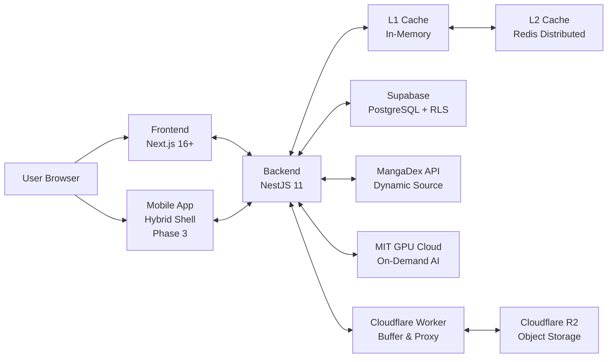

# MangaDock System Architecture Overview (V5 Master)

เอกสารนี้ใช้สรุปภาพรวมสถาปัตยกรรมของระบบ MangaDock ในระดับ high-level เพื่ออธิบายความสัมพันธ์เชิงวิศวกรรมขั้นสูงตามมาตรฐาน T4-STANDARD

## 1. High-Level Architecture

## 2. Core Architectural Components (V5 Refinement)

### 2.1 Advanced 2-Layer Cache (Phase 2 Upgrade)
*   **L2-Centric Design:** Redis ทำหน้าที่เป็น Source of Truth และ Write-buffer หลัก เพื่อรองรับการขยายโหนด (Horizontal Scaling)
*   **L1 Mirroring:** L1 (In-Memory) ทำหน้าที่เป็น Read Mirror ประสิทธิภาพสูง โดยซิงค์ข้อมูลผ่านระบบ **Redis Pub/Sub** แบบ Versioned Cooperative
*   **Intelligent Batching:** ใช้ Leader Node ที่ว่างที่สุด (Workload-Aware) ดึงข้อมูลจาก L2 มาพักใน Local JSON ก่อนส่งขึ้น Supabase เพื่อลด DB Load

### 2.2 Frontend Optimizations (L1 Client Cache & Real-time)
*   **LRU API Cache (O(1) Complexity):** ระบบ In-memory Cache ใน Frontend (Next.js) ที่ใช้โครงสร้าง JavaScript `Map` ในการทำ Least Recently Used (LRU) กำหนดขีดจำกัดที่ 500 Entries เพื่อป้องกัน Memory Leak บน Browser
*   **Stale-While-Revalidate (SWR):** ระบบจะโหลดข้อมูลเก่าจาก Cache มาแสดงทันทีเพื่อลด Perceived Latency (Zero-latency navigation) และแอบดึงข้อมูลใหม่หลังบ้าน (Silent Fetch) แบบไม่มี Skeleton Loading
*   **SSE Real-time Bridge:** ระบบ Server-Sent Events ที่เชื่อมต่อกับ Redis Pub/Sub เพื่อผลักดัน (Push) การเปลี่ยนแปลง (เช่น ยอดโหวต, คอมเมนต์ใหม่) เข้าสู่ UI โดยตรง พร้อมระบบ Exponential Backoff สำหรับป้องกัน Connection Drop

### 2.3 Commercial-Grade Storage
*   **Multi-layer Buffering:** ใช้ Cloudflare Workers เป็น Buffer ด่านหน้าเพื่อลด Request Rate และ Cost ไปยัง R2 โดยตรง
*   **Image Proxy:** ทำ Image Optimization และป้องกัน Hotlinking ผ่านระบบ Proxy

### 2.4 On-Demand AI Pipeline
*   **GPU Cloud Migration:** ย้าย MIT ขึ้นระบบ GPU Cloud ที่รองรับการประมวลผลแบบขนาน (Parallel)
*   **On-Demand Strategy:** ทำงานเฉพาะเมื่อมี Traffic จริง (Usage-based) เพื่อประสิทธิภาพสูงสุดในต้นทุนที่ต่ำที่สุด

### 2.5 Hybrid Mobile Strategy
*   **Shortest Workflow:** ใช้ React Native หุ้ม Web App พรีเมียม และแบ่งปัน Codebase (Shared Logic/Types) ร่วมกัน 
*   **Native OS Bridge:** เชื่อมต่อ MediaProjection และ WindowManager API ผ่าน Native Modules

## 3. Interaction Summary
1. **Frontend:** จัดการ UI พรีเมียม และซิงค์ Session ผ่าน Auth Bridge
2. **Backend:** Orchestration Layer ที่คุมกฎธุรกิจ, Cache Sync, และ Financial Ledger
3. **Infrastructure:** ใช้ Supabase เพื่อลดความซับซ้อนและประหยัดต้นทุนแบนด์วิดท์
4. **MIT:** ประมวลผลภาพแบบ On-demand บน GPU Cloud ความเร็วสูง

## 4. Responsibility by Layer
*   **Frontend:** Interaction & Code Sharing UI
*   **Backend:** Architecture Orchestration & Data Consistency
*   **MIT:** Parallel AI Image Processing
*   **Infrastructure:** Distributed Scaling & Secure Asset Buffering
