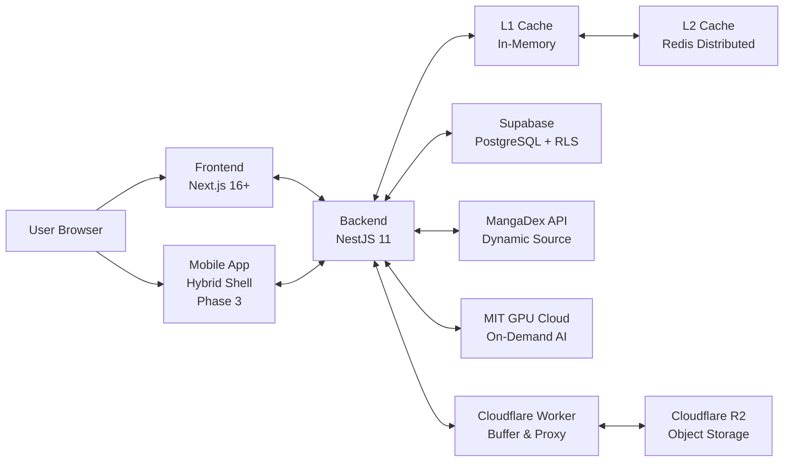

# MangaDock System Architecture Overview (V5 Master)

เอกสารนี้ใช้สรุปภาพรวมสถาปัตยกรรมของระบบ MangaDock ในระดับ high-level เพื่ออธิบายความสัมพันธ์เชิงวิศวกรรมขั้นสูงตามมาตรฐาน T4-STANDARD

## 1. High-Level Architecture



## 2. Core Architectural Components (V5 Refinement)

### 2.1 Advanced 3-Layer Cache (Phase 2 — In Progress)

**Truth Hierarchy:**
```
L1  in-memory (JsonCacheService)   — latency; lost on restart
L2  Redis                          — source of truth at runtime; enables horizontal scaling
L3  JSON disk (L3DiskService)      — per-node backup; Leader buffer before Supabase write
DB  Supabase                       — long-term authoritative source
```

*   **L1 — In-process Latency:** `JsonCacheService` in-memory Map เท่านั้น ไม่มี disk I/O; เขียนพร้อม L2 บน `set()` เพื่อ in-process read consistency
*   **L2 — Runtime Source of Truth:** Redis เป็น single source of truth ณ Runtime รองรับ Horizontal Scaling; ทุก `set()` เขียน L2 ก่อน
*   **L3 — Per-node Backup & Leader Buffer:** `L3DiskService` (pure disk) เขียนโดย `L3BatchWriter` ที่รันบนทุก node ตาม Flush Frequency ต่อ data type; Leader ทำ L2→L3 re-sync ก่อน Supabase write (Issues #13–15 🔵 Planned)
*   **Redis NX Lock Leader Election:** ✅ `SET cache:leader NX PX` acquisition + Lua CAS renewal + `DEL` on shutdown — ป้องกัน split-brain, leader thrashing, lock theft
*   **Reliable Write-behind Queue:** ✅ `RPOPLPUSH` atomic move → L3 sync → `LREM` ack; crash recovery ด้วย `LRANGE` on startup
*   **Node Observability:** ✅ `MetricsService` heartbeat → `cluster_metrics:{nodeId}` (TTL 30s) — monitoring เท่านั้น ไม่ใช้ตัดสิน leadership
*   **Cross-node L1 Sync:** Redis Pub/Sub ยังไม่ implement — Phase 3
*   **Recovery Hierarchy:** L1 memory → L3 disk vs Supabase timestamp (newer wins) → Supabase only; implement พร้อม Supabase handler แรก

### 2.2 Frontend Optimizations (L1 Client Cache & Real-time)
*   **LRU API Cache (O(1) Complexity):** ระบบ In-memory Cache ใน Frontend (Next.js) ที่ใช้โครงสร้าง JavaScript `Map` ในการทำ Least Recently Used (LRU) กำหนดขีดจำกัดที่ 500 Entries เพื่อป้องกัน Memory Leak บน Browser
*   **Stale-While-Revalidate (SWR):** ระบบจะโหลดข้อมูลเก่าจาก Cache มาแสดงทันทีเพื่อลด Perceived Latency (Zero-latency navigation) และแอบดึงข้อมูลใหม่หลังบ้าน (Silent Fetch) แบบไม่มี Skeleton Loading
*   **SSE Real-time Bridge:** ระบบ Server-Sent Events ที่เชื่อมต่อกับ Redis Pub/Sub เพื่อผลักดัน (Push) การเปลี่ยนแปลง (เช่น ยอดโหวต, คอมเมนต์ใหม่) เข้าสู่ UI โดยตรง พร้อมระบบ Exponential Backoff สำหรับป้องกัน Connection Drop

### 2.3 Commercial-Grade Storage
*   **Multi-layer Buffering:** ใช้ Cloudflare Workers เป็น Buffer ด่านหน้าเพื่อลด Request Rate และ Cost ไปยัง R2 โดยตรง
*   **Image Proxy:** ทำ Image Optimization และป้องกัน Hotlinking ผ่านระบบ Proxy

### 2.4 On-Demand AI Pipeline
*   **GPU Cloud Migration:** ย้าย MIT ขึ้นระบบ GPU Cloud ที่รองรับการประมวลผลแบบขนาน (Parallel)
*   **On-Demand Strategy:** ทำงานเฉพาะเมื่อมี Traffic จริง (Usage-based) เพื่อประสิทธิภาพสูงสุดในต้นทุนที่ต่ำที่สุด

### 2.5 Hybrid Mobile Strategy
*   **Shortest Workflow:** ใช้ React Native หุ้ม Web App พรีเมียม และแบ่งปัน Codebase (Shared Logic/Types) ร่วมกัน 
*   **Native OS Bridge:** เชื่อมต่อ MediaProjection และ WindowManager API ผ่าน Native Modules

### 2.6 Atomic Operations & Security Hardening (PR #8 Integration)
*   **Database-Level Atomicity (RPCs):** ระบบการเงิน (Wallet Ledger) และระบบโหวตถูกย้ายตรรกะการคำนวณจากระดับ Application ไปยังระดับฐานข้อมูลโดยใช้ **PostgreSQL RPCs** (`add_coins_atomic`, `spend_coins_atomic`, `recalculate_votes_atomic`) เพื่อป้องกันปัญหา **TOCTOU (Time-of-Check to Time-of-Use)** และ Double-Spending อย่างเด็ดขาด 100%
*   **Zero-Trust File Uploads:** ระบบตรวจสอบชนิดไฟล์รูปภาพเปลี่ยนจากการเชื่อถือ HTTP Headers สู่การตรวจสอบ **Magic Bytes** เชิงลึกผ่านไลบรารี `file-type` ป้องกันการโจมตีผ่านไฟล์ปลอมแปลง
*   **XSS Sanitization:** ข้อมูล URL รูปภาพและเนื้อหาถูก Sanitize เพื่อสกัดกั้นการโจมตีแบบ Cross-Site Scripting (`javascript:` payloads) ในระดับ Frontend Component

## 3. Interaction Summary
1. **Frontend:** จัดการ UI พรีเมียม และซิงค์ Session ผ่าน Auth Bridge
2. **Backend:** Orchestration Layer ที่คุมกฎธุรกิจ, Cache Sync, และ Financial Ledger
3. **Infrastructure:** ใช้ Supabase เพื่อลดความซับซ้อนและประหยัดต้นทุนแบนด์วิดท์
4. **MIT:** ประมวลผลภาพแบบ On-demand บน GPU Cloud ความเร็วสูง

## 4. Responsibility by Layer
*   **Frontend:** Interaction & Code Sharing UI
*   **Backend:** Architecture Orchestration & Data Consistency
*   **MIT:** Parallel AI Image Processing
*   **Infrastructure:** Distributed Scaling & Secure Asset Buffering
