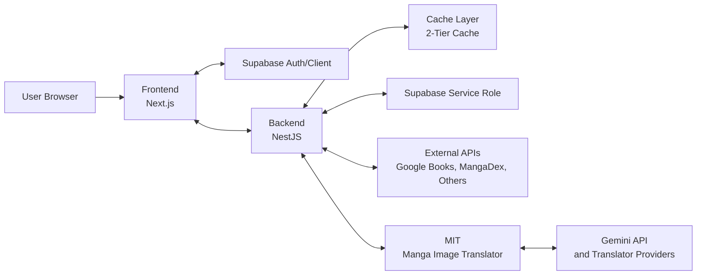

# MangaDock System Architecture Overview

เอกสารนี้ใช้สรุปภาพรวมสถาปัตยกรรมของระบบ MangaDock ในระดับ high-level เพื่ออธิบายความสัมพันธ์ระหว่าง Frontend, Backend, MIT, Supabase และ external integrations โดยไม่ลงลึกถึง implementation ของแต่ละ service

## 1. Recommended Use of This Document

ไฟล์นี้เหมาะสำหรับใช้ใน 3 กรณีหลัก

1. ใช้เป็นภาพรวมของระบบสำหรับคนที่เพิ่งเข้ามาอ่านโปรเจ็กต์
2. ใช้เป็นเอกสารอ้างอิงกลางก่อนแยกไปอ่าน Frontend, Backend หรือ MIT docs
3. ใช้เป็น architecture overview แบบย่อในรายงานหรือการนำเสนอ

## 2. High-Level Architecture

## 3. Interaction Summary

ความสัมพันธ์หลักของระบบสามารถสรุปได้ดังนี้

1. Frontend (Next.js) ติดต่อกับ Backend (NestJS) เพื่อเรียกข้อมูลหนังสือ มังงะ ผู้ใช้ รายการโปรด และ flow การแปลภาพ
2. Frontend ติดต่อกับ Supabase สำหรับ authentication และ real-time data ฝั่ง client
3. Backend ติดต่อกับ 2-Layer Cache (Memory + Redis) เพื่อลดการเรียกข้อมูลซ้ำและเก็บผลลัพธ์ที่ใช้บ่อย พร้อมระบบ Graceful Shutdown
4. Backend ติดต่อกับ Supabase (Service Role) สำหรับงานฝั่ง server เช่น การจัดการข้อมูลที่ซับซ้อนและการตรวจสอบสิทธิ์
5. Backend ติดต่อกับ External APIs เช่น Google Books, MangaDex และบริการภายนอกอื่นตาม flow ของระบบ
6. Backend ติดต่อกับ MIT ผ่าน HTTP แบบ Asynchronous (Fire-and-forget) เพื่อสั่งงานแปลภาพมังงะ
7. MIT ประมวลผลเสร็จแล้วส่งข้อมูลกลับมาที่ Backend ผ่าน Webhook Callback
8. MIT ติดต่อกับ Gemini API หรือ translator providers อื่นเพื่อทำงานในส่วน translation pipeline

## 4. Responsibility by Layer

### Frontend

- แสดงผลหน้า UI และจัดการ interaction ของผู้ใช้
- เรียก backend APIs สำหรับ business flows หลัก
- ใช้ Supabase สำหรับงาน authentication และจัดการ session ฝั่ง client
- มีระบบ SupabaseGuard แจ้งเตือนเมื่อฐานข้อมูลไม่พร้อมใช้งาน

### Backend

- เป็น orchestration layer หลักของระบบ
- รวม business logic, API contracts และ service integrations
- จัดการ Cache 2 ชั้น และรักษาสถานะข้อมูลตอน Shutdown
- ติดต่อ Supabase, external content providers และสั่งงาน MIT แบบ Non-blocking

### MIT

- รับผิดชอบ image translation pipeline (FastAPI)
- ทำ OCR, translation, inpainting, rendering และ patch generation
- รองรับการทำงานแบบ Asynchronous ผ่าน Webhook Callback
- พึ่งพา translator providers ภายนอก เช่น Gemini

## 5. Where To Read Next

1. [Frontend/FRONTEND_DOC_INDEX.md](Frontend/FRONTEND_DOC_INDEX.md) สำหรับรายละเอียดฝั่ง Frontend
2. [Backend/BACKEND_DOC_INDEX.md](Backend/BACKEND_DOC_INDEX.md) สำหรับรายละเอียดฝั่ง Backend
3. [MIT/MIT_DOC_INDEX.md](MIT/MIT_DOC_INDEX.md) สำหรับรายละเอียดฝั่ง MIT
4. [Software Engineer/UML_REPORT.md](Software%20Engineer/UML_REPORT.md) หากต้องการ diagram เชิงรายงานเพิ่มเติม
