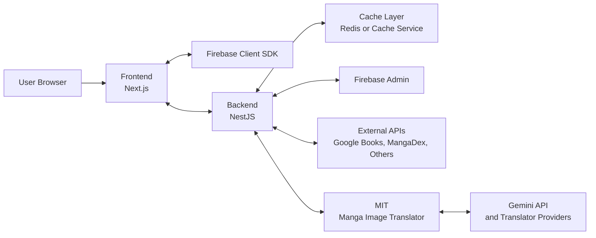

# MangaDock System Architecture Overview

เอกสารนี้ใช้สรุปภาพรวมสถาปัตยกรรมของระบบ MangaDock ในระดับ high-level เพื่ออธิบายความสัมพันธ์ระหว่าง Frontend, Backend, MIT, Firebase และ external integrations โดยไม่ลงลึกถึง implementation ของแต่ละ service

## 1. Recommended Use of This Document

ไฟล์นี้เหมาะสำหรับใช้ใน 3 กรณีหลัก

1. ใช้เป็นภาพรวมของระบบสำหรับคนที่เพิ่งเข้ามาอ่านโปรเจ็กต์
2. ใช้เป็นเอกสารอ้างอิงกลางก่อนแยกไปอ่าน Frontend, Backend หรือ MIT docs
3. ใช้เป็น architecture overview แบบย่อในรายงานหรือการนำเสนอ

## 2. High-Level Architecture

## 3. Interaction Summary

ความสัมพันธ์หลักของระบบสามารถสรุปได้ดังนี้

1. Frontend (Next.js) ติดต่อกับ Backend (NestJS) เพื่อเรียกข้อมูลหนังสือ มังงะ ผู้ใช้ รายการโปรด และ flow การแปลภาพ
2. Frontend ติดต่อกับ Firebase Client SDK สำหรับ authentication-related flows ฝั่ง client
3. Backend ติดต่อกับ Cache Layer เพื่อลดการเรียกข้อมูลซ้ำและเก็บผลลัพธ์ที่ใช้บ่อย
4. Backend ติดต่อกับ Firebase Admin สำหรับงานฝั่ง server เช่น validation และการจัดการข้อมูลผู้ใช้ที่เกี่ยวข้อง
5. Backend ติดต่อกับ External APIs เช่น Google Books, MangaDex และบริการภายนอกอื่นตาม flow ของระบบ
6. Backend ติดต่อกับ MIT ผ่าน HTTP เพื่อสั่งงานแปลภาพมังงะ
7. MIT ติดต่อกับ Gemini API หรือ translator providers อื่นเพื่อทำงานในส่วน translation pipeline

## 4. Responsibility by Layer

### Frontend

- แสดงผลหน้า UI และจัดการ interaction ของผู้ใช้
- เรียก backend APIs สำหรับ business flows หลัก
- ใช้ Firebase Client SDK สำหรับงาน authentication ฝั่ง client

### Backend

- เป็น orchestration layer หลักของระบบ
- รวม business logic, API contracts และ service integrations
- ติดต่อ cache, Firebase Admin, external content providers และ MIT

### MIT

- รับผิดชอบ image translation pipeline
- ทำ OCR, translation, inpainting, rendering และ patch generation
- พึ่งพา translator providers ภายนอกในบางโหมด เช่น Gemini

## 5. Where To Read Next

1. [Frontend/FRONTEND_DOC_INDEX.md](Frontend/FRONTEND_DOC_INDEX.md) สำหรับรายละเอียดฝั่ง Frontend
2. [Backend/BACKEND_DOC_INDEX.md](Backend/BACKEND_DOC_INDEX.md) สำหรับรายละเอียดฝั่ง Backend
3. [MIT/MIT_DOC_INDEX.md](MIT/MIT_DOC_INDEX.md) สำหรับรายละเอียดฝั่ง MIT
4. [Software Engineer/UML_REPORT.md](Software%20Engineer/UML_REPORT.md) หากต้องการ diagram เชิงรายงานเพิ่มเติม