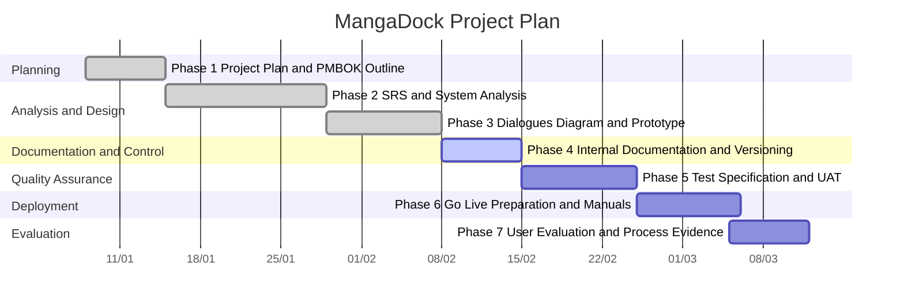

# Phase 1: Project Plan and Gantt Chart

เอกสารฉบับนี้จัดทำตามแนวคิดของ PMBOK ในระดับที่เหมาะกับรายงานวิชา Software Engineering เพื่อใช้อธิบายการวางแผนโครงการ MangaDock ตั้งแต่ขอบเขตงาน ระยะเวลา การติดตามความคืบหน้า และ milestone สำคัญของโครงการ

## 1. Project Overview

MangaDock เป็นระบบสำหรับค้นหา อ่าน และจัดการหนังสือหรือมังงะ โดยมีความสามารถสำคัญ ได้แก่ การค้นหาหนังสือ การเปิดรายละเอียด การอ่านมังงะ การแปลภาพมังงะ และการจัดการบัญชีผู้ใช้ ระบบถูกพัฒนาในลักษณะ full-stack โดยมี Frontend (Next.js), Backend (NestJS) และ MIT (Manga Image Translator microservice) ทำงานร่วมกัน

## 2. Project Objectives

1. พัฒนาระบบที่รองรับการใช้งานหนังสือและมังงะในแพลตฟอร์มเดียว
2. รองรับการแปลหน้ามังงะผ่าน service ภายนอกที่เชื่อมต่อผ่าน HTTP
3. สร้างระบบที่มีโครงสร้างโมดูลชัดเจนและสามารถพัฒนาต่อได้
4. จัดทำเอกสารและหลักฐานการพัฒนาให้ครบตามกระบวนการวิชา Software Engineering

## 3. Project Scope

### In Scope

- ระบบค้นหาและแสดงรายละเอียดหนังสือหรือมังงะ
- ระบบอ่านมังงะและบันทึกประวัติการอ่าน
- ระบบบัญชีผู้ใช้, favorites, liked items และ profile management
- ระบบแปลภาพมังงะผ่าน Manga Image Translator service
- ระบบ cache, status monitoring และ integration กับบริการภายนอก

### Out of Scope

- ระบบชำระเงิน
- ระบบจัดการสิทธิ์หลายระดับแบบ enterprise
- mobile native application
- ระบบ analytics เชิงธุรกิจแบบเต็มรูปแบบ

## 4. PMBOK-Oriented Planning Structure

### 4.1 Scope Management

ขอบเขตของโครงการกำหนดจาก feature หลักของระบบอ่านหนังสือและมังงะ โดยทุกงานที่พัฒนาต้องเชื่อมโยงกลับไปยังความต้องการของผู้ใช้และผลลัพธ์ที่ตรวจสอบได้จริง

### 4.2 Schedule Management

โครงการถูกแบ่งออกเป็น 7 phase ตามโครงสร้างเอกสารและผลลัพธ์ที่ต้องส่ง โดยมีการกำหนด milestone หลังจบแต่ละ phase เพื่อใช้ติดตามความพร้อมของระบบและเอกสารประกอบ

### 4.3 Resource Management

ทรัพยากรหลักของโครงการประกอบด้วยทีมพัฒนา เครื่องสำหรับรัน Frontend (Next.js), เครื่องสำหรับรัน Backend (NestJS), เครื่องหรือ environment สำหรับรัน MIT (Manga Image Translator microservice) และบริการภายนอก เช่น Firebase, Google Books, MangaDex และ Gemini

### 4.4 Risk Management

ความเสี่ยงหลักของโครงการ ได้แก่ dependency จาก external services, ความซับซ้อนของ translation pipeline, ปัญหา environment setup, และความล่าช้าในการรวมเอกสารกับระบบจริง จึงต้องมีการแยกส่วนบริการอย่างชัดเจนและจัดทำเอกสารประกอบอย่างต่อเนื่อง

## 5. Project Milestones

| Milestone | Deliverable |
|---|---|
| M1 | Project planning complete |
| M2 | SRS and system analysis complete |
| M3 | Prototype and interaction design complete |
| M4 | Internal documentation and versioning evidence complete |
| M5 | Test specification and UAT evidence complete |
| M6 | Deployment and go-live documentation complete |
| M7 | User evaluation and quality evidence complete |

## 6. Gantt Chart

หมายเหตุ: วันที่ใน Gantt Chart สามารถปรับให้ตรงกับ timeline จริงของกลุ่มก่อนนำไปส่งฉบับสุดท้าย

## 7. Expected Deliverables

1. เอกสารวางแผนโครงการ
2. เอกสาร SRS และแบบจำลองระบบ
3. Prototype และเอกสาร interaction
4. เอกสารภายในและหลักฐาน version control
5. เอกสารทดสอบและผล UAT
6. เอกสารติดตั้งและคู่มือใช้งาน
7. แบบประเมินคุณภาพซอฟต์แวร์หรือหลักฐานมาตรฐานกระบวนการ

## 8. Summary

Phase 1 เป็นรากฐานสำคัญของโครงการ เพราะช่วยกำหนดขอบเขต เป้าหมาย ลำดับเวลา และผลลัพธ์ที่คาดหวังอย่างชัดเจน ทำให้การดำเนินงานใน phase ต่อไปสามารถควบคุมได้เป็นระบบและสอดคล้องกับแนวทางวิศวกรรมซอฟต์แวร์

สำหรับเอกสารระบบที่สอดคล้องกับแผนงานใน phase นี้ สามารถอ้างอิงเพิ่มเติมได้จาก [../DOCUMENT_INDEX.md](../DOCUMENT_INDEX.md), [../Frontend/FRONTEND_DOC_INDEX.md](../Frontend/FRONTEND_DOC_INDEX.md), [../Backend/BACKEND_DOC_INDEX.md](../Backend/BACKEND_DOC_INDEX.md) และ [../MIT/MIT_DOC_INDEX.md](../MIT/MIT_DOC_INDEX.md)