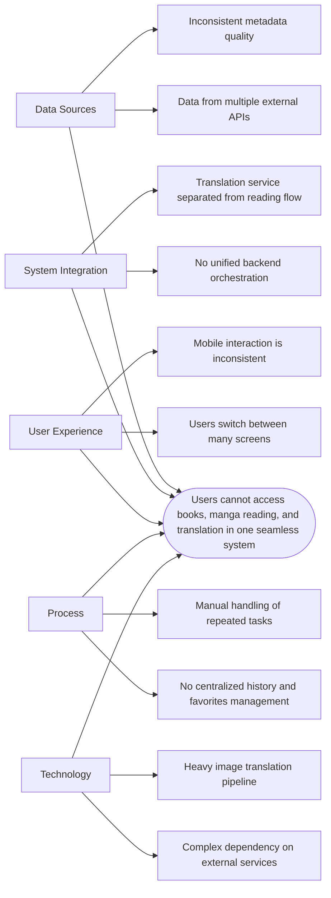
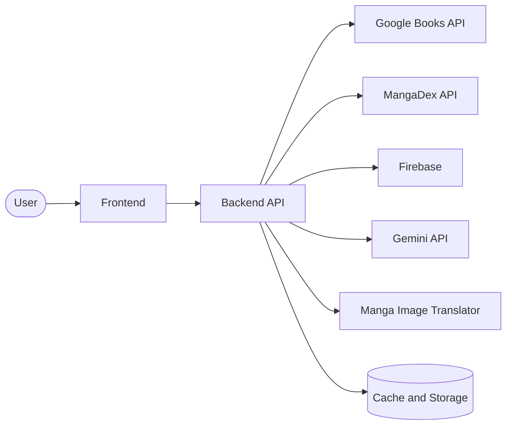

# Phase 2: Software Requirement Specification and System Analysis

เอกสารฉบับนี้อ้างอิงโครงสร้างของ SRS ตามแนว IEEE ในระดับที่เหมาะกับรายงานวิชา Software Engineering และรวมการวิเคราะห์ปัญหา การออกแบบระบบ และเอกสารข้อมูลที่จำเป็นสำหรับโครงการ MangaDock

## 1. Introduction

### 1.1 Purpose

เอกสารนี้มีวัตถุประสงค์เพื่ออธิบายความต้องการของระบบ MangaDock ทั้งในเชิง functional และ non-functional รวมถึงนำเสนอการวิเคราะห์ปัญหา การออกแบบโครงสร้างระบบ และแบบจำลองข้อมูลที่ใช้สนับสนุนการพัฒนา

### 1.2 Scope

MangaDock เป็นระบบอ่านหนังสือและมังงะที่รองรับการค้นหา การดูรายละเอียด การอ่านตอน การจัดการข้อมูลผู้ใช้ และการแปลภาพมังงะผ่าน MIT (Manga Image Translator microservice) โดยออกแบบให้ Frontend (Next.js), Backend (NestJS) และ service ภายนอกทำงานร่วมกันผ่าน API ที่ชัดเจน

### 1.3 Definitions

- Frontend: ส่วนติดต่อผู้ใช้ที่พัฒนาด้วย Next.js
- Backend: บริการหลักของระบบที่พัฒนาด้วย NestJS
- MIT: Manga Image Translator microservice สำหรับแปลหน้ามังงะ
- External Services: Firebase, Google Books, MangaDex, Gemini และบริการอื่นที่ระบบเรียกใช้

## 2. Problem Analysis

### 2.1 Problem Statement

ผู้ใช้งานทั่วไปต้องใช้หลายแอปหรือหลายเว็บไซต์ในการค้นหาหนังสือ ดูข้อมูลมังงะ และอ่านมังงะที่ต้องการแปล ทำให้ประสบการณ์ใช้งานไม่ต่อเนื่อง อีกทั้งการจัดเก็บประวัติการอ่าน รายการโปรด และการแปลหน้ามังงะยังแยกออกจากกัน ส่งผลให้ระบบที่ใช้งานอยู่เดิมไม่ตอบโจทย์ความสะดวกและความต่อเนื่องของผู้ใช้

### 2.2 Fishbone Diagram

### 2.3 SWOT Analysis

| Category | Analysis |
|---|---|
| Strengths | ระบบรวมหนังสือ มังงะ และการแปลภาพไว้ใน workflow เดียว |
| Weaknesses | พึ่งพา external services หลายตัวและมี complexity สูงในฝั่ง translation |
| Opportunities | สามารถต่อยอดเป็นแพลตฟอร์มอ่านและแปลมังงะแบบเฉพาะทางได้ |
| Threats | API ภายนอกเปลี่ยนแปลง, rate limit, ค่าใช้จ่ายของ AI service, และ downtime ของ upstream |

## 3. Overall Description

### 3.1 Product Perspective

ระบบถูกออกแบบเป็นสถาปัตยกรรมแบบแยกส่วน โดย Frontend (Next.js) ทำหน้าที่เป็น user interface, Backend (NestJS) ทำหน้าที่เป็น orchestration layer และ MIT ทำหน้าที่ประมวลผลภาพมังงะโดยเฉพาะ

### 3.2 User Classes

- Guest: ค้นหา ดูรายละเอียด และสำรวจเนื้อหาได้
- Member: อ่านมังงะ แปลหน้า จัดการ profile และรายการส่วนตัวได้
- Administrator or Maintainer: ดูแล environment, service configuration และ deployment

## 4. Functional Requirements

1. ระบบต้องรองรับการค้นหาหนังสือและมังงะ
2. ระบบต้องแสดงรายละเอียดหนังสือหรือมังงะได้
3. ระบบต้องรองรับการอ่านตอนมังงะ
4. ระบบต้องรองรับการแปลหน้ามังงะผ่าน MIT (Manga Image Translator microservice)
5. ระบบต้องรองรับการสมัครสมาชิกและเข้าสู่ระบบ
6. ระบบต้องรองรับการจัดการ favorites, liked items และ reading history
7. ระบบต้องรองรับการจัดการข้อมูลบัญชีผู้ใช้

## 5. Non-Functional Requirements

1. ระบบต้องมี response time อยู่ในระดับที่ผู้ใช้ยอมรับได้สำหรับการค้นหาและเปิดข้อมูลทั่วไป
2. ระบบต้องรองรับการแยก service เพื่อให้ deploy และดูแลรักษาได้ง่าย
3. ระบบต้องสามารถ log และติดตามสถานะของ service สำคัญได้
4. ระบบต้องมีโครงสร้างที่รองรับการขยาย feature ในอนาคต

## 6. System Design Artifacts

### 6.1 UML and DFD Reference

เอกสารแผนภาพ UML หลักถูกแยกไว้ใน [UML_REPORT.md](UML_REPORT.md) เพื่อใช้อ้างอิงในส่วนของ Use Case, Component, Class, Sequence, Activity และ Deployment Diagram

เอกสารสรุประดับระบบที่ใช้สนับสนุนการอ่าน phase นี้เพิ่มเติม ได้แก่ [../Frontend/FRONTEND_DOC_INDEX.md](../Frontend/FRONTEND_DOC_INDEX.md), [../Backend/BACKEND_DOC_INDEX.md](../Backend/BACKEND_DOC_INDEX.md) และ [../MIT/MIT_DOC_INDEX.md](../MIT/MIT_DOC_INDEX.md)

### 6.2 Context-Level DFD

### 6.3 ER and Relation Overview

เอนทิตีหลักของระบบประกอบด้วย User, FavoriteItem, LikedItem, ReadingHistory, ValidationRequest และ CachedContent โดยความสัมพันธ์สำคัญคือผู้ใช้หนึ่งคนสามารถมี favorite ได้หลายรายการ มี liked items ได้หลายรายการ และมีประวัติการอ่านได้หลายรายการ

### 6.4 Data Dictionary

| Entity | Field | Description |
|---|---|---|
| User | uid | รหัสผู้ใช้จาก Firebase |
| User | displayName | ชื่อแสดงผลของผู้ใช้ |
| User | email | อีเมลผู้ใช้ |
| FavoriteItem | bookId | รหัสหนังสือหรือมังงะที่บันทึกไว้ |
| FavoriteItem | createdAt | วันที่เพิ่มรายการโปรด |
| ReadingHistory | chapterId | รหัสตอนที่อ่านล่าสุด |
| ReadingHistory | pageIndex | หน้าที่อ่านล่าสุด |
| CachedContent | cacheKey | คีย์สำหรับ cache retrieval |
| CachedContent | source | แหล่งข้อมูลเดิมที่ถูก cache |

## 7. Summary

Phase 2 เป็นส่วนที่เชื่อมระหว่างการเข้าใจปัญหาและการออกแบบระบบจริง โดย SRS ช่วยให้ทีมมีกรอบความต้องการที่ชัดเจน ขณะที่การวิเคราะห์ด้วย Fishbone, SWOT, UML, DFD, ER และ Data Dictionary ช่วยลดความกำกวมก่อนเข้าสู่การพัฒนาและการทดสอบในลำดับต่อไป