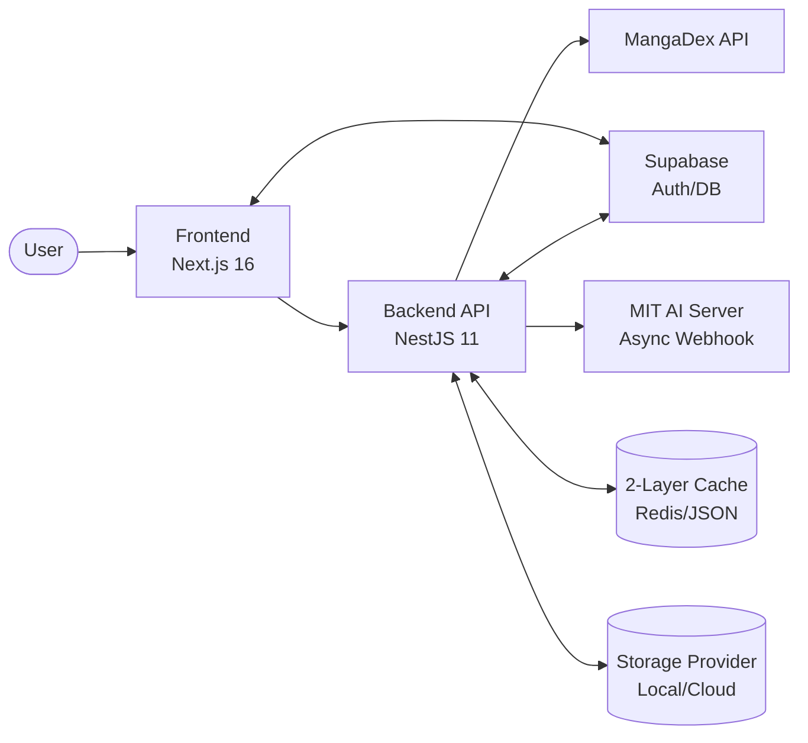

# Phase 2: Software Requirement Specification and System Analysis (Updated Phase 1.5)

เอกสารฉบับนี้อ้างอิงโครงสร้างของ SRS ตามแนว IEEE และรวมการวิเคราะห์ที่อัปเดตตามสถาปัตยกรรมล่าสุด (Supabase Migration & Async Pipeline)

## 1. Introduction

### 1.1 Purpose

เอกสารนี้อธิบายความต้องการของระบบ MangaDock ทั้งในเชิง functional และ non-functional โดยเน้นที่ความเสถียรของระบบ (Optimization) และความพร้อมของโครงสร้างพื้นฐาน (Readiness) ตามมาตรฐาน **T4-STANDARD**

### 1.2 Scope

MangaDock (MetaBooks) เป็นแพลตฟอร์มอ่านและแปลมังงะแบบ Decoupled โดยใช้ Next.js 16 (Frontend), NestJS 11 (Backend) และ FastAPI (AI MIT Server) เชื่อมต่อผ่าน Supabase สำหรับฐานข้อมูลและการยืนยันตัวตน

### 1.3 Definitions

- **Storage Adapter:** ระบบจัดการไฟล์แบบ Abstraction ที่รองรับทั้ง Disk และ R2
- **Async Webhook:** กระบวนการส่งงานแปล AI แบบไม่รอผลทันที (Non-blocking)
- **Zero-Trust Stub:** ระบบตรวจสอบ Hardware ID เพื่อป้องกันความปลอดภัยด่านหน้า

## 2. Problem Analysis (Updated)

### 2.2 Fishbone Diagram (Infrastructure Focus)

```mermaid
flowchart LR
  P([High Latency and Storage Lock-in])

  A[Data Sources]
  B[System Integration]
  C[User Experience]
  D[Process]
  E[Technology]

  A --> P
  B --> P
  C --> P
  D --> P
  E --> P

  A1[Unstable Upstream APIs]
  B1[Synchronous AI Pipeline (Timeout Risk)]
  C1[No feedback when DB is offline]
  D1[Tight coupling with Local Disk]
  E1[Lack of structured observability]
```

## 3. Product Perspective

ระบบใน Phase 1.5 ถูกยกระดับให้เป็น **Cloud-Ready Microservices** โดยแยกส่วนประมวลผล (Compute), จัดเก็บ (Storage), และควบคุม (Orchestration) ออกจากกันอย่างชัดเจนผ่าน Interface มาตรฐาน

## 4. Functional Requirements (Added)

8. ระบบต้องสามารถตรวจจับและแจ้งเตือนผู้ใช้เมื่อฐานข้อมูล Supabase ไม่พร้อมใช้งาน (Supabase Guard)
9. ระบบต้องรองรับการแปลภาพขนาดใหญ่ผ่าน Asynchronous Pipeline โดยไม่ตัดการเชื่อมต่อ
10. ระบบต้องระบุตัวตนอุปกรณ์ผ่าน Hardware Fingerprinting เพื่อความปลอดภัย

## 5. Non-Functional Requirements (T4-Standard)

1. **Idempotency:** งานแปลที่ทำซ้ำต้องไม่ใช้ทรัพยากรเพิ่ม
2. **Observability:** ทุก Request ต้องถูก Log ในรูปแบบ Structured JSON
3. **Resilience:** ระบบต้องมี Graceful Shutdown และ Retry Sync Cache 3 ครั้ง

## 6. System Design Artifacts

### 6.2 Context-Level DFD (Phase 1.5)



### 6.4 Data Dictionary (Updated)

| Entity | Field | Description |
|---|---|---|
| User | uid | รหัสผู้ใช้จาก **Supabase Auth** |
| User | hardwareId | ID เฉพาะของอุปกรณ์ (Fingerprint) |
| ChapterVersion | taskId | ID ของงานแปลสำหรับ Webhook Callback |
| Storage | key | ที่อยู่ไฟล์ใน Storage Adapter (e.g. uploads/avatars/...) |

---

*เอกสารชุดนี้ได้รับการปรับปรุงเพื่อให้สะท้อนสถาปัตยกรรมระดับเอ็นเตอร์ไพรส์ในปัจจุบัน*
