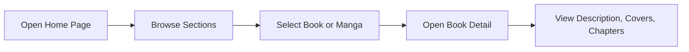
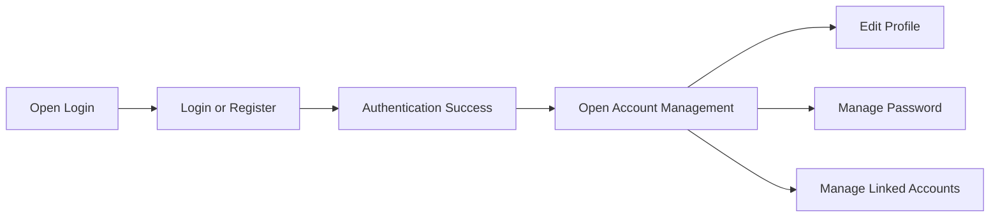

# Phase 3: Dialogues Diagram and Prototype

เอกสารฉบับนี้อธิบายการออกแบบปฏิสัมพันธ์ระหว่างผู้ใช้กับระบบ MetaBooks ในระดับหน้าจอและ flow การใช้งาน โดยเน้น Dialogues Diagram และต้นแบบระบบที่ใช้สื่อสารแนวคิดก่อนและระหว่างการพัฒนา

## 1. Purpose

วัตถุประสงค์ของ Phase 3 คือการทำให้ทีมพัฒนาและผู้เกี่ยวข้องเห็นภาพการใช้งานจริงของระบบในมุมมองผู้ใช้ ตั้งแต่การเข้าใช้งานระบบ การเปิดรายละเอียดหนังสือหรือมังงะ การอ่านตอน และการจัดการบัญชีผู้ใช้ รวมถึงการสื่อสารพฤติกรรมของระบบในจุดที่มีการโต้ตอบหลายขั้นตอน

## 2. Main User Dialogue Flows

### 2.1 Browse and View Book Detail



### 2.2 Manga Reading and Translation

```mermaid
flowchart LR
  A[Open Book Detail] --> B[Select Chapter]
  B --> C[Open Reader]
  C --> D[Select Page]
  D --> E[Request Translation]
  E --> F[Backend (NestJS) Calls MIT]
  F --> G[Display Translated Page or Patches]
```

### 2.3 Login and Account Management



## 3. Prototype Scope

ต้นแบบของระบบครอบคลุมหน้าสำคัญดังนี้

1. หน้าแรกและ section สำหรับเนื้อหาเด่น
2. หน้า search และ categories
3. หน้า book detail หรือ manga detail
4. หน้า reader สำหรับการอ่านมังงะ
5. modal หรือ page สำหรับ login และ account management
6. หน้า my list สำหรับ favorites และ liked items

## 4. Prototype Description

Prototype ของ MetaBooks ถูกพัฒนาควบคู่กับระบบจริงในฝั่ง Frontend (Next.js) ทำให้ไม่ใช่เพียงภาพ mockup แต่เป็น clickable interface ที่สามารถแสดง flow การทำงานได้จริงในหลายส่วน เช่น การเปิดรายละเอียด การอ่านตอน และการจัดการบัญชีบน mobile และ desktop

ลักษณะสำคัญของ prototype ได้แก่

- ใช้ component-based UI เพื่อให้ปรับปรุงหน้าจอได้ต่อเนื่อง
- รองรับ responsive design สำหรับ mobile และ desktop
- แยก flow ที่ซับซ้อนออกเป็น modal หรือ page mode ตามบริบทของการใช้งาน
- แสดง interaction ที่สำคัญ เช่น navigation, dialog, hover state, mobile state และ progressive disclosure

## 5. Relationship with UML

Dialogues Diagram และ Prototype ใน phase นี้ควรใช้ร่วมกับ [UML_REPORT.md](UML_REPORT.md) โดยเฉพาะ Use Case Diagram, Sequence Diagram และ Activity Diagram เพื่อให้รายงานอธิบายได้ทั้งมุมมองโครงสร้างระบบและมุมมองประสบการณ์ใช้งานจริง

ในกรณีที่ต้องการเชื่อมรายละเอียดของ prototype กับระบบจริง สามารถอ้างอิง [../Frontend/FRONTEND_DOC_INDEX.md](../Frontend/FRONTEND_DOC_INDEX.md) สำหรับ Frontend (Next.js), [../Backend/BACKEND_DOC_INDEX.md](../Backend/BACKEND_DOC_INDEX.md) สำหรับ Backend (NestJS) และ [../MIT/MIT_DOC_INDEX.md](../MIT/MIT_DOC_INDEX.md) สำหรับ flow การแปลภาพที่พึ่งพา MIT

## 6. Summary

Phase 3 ช่วยลดความคลาดเคลื่อนระหว่างความต้องการเชิงเอกสารกับพฤติกรรมจริงของระบบ เพราะทำให้ทีมสามารถตรวจสอบ flow การใช้งานในระดับหน้าจอได้ตั้งแต่ก่อนส่งมอบ และช่วยให้การปรับปรุง UX/UI เป็นไปอย่างมีเหตุผลรองรับ