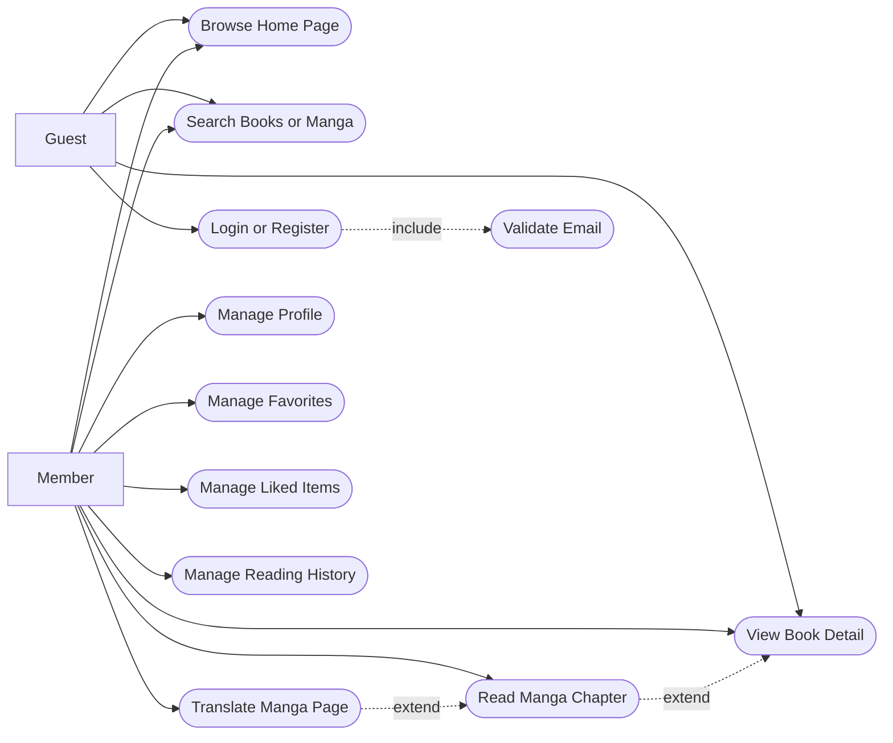
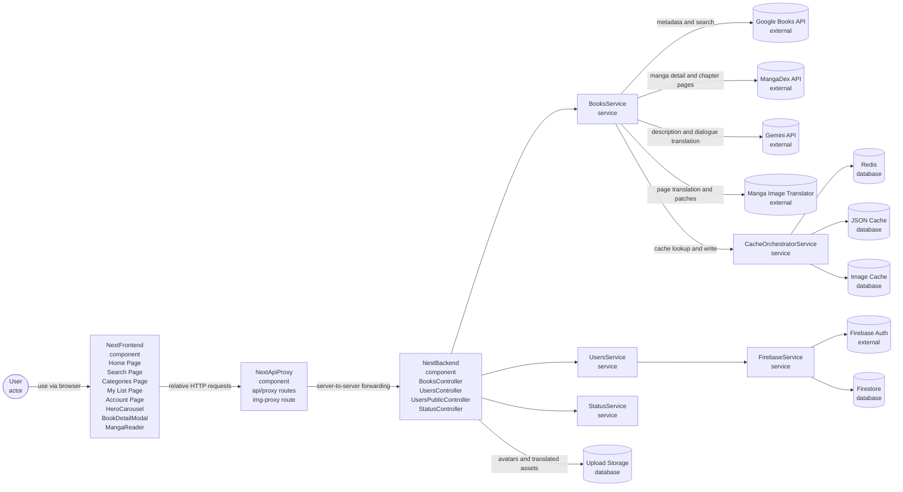
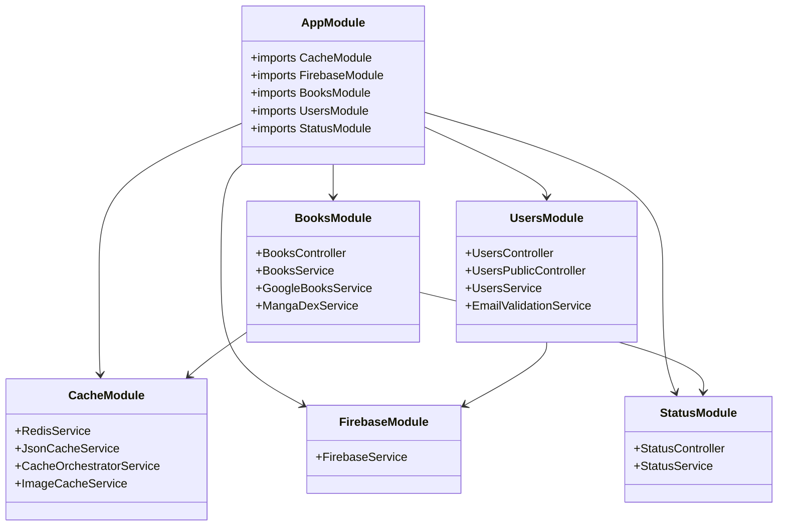
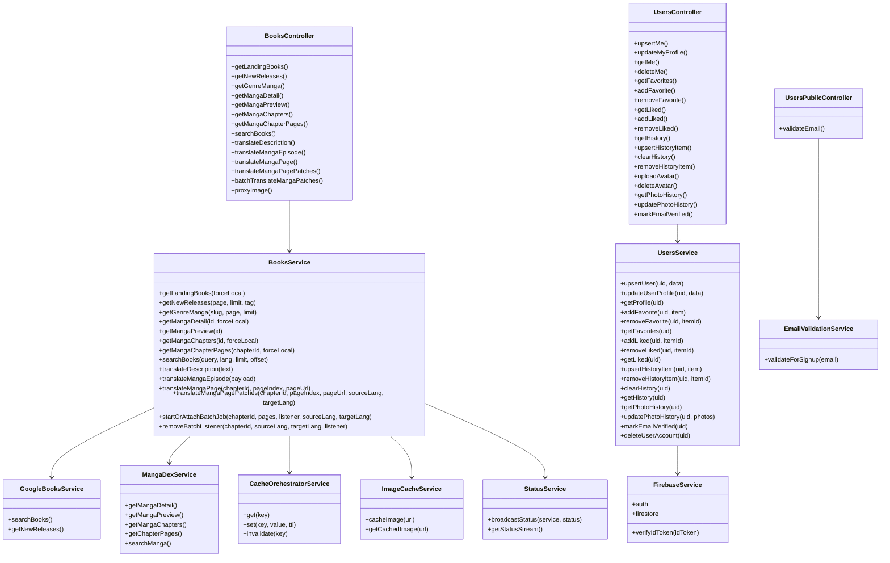
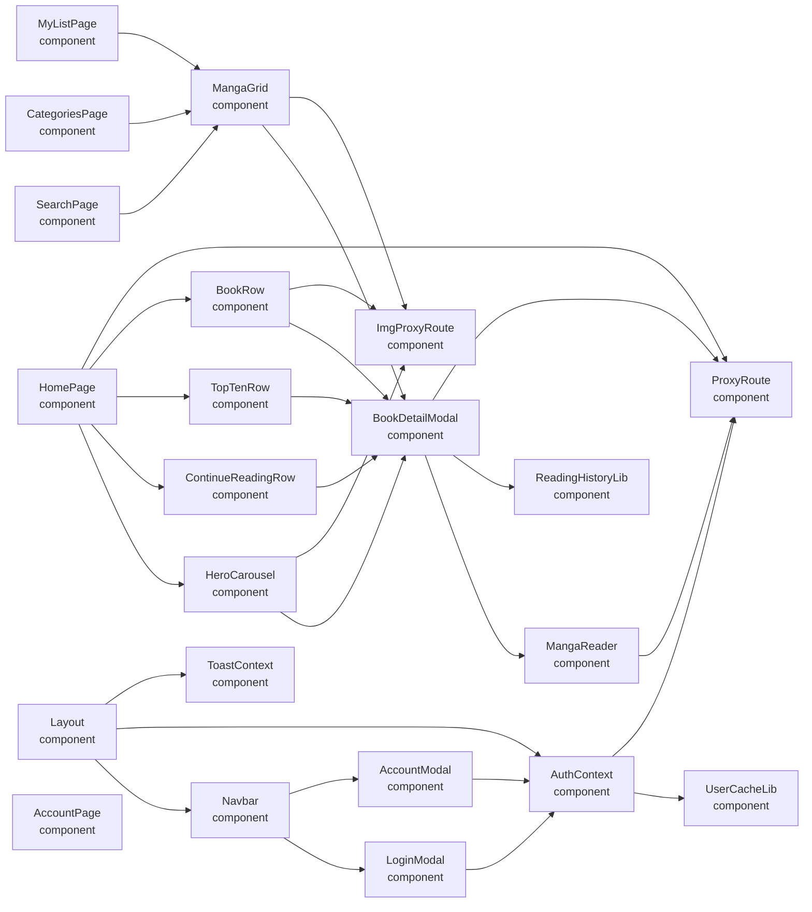
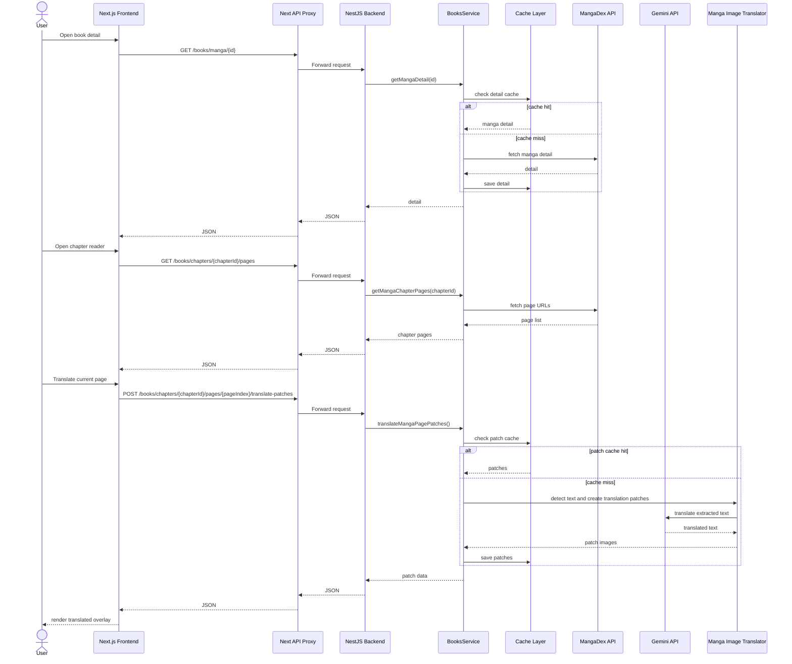
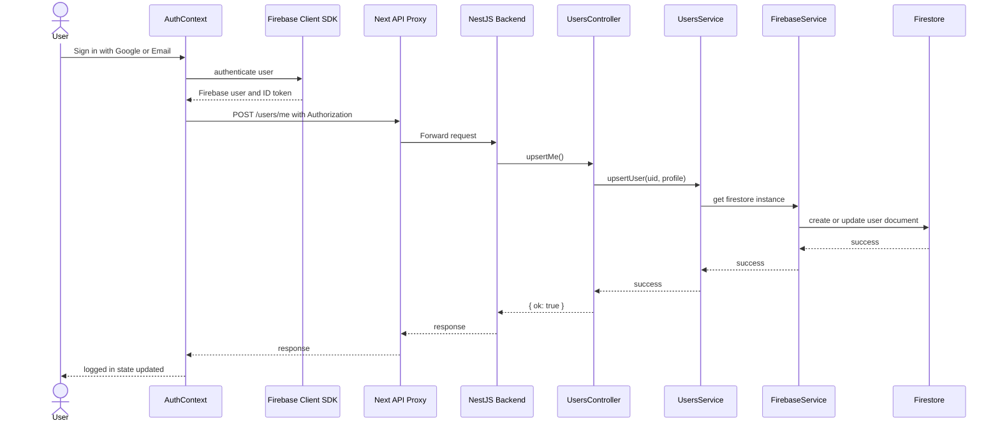
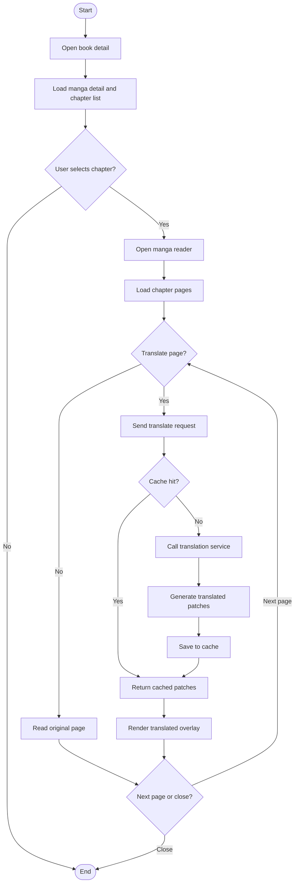
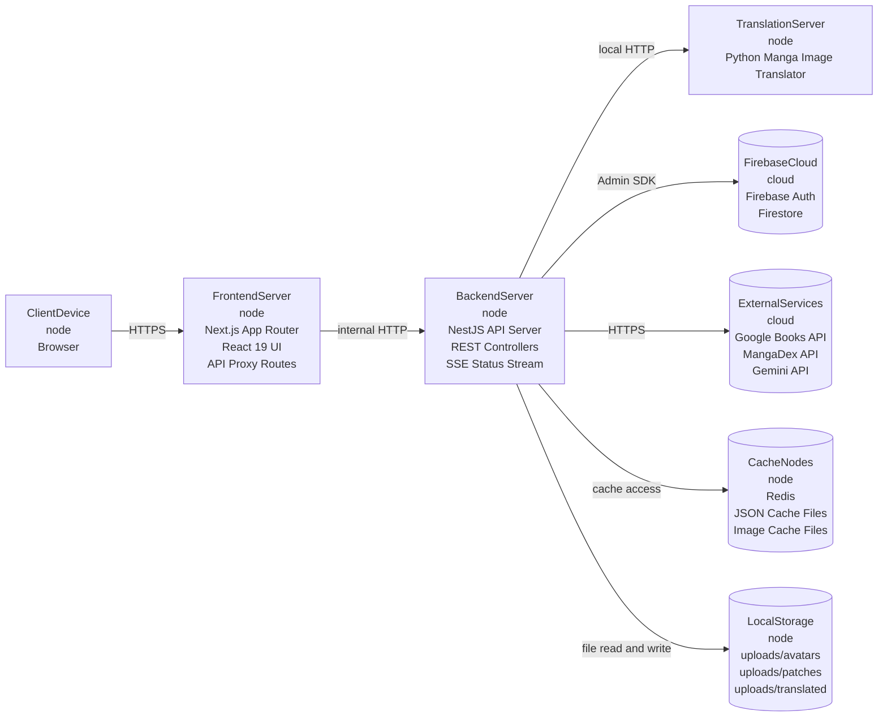

# MangaDock UML Report

เอกสารนี้รวบรวมแผนภาพ UML หลักของโปรเจกต์ MangaDock สำหรับใช้ในรายงานและการนำเสนอวิชา Software Engineering

หมายเหตุสำคัญ:

- UML ไม่ได้มีแค่แบบเดียว ภาพตัวอย่างที่เห็นบ่อยคือ Class Diagram
- สำหรับรายงานระบบนี้ ควรใช้ UML หลัก 5 แบบ คือ Use Case, Class, Sequence, Activity, Deployment
- Mermaid รองรับ UML บางประเภทได้ดีมาก เช่น classDiagram และ sequenceDiagram
- Use Case Diagram ใน Mermaid ยังไม่มี syntax UML โดยตรง จึงต้องวาดแบบจำลองใกล้เคียงหรือใช้ draw.io, StarUML, Lucidchart ถ้าต้องการ notation เป๊ะ 100%

## 1. UML Use Case Diagram

ตัวนี้เป็นเวอร์ชันสำหรับรายงานใน Mermaid ที่สื่อความหมายแบบ Use Case ให้ใกล้เคียง UML มากที่สุด

## 2. UML Component Diagram

## 3. UML Package or Module Diagram

## 4. UML Class Diagram

ภาพนี้เป็น UML แบบเดียวกับตัวอย่างที่คุณส่งมา และเป็นแผนภาพที่ควรใช้เป็นหลักในรายงาน

## 5. UML Class Diagram for Frontend Structure

## 6. UML Sequence Diagram: User Reads and Translates Manga

## 7. UML Sequence Diagram: Authentication and Profile Sync

## 8. UML Activity Diagram: Read and Translate Manga Flow

## 9. UML Deployment Diagram

## 10. Report Summary

### System Overview

MangaDock เป็นระบบอ่านหนังสือและมังงะที่ใช้สถาปัตยกรรมแบบแยก frontend และ backend อย่างชัดเจน โดย frontend พัฒนาด้วย Next.js และ backend พัฒนาด้วย NestJS พร้อมเชื่อมต่อบริการภายนอกหลายตัว เช่น Firebase, Google Books, MangaDex, Gemini และบริการแปลภาพมังงะ

### Key Design Points

- Frontend ใช้ App Router และแยก UI เป็น reusable components
- Next API routes ทำหน้าที่ proxy เพื่อลดปัญหา CORS และทำให้ client ใช้ relative URL ได้
- Backend แบ่งตามโมดูลธุรกิจ ได้แก่ books, users, cache, firebase และ status
- BooksService เป็น service กลางที่รวม content retrieval, translation และ cache orchestration
- UsersService จัดการข้อมูลผู้ใช้บน Firestore และฟีเจอร์ favorites, liked, history, profile
- ระบบมี cache หลายชั้นเพื่อเพิ่ม performance และรองรับกรณี upstream service ล่มชั่วคราว

### Recommended Usage in Report

ใช้แผนภาพตามลำดับนี้:

1. Use Case Diagram เพื่ออธิบายขอบเขตระบบ
2. Component Diagram เพื่ออธิบายภาพรวมทั้งระบบ
3. Package or Module Diagram เพื่ออธิบายการแบ่งโมดูลของ backend
4. Class Diagram เพื่ออธิบายโครงสร้าง class และ service หลัก
5. Sequence Diagram เพื่ออธิบาย flow สำคัญของระบบ
6. Activity Diagram เพื่ออธิบายขั้นตอนการทำงาน
7. Deployment Diagram เพื่ออธิบายการติดตั้งและการเชื่อมต่อบริการ

### If You Need Strict UML Notation

ถ้าต้องการ notation ให้เหมือนในหนังสือเรียนหรือรูปตัวอย่างแบบเป๊ะที่สุด แนะนำให้นำโครงจากไฟล์นี้ไปวาดต่อในเครื่องมือที่รองรับ UML โดยตรง เช่น:

1. StarUML
2. draw.io
3. Lucidchart
4. Visual Paradigm

Mermaid เหมาะมากสำหรับการทำเอกสารในโปรเจกต์และแก้ไขเร็ว แต่บาง diagram เช่น Use Case จะไม่เหมือน UML textbook แบบ 100%

หมายเหตุ:

- เนื้อหาสำหรับ Paper หัวข้อ `Phase 4: Internal Documentation and Versioning Control` ถูกแยกออกไปไว้ในไฟล์ [SE_PHASE4_INTERNAL_DOCUMENTATION.md](SE_PHASE4_INTERNAL_DOCUMENTATION.md) เพื่อให้ `UML_REPORT.md` โฟกัสเฉพาะแผนภาพ UML และไม่ปะปนกับเนื้อหาเชิงรายงาน