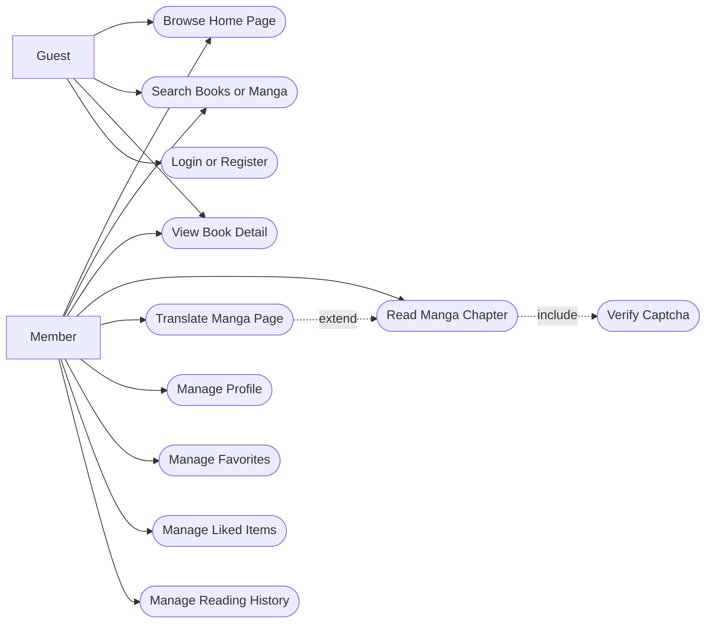
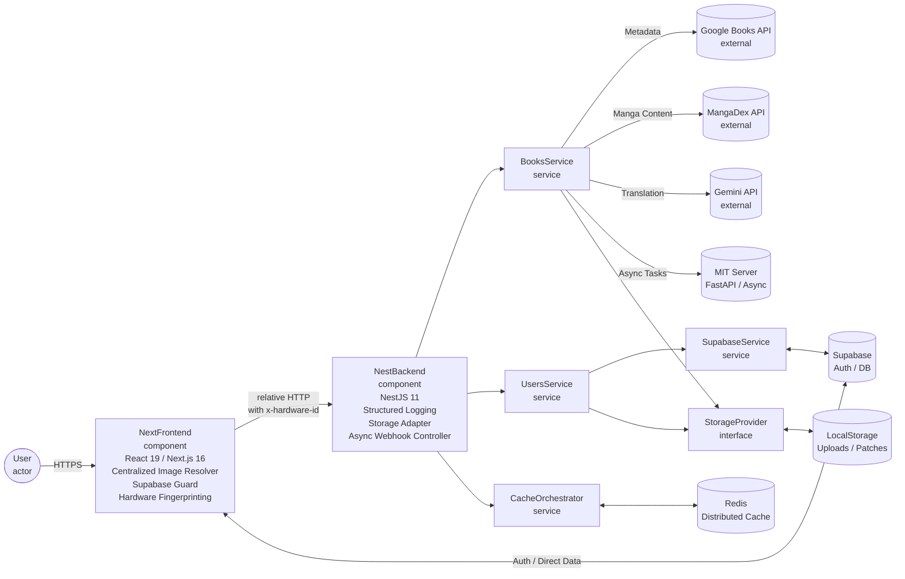
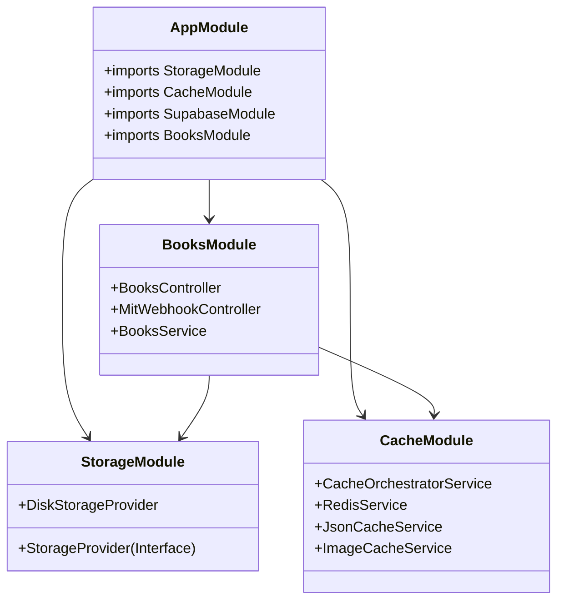
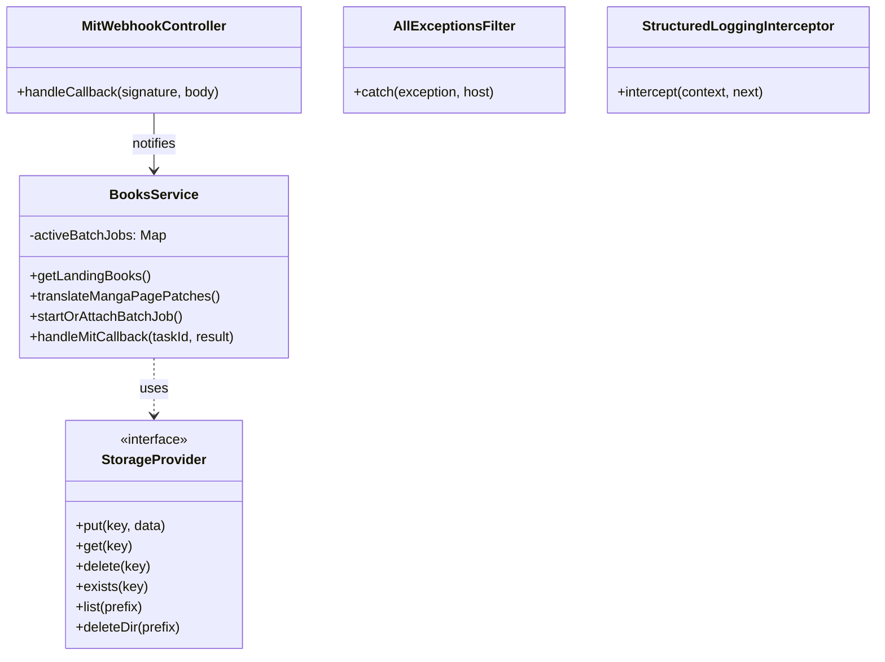
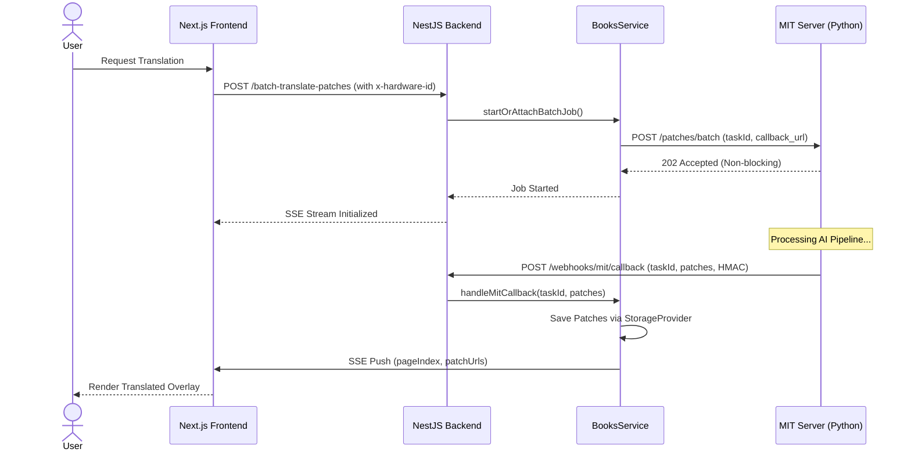
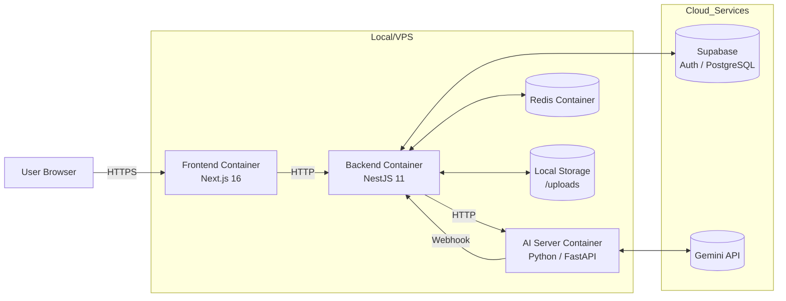

# MangaDock UML Report

เอกสารนี้รวบรวมแผนภาพ UML หลักของโปรเจกต์ MangaDock สำหรับใช้ในรายงานและการนำเสนอวิชา Software Engineering (อัปเดต Phase 1.5)

---

## 1. UML Use Case Diagram

## 2. UML Component Diagram (Phase 1.5 Optimized)

## 3. UML Package Diagram (Backend)

## 4. UML Class Diagram (Core Services)

## 5. UML Sequence Diagram: Async Manga Translation (T4-Standard)

## 6. UML Deployment Diagram (Phase 1.5 Readiness)

---

*แผนภาพ UML ชุดนี้สะท้อนโครงสร้างระบบที่มีความยืดหยุ่น (Decoupled) และพร้อมสำหรับการย้ายเข้าสู่ระบบ Cloud / Cloudflare ใน Phase ถัดไป*
