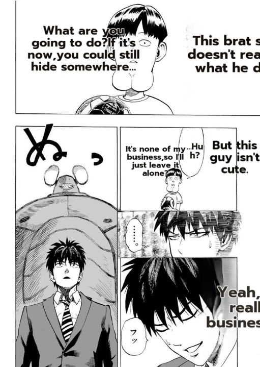
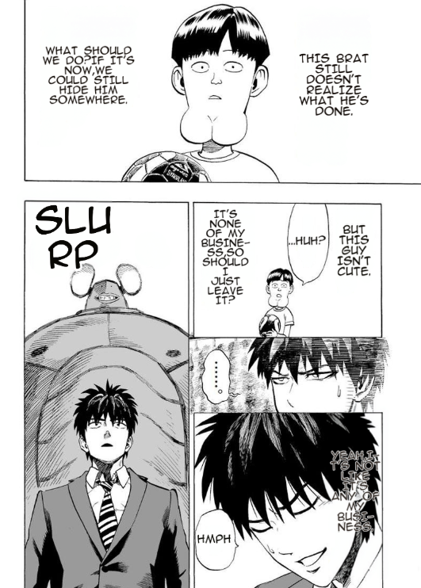

# Render-quality: before → after (One-Punch benchmark, EN)

Visual proof of the translation-render quality work that culminated in PR #277
(Flux Klein inpainter + multilingual SFX + render parity). Same page, English target.

## Before
Raw JP SFX (ぬ) left un-translated, the painted band / ghost over the dark hair, and
dialogue clipped/overflowing.

## After
SFX lettered in the target language (ぬ → "SLURP"), the band/ghost gone (texture
reconstructed), and dialogue cleanly fit in the speech balloons.

---

## เทียบ ก่อน → หลัง (ภาษาไทย)

หลักฐานภาพของงานปรับคุณภาพการ render การแปล ที่สรุปใน PR #277 (Flux Klein inpainter +
multilingual SFX + render parity) หน้าเดียวกัน เป้าหมายอังกฤษ

- **Before:** SFX ญี่ปุ่นดิบ (ぬ) ไม่ถูกแปล, painted band / ghost บนผมดำ, dialogue ตก/ล้น
- **After:** SFX letter เป็นภาษาเป้าหมาย (ぬ → "SLURP"), band/ghost หาย (texture กลับมา),
  dialogue พอดีในลูกโป่ง
