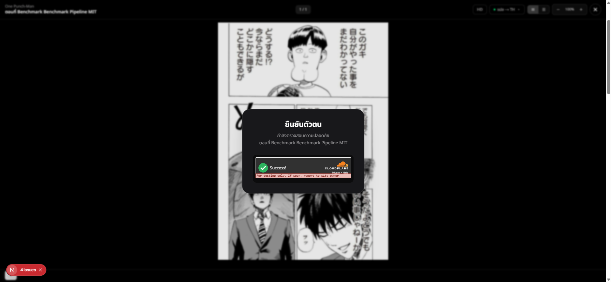

# Post-mortem — Translate dead-ends when the captcha clearance token expires

> Hotfix landed 2026-07-01. Bug reported by user; fix validated live on `localhost:4000`.

## Summary

**EN** — When a reader kept a chapter open past the 1-hour lifetime of the HWID-bound captcha
clearance token (#227), pressing **แปลหน้านี้ / แปลทั้งตอน** failed with a `401` and only surfaced an
error toast — the reader had no way to re-verify, so translation was permanently stuck until a full
page reload. The fix routes the translate `401` into the **same** captcha re-prompt the page-fetch
path already used, so the Turnstile modal re-appears and the user recovers in place. Issue: (this PR),
PR: (this PR), owner: @xenodev.

**TH** — เมื่อผู้อ่านเปิดตอนค้างไว้เกิน 1 ชั่วโมง (อายุของ captcha clearance token ที่ผูกกับ HWID, #227) การกด
**แปลหน้านี้ / แปลทั้งตอน** จะล้มเหลวด้วย `401` และขึ้นแค่ toast error — reader ไม่มีทางให้ยืนยัน captcha ใหม่ ทำให้
การแปลค้างถาวรจนกว่าจะ reload ทั้งหน้า การแก้ไขนำ `401` จากการแปลไปเข้า flow re-prompt captcha **เดียวกัน**กับที่เส้นทาง
โหลดหน้าใช้อยู่แล้ว ทำให้ Turnstile modal เด้งกลับมาและผู้ใช้กู้คืนได้ทันทีในที่เดิม

## Symptom

Console error reproduced live (identical to the user's report):

```
[PageTranslate] Translating page 1 (index 0): /api/proxy/uploads/chapters/752fc515-.../a49c7360-....jpg
Failed to load resource: the server responded with a status of 401 (Unauthorized)
  @ /api/proxy/books/chapters/ver:752fc515-.../pages/0/translate-patches
[PageTranslate] Page 1 failed: Error: Manga page patch translation failed (401):
  {"statusCode":401,"path":"/books/chapters/ver:752fc515-.../pages/0/translate-patches",
   "message":"Captcha clearance token is invalid, expired"}
    at translateMangaPagePatches (app/lib/mangaTranslatePage.ts:81)
    at async translateCurrentPage (app/hooks/useChapterTranslation.ts:339)
```

## Root cause

The captcha clearance token is a short-lived (1-hour) HWID-bound credential the reader stores in
`localStorage.cf_clearance_token` and the global fetch interceptor attaches to every backend request
(`app/lib/zeroTrustHeaders.ts`). The backend `TurnstileGuard` rejects an expired token with `401`.

Only **one** of the two code paths that hit captcha-guarded endpoints handled that `401`:

- **Page serving** — `MangaReader.tsx` page-fetch effect: on `r.status === 401` it cleared the token
  and set `turnstilePassed = false`, which re-renders the Turnstile modal. ✅ recovers.
- **Translation** — `useChapterTranslation.ts` → `mangaTranslatePage.ts`: the lib threw
  `Manga page patch translation failed (401)` / `Batch translate failed (401)`, and both `catch`
  blocks only called `showToast(...)`. Nothing reset the token or re-showed the captcha. ❌ dead-ends.

## Why it produced the symptom

The translate button stayed enabled and the token stayed stale in `localStorage`, so every retry
re-sent the same expired token → the same `401` → the same toast, with no path back to a valid token.

## Fix

Reuse the proven recovery path instead of inventing a second one:

1. `mangaTranslatePage.ts` — new pure predicate `isCaptchaExpiredError(err)` (matches `(401)` /
   `captcha clearance token`), colocated with the throw sites and unit-tested.
2. `useChapterTranslation.ts` — new `onCaptchaExpired` option; both `startTranslate` (batch) and
   `translateCurrentPage` detect the 401 via the predicate → call `onCaptchaExpired()` + a clear toast,
   and the batch path **skips its 500/network retry loop** (retrying with the same expired token would
   only 401 again).
3. `MangaReader.tsx` — extracted `resetCaptcha()` (drop token + `setTurnstilePassed(false)`) shared by
   the page-fetch 401 path and the new translate 401 path (`onCaptchaExpired: resetCaptcha`).

After a valid re-verify the global interceptor picks up the fresh `localStorage` token automatically —
the user just presses translate again. No token threading through the hook.

## How it was found

User pasted the exact `401` console error. Traced the two captcha-guarded call sites; confirmed the
page-fetch path already recovered (`MangaReader.tsx:536`) while the translate path only toasted
(`useChapterTranslation.ts` catch blocks). Reproduced deterministically by injecting a bogus
`cf_clearance_token` and pressing translate — reproduces the `401` every time.

## Why it slipped through

Latent path gap: #227 added captcha recovery to the page-fetch path but the translate feature (added
later) never wired the same recovery, and no test exercised a 401 on the translate path. Blameless —
the two paths were built at different times and the shared recovery was never extracted until now.

## Validation

- **Unit** — `mangaTranslatePage.test.ts` +4 tests for `isCaptchaExpiredError` (401 single/batch = true;
  500 / network / non-Error = false). Full frontend suite: **138 pass, 0 fail**. Typecheck clean; no new
  lint warnings.
- **Live E2E** — `localhost:4000`, real One-Punch "Benchmark" chapter, authenticated session. Injected a
  bogus token → pressed แปลหน้านี้ → backend `401` (message above) → the **Turnstile "ยืนยันตัวตน" modal
  re-appeared** (screenshot). When the Cloudflare test key auto-solved, a fresh valid token was obtained
  automatically and translation could proceed — full recovery loop confirmed.



*Coverage note:* verified on the single-page (`translateCurrentPage`) path end-to-end; the batch
(`startTranslate`) path shares the same predicate + `onCaptchaExpired` wiring and is covered by the unit
tests, not a separate live run.

## Action items / follow-ups

None — the fix is sufficient. The recovery is now a single shared `resetCaptcha()`, so a future
captcha-guarded call site inherits it by wiring the same callback.
