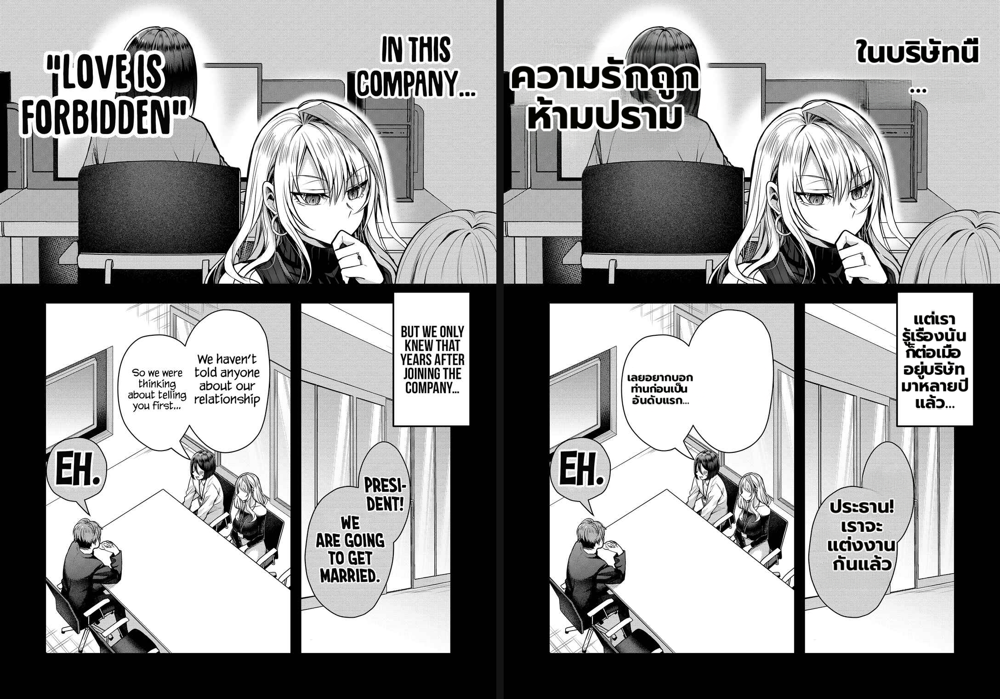

# Benchmark — display-caption sizing for clean-layout (Gal Yome EN→Thai, #175 follow-up)

- **Date:** 2026-06-30
- **Branch:** `worktree-feat-mit-font-s1` (PR #433)
- **Type:** direct-worker, per-region font telemetry (temporary `[CleanFsProbe]` log) + visual render check; real `Backend/.env` config.
- **Fix under test:** `render_overlap.clean_layout_target_fs` + display-caption sizing/wrap in `rendering._clean_layout_dst`.

## The defect (user-reported)

On the fixed renders the user flagged that big on-art **display captions** render **far smaller than the original lettering** — e.g. "LOVE IS FORBIDDEN" / "IN THIS COMPANY" (page 11). Narration was fine.

## Root cause (proven by font telemetry)

`_clean_layout_dst` sized every clean-layout (on-art / no-bubble) region with the **flat** `clean_layout_font_size` (= `font_size_max` × page-scale ≈ 26 px here), ignoring the region's **original lettering size** (`region.font_size`). Measured on page 11:

| region | original `font_size` | rendered `clean_fs` (old) | ratio |
|---|---|---|---|
| "ความรักเป็นสิ่งต้องห้าม" (LOVE IS FORBIDDEN) | **96** | 26 | **3.7× too small** |
| "ในบริษัทนี้…" (IN THIS COMPANY) | **67** | 26 | **2.6× too small** |
| narration "ดังนั้นเราเลย…" | 21 | 26 | fine (≥ original) |

So a 96 px stylized caption and a 21 px narration line came out the **same** ~26 px.

## The fix

`clean_layout_target_fs(orig_fs, clean_fs_flat)` (pure): narration (`orig ≤ flat`) returns the flat size **unchanged** (byte-identical → no #175 / ADR 025 regression); a **display caption** (`orig > flat`) renders near its **original** size (capped at 120 for sanity). `_clean_layout_dst` then:
- wraps a sized-up caption to its **own (wider) source footprint** (not the narrow narration column) so big glyphs don't break mid-word;
- shrinks the font only enough to keep the wrapped block within `1.6×` the caption's original height (`_CLEAN_DISPLAY_H_TOL`), never below the flat size.

## Result (original | fixed)

- "ความรักถูกห้ามปราม" now renders **large**, wrapped cleanly to 2 lines ("ความรักถูก / ห้ามปราม") at word boundaries — matching the original "LOVE IS FORBIDDEN" prominence (was a single tiny 26 px line).
- "ในบริษัทนี้…" renders large, matching "IN THIS COMPANY…".
- Narration bubbles unchanged.

`test_render_overlap` + `test_ocr_vlm` **68/0** (3 new `clean_layout_target_fs` cases: narration-unchanged / display-tracks-original / cap-runaway).

## Assessment

- **The "เล็กกว่า original" defect is fixed** — display captions track their original lettering size instead of collapsing to narration size.
- **No narration regression**: the flat clean-layout path (ADR 025) is byte-identical for `orig ≤ flat` (proven by the pure test + the unchanged narration in the render).
- **Remaining (deferred, agreed):** #436 — page 11 "We haven't told anyone…" is translated correctly but a second overlapping balloon still renders empty; page 4 bubble 2 clips behind its neighbour. Separate (overlapping-bubble) work.

**Verdict:** ship.
