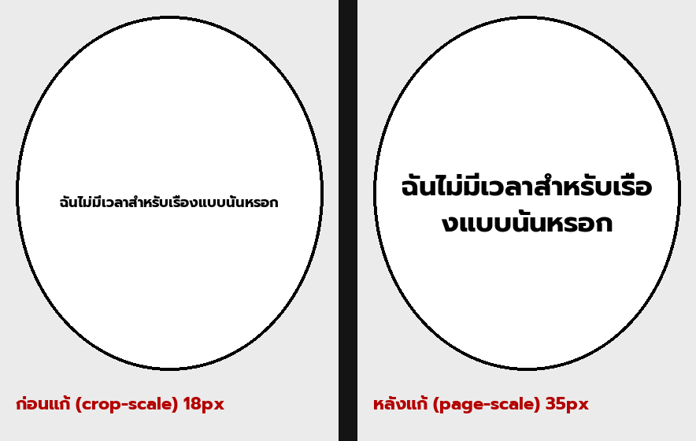

# Benchmark — clean-layout narration page-scale fix (#175 / ADR 025)

- **Date:** 2026-06-30
- **Type:** deterministic, non-E2E (no browser/Reader, no translation, no GPU)
- **Branch / commit:** `worktree-feat-mit-font-s1` · 70c6bf1 (fix), 0f26428 (docs)
- **What changed:** clean-layout narration font now scales by the full **page** area, not the per-region **crop** area (`_clean_layout_dst` ← `page_shape`).

## Method (why deterministic)

The existing A/B scripts (`MIT/tools/ab_*.py`) all go through the worker and **re-translate** each run → the `custom_openai` translator is non-deterministic, so an OLD-vs-NEW page render is confounded (different text/wrapping each time). This bug is also **patch-path-only** (it needs per-region crops). So this benchmark isolates **only the font-size change**: it calls the real fix function `clean_layout_font_size` directly across representative crop sizes, and renders the **same** Thai narration into identical balloon boxes at the OLD vs NEW px with the real `Prompt-Bold` font. Re-runs are byte-identical.

Script: `scratchpad/bench_clean_pageshape.py` (throwaway measurement harness).

## Quantitative result

Narration string: `ฉันไม่มีเวลาสำหรับเรื่องแบบนั้นหรอก` · `MIT_FONT_SIZE_MAX=20` · page 1456×2048 (~3 MP) · `page_scaled_font_min=18`.

| crop (W×H) | crop MP | processing_scale | OLD px (crop) | NEW px (page) | ratio |
|---|---|---|---|---|---|
| 360×300 | 0.11 | 0.50 (floor) | **18** | **35** | 1.94× |
| 502×434 | 0.22 | 0.50 | **18** | **35** | 1.94× |
| 600×550 | 0.33 | 0.57 | **18** | **35** | 1.94× |
| 834×642 | 0.54 | 0.73 | **18** | **35** | 1.94× |

**Key finding:** OLD pins at the 18px floor for **every** crop — `processing_scale(crop)` collapses to 0.50–0.73, so `20 × that = 10–15 px` falls below the page-scaled floor (18) and is clamped. That is why narration looked uniformly tiny chapter-wide regardless of balloon size. NEW = `20 × processing_scale(3 MP) = 35px` (the designed size) → **≈1.94× larger, consistently**.

## Comparison image

*Same balloon, same Thai narration: left = before (crop-scale, 18px, microscopic, lost in the balloon); right = after (page-scale, 35px, readable, fills the balloon).*

## Assessment

| Dimension | Verdict | Note |
|---|---|---|
| Fixes the root cause | ✅ strong | narration 18→35px on every page; matches the user-observed symptom |
| No regression | ✅ | render golden byte-identical (full-page path → `page_shape=None` → unchanged); dialogue/bubble-fit untouched |
| Matches design | ✅ | 35px = intended size (`font_size_max` × page scale), not an arbitrary number |
| Completeness | ⚠️ partial | fixes the **size**; does not change **which** regions are routed to clean-layout (rw/bw discriminator unchanged) |
| Tuning lever | — | absolute size still controlled by `MIT_FONT_SIZE_MAX` |

Cross-checked against the earlier live E2E (Gal Yome EN ch1 p14 → Thai): the previously-microscopic top-right narration rendered as readable 3-line text, no crash, nothing oversized — consistent with this ~1.94× measurement.

**Verdict:** good — addresses the root cause, measurable ~1.94× improvement that is uniform across balloon sizes, zero regression. Remaining items are separate concerns (narration *routing*, and the SFX-over-dialogue overlap #436).
