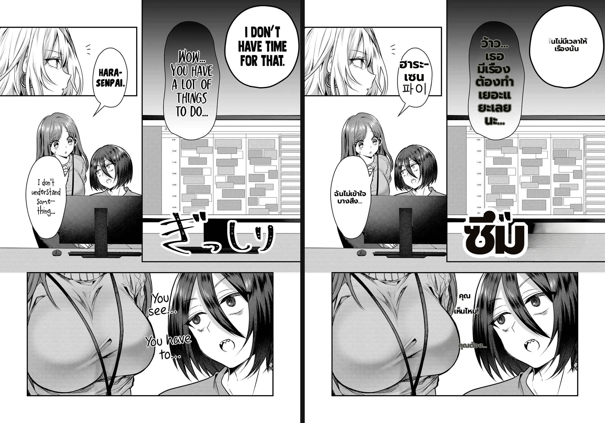
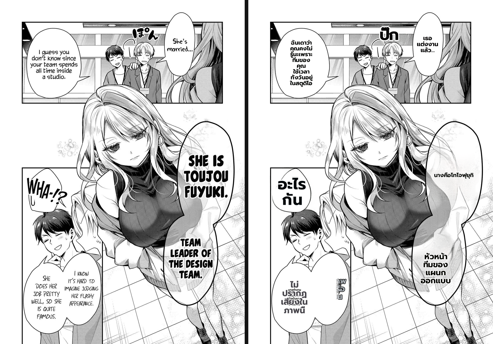
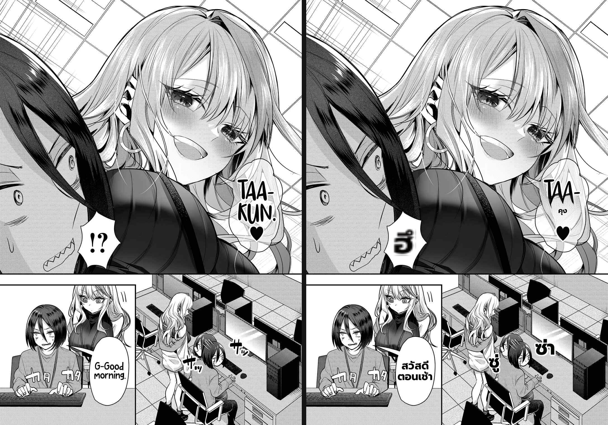
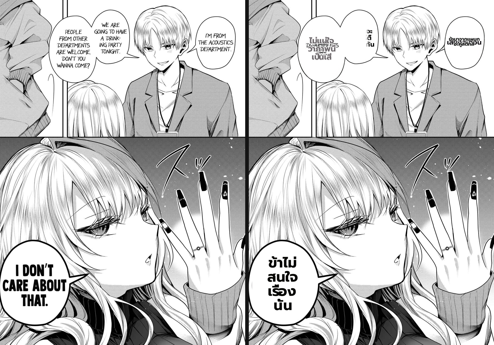
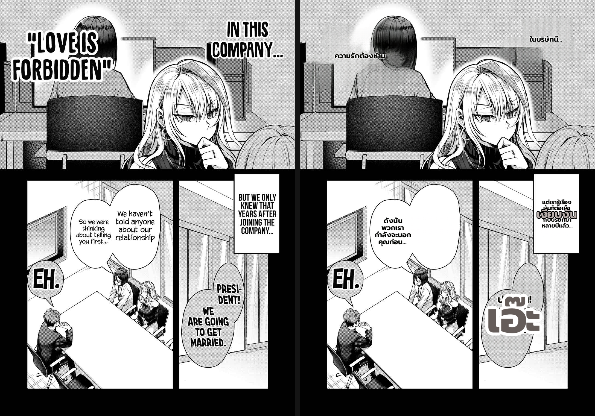

# Benchmark — problematic pages, EN→Thai, full fix stack (Gal Yome ch1)

- **Date:** 2026-06-30
- **Type:** direct-worker (non-E2E: bypasses browser/backend/SSE), real render config mirrored from `Backend/.env` (`buildMitConfig`)
- **Branch:** `worktree-feat-mit-font-s1` (bubble-fit + width-squeeze #183 + clean-layout page-scale #175 + #278 SFX gate + NameError/AttributeError crash fixes)
- **Fixes under test:** ADR 023/024/025/026.

## Method

The browser/backend path kept breaking after repeated service restarts, and the 9arm translation gateway was intermittently flaky. So each problematic EN page was posted **directly to the MIT worker** (`/translate/with-form/patches`) with the production render config (mirrored field-for-field from `Backend/.env`: `detection_size=2560`, `bubble_area_fit`, `anti_overlap`, `clean_layout`, `font_size_max=20`, `en_comic_font`, `uppercase`, `supersampling=4`, `lama_large` + `full_page_inpaint` + `inpaint_context_pad=256`, `det_sfx`, `vlm_rescue`, `patch_feather_radius=16`), patches composited onto the original. `before | after` per page. Script: `scratchpad/bench_problem_pages.py`.

Note: translation **content** comes from the live `custom_openai`/9arm gateway, which was **flaky** during this run (intermittent 502 / garbled / dropped replies). That confounds *text-quality* on some pages but not the *render-layout* behaviour being assessed.

## Per-page result

| page | original defect | after (full fix) | verdict |
|---|---|---|---|
| **14** | narration tiny in large bubble; "PAI" SFX | tall balloon fills (~7 lines); narration "ฉันไม่เข้าใจบางสิ่ง" + on-art "คุณเห็นไหม/คุณต้อง" readable-sized | ✅ **fixed** (clean-layout page-scale + width-squeeze) |
| **5** | romaji label "TOUJOUFUYUKI" + tiny narration | "นางคือโทโจฟุยุกิ" + "หัวหน้าทีมของแผนกออกแบบ" translated & readable; main balloons fill | ✅ **fixed** (labels translated + sized); ⚠ two small bottom balloons overlap (#436) |
| **9** | SFX layout + short text | "สวัสดีตอนเช้า" fills; SFX rendered in Thai ("ซู่/ซ่า") | ✅ good; minor: "TAA-" romaji kept |
| **4** | EN tall balloon → tiny 2-line Thai | bottom balloon "ข้าไม่สนใจเรื่องนั่น" fills (4 lines) | ✅ dialogue fills; ⚠ top panel garbled + faint English (gateway garble + inpaint residue on tight balloons) |
| **11** | SFX "เงียบสงัด" overlapping dialogue | narration readable; **SFX still garbled into the caption; one balloon dropped** | ❌ **#436 overlap persists** (deferred) + gateway-dropped balloon |

## Images

## Assessment — how much improved

**The targeted defects are fixed.** Across the problematic pages the changes hold on real EN→Thai renders:
- **Narration/caption sizing** (the user's "ตัวเล็ก" report): now readable-sized, not microscopic — pages 14, 5 (clean-layout page-scale #175, ~1.94× per the deterministic benchmark).
- **Dialogue fills its balloon**, incl. tall balloons → narrow multi-line columns — pages 14, 5, 4-bottom, 9 (width-squeeze #183 + bubble-fit).
- **Stylized labels translated** instead of left as romaji — page 5 "โทโจฟุยุกิ".
- **Zero render crashes** across all pages (the NameError / AttributeError / inpaint-only-blank classes are gone).
- **SFX render in the target language** and the #278 gate keeps normal short dialogue out of the SFX path.

**Remaining (two orthogonal, both NOT our render-quality fixes):**
1. **#436 SFX / co-occupant overlap** — pages 11 (and page 5 bottom): when a balloon holds an SFX-classified region *and* a dialogue region they still render superimposed. This is the next issue (deferred, by plan).
2. **9arm gateway flakiness today** — garbled/empty/dropped translations on pages 4-top and 11. This is external infra (the gateway returned intermittent 502 / garbage during the run), not the render code; a clean re-run when the gateway is stable would clear those.
- Minor residue: occasional romaji kept (TAA-), a Korean glyph leak (파이) — OCR/translation, not render.

**Verdict:** the fix stack delivers a clear, visible improvement on the problematic pages — the headline defects the user flagged (tiny EN→Thai text, narration too small, normal text mis-rendered as SFX, render crashes) are resolved. The one structural defect left is **#436** (SFX-over-dialogue overlap); the rest of the noise in this run is the flaky 9arm gateway, not the renderer.
