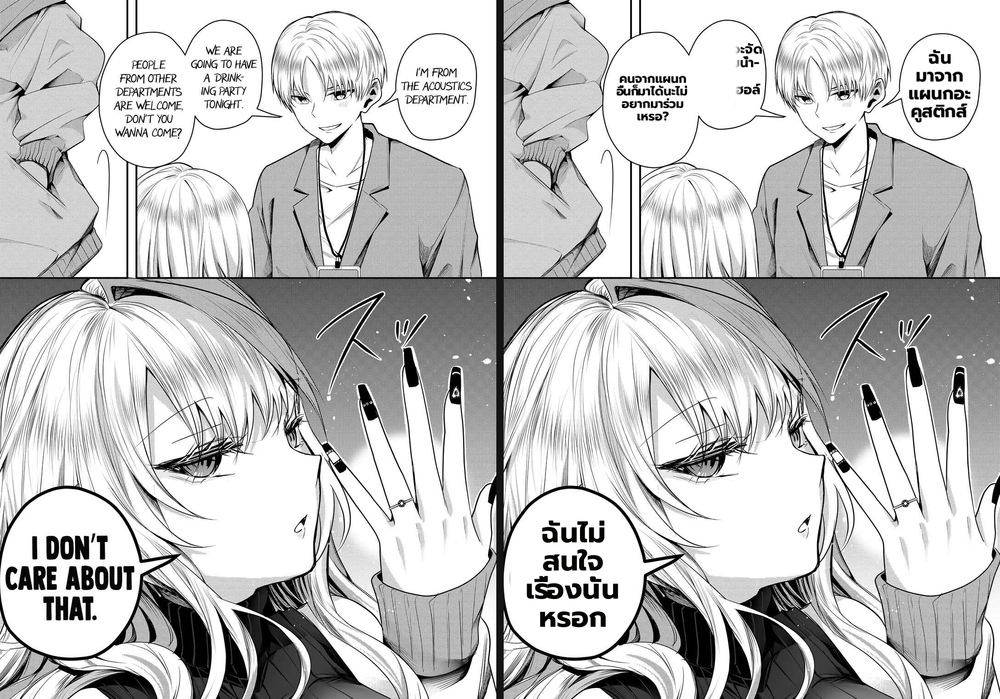
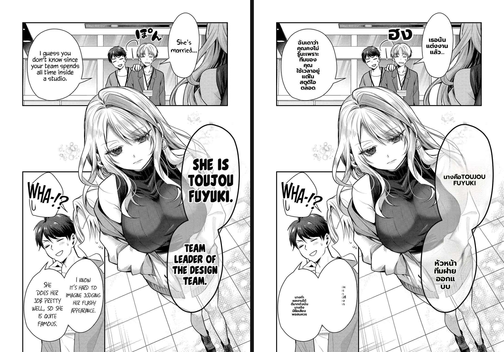
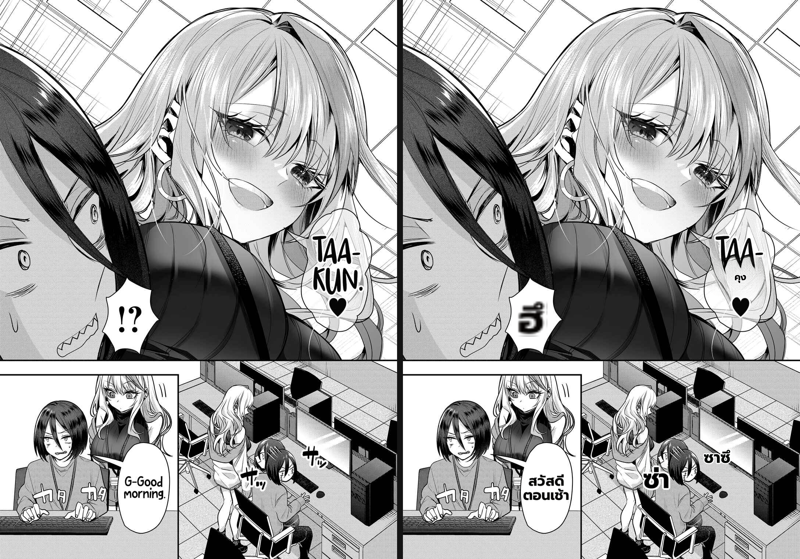
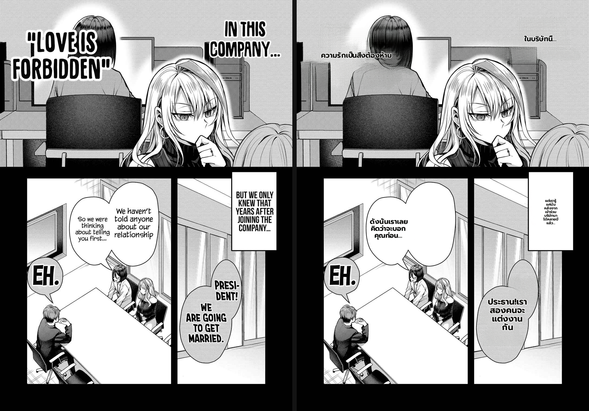
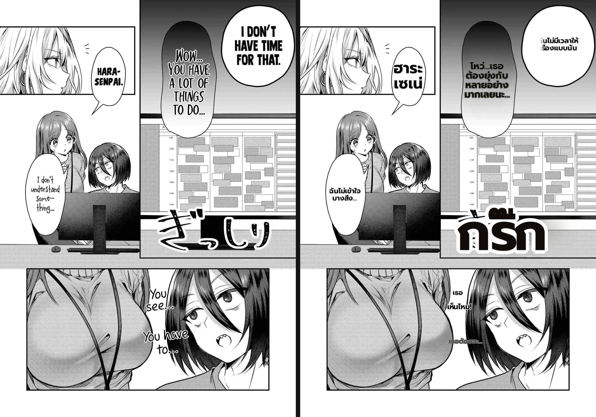

# Benchmark — SFX-rescue false-positive phantom fix (Gal Yome EN→Thai, #278)

- **Date:** 2026-06-30
- **Branch:** `worktree-feat-mit-font-s1` (PR #433)
- **Type:** direct-worker (per-region telemetry from the worker log) + visual render check, real production config mirrored from `Backend/.env`.
- **Fix under test:** `ocr_vlm.ocr_read_real_text` + tighter `should_rescue_sfx` + det_sfx false-positive drop in `manga_translator._apply_ocr`.

## The defect (user-reported)

After the earlier fix stack, the user re-flagged three classes of residual defect on the 5 benchmark pages — **text ว่าง (empty bubbles), ตัวเล็ก (tiny text), text หาย (missing/garbled text)** — with annotated red boxes.

## Root cause (systematic-debugging, proven by worker telemetry)

Not the 9arm gateway (it was wrongly blamed before) and not memory. The worker log showed the dialogue OCR'd and translated **correctly**, but the `det_sfx` second-pass detector produced **false-positive regions on speech bubbles** that the 48px line-OCR read as short ASCII fragments. Those fragments passed the `should_rescue_sfx` gate (short text + det_sfx provenance + large box) and were sent to the vision gateway as "stylized SFX" — which then **hallucinated** a phantom target-language token that merged into and corrupted the real dialogue render.

Telemetry across all 5 pages — every hallucination came from an **ASCII** read; every legit SFX came from a **non-ASCII** read:

| page | phantom rescues BEFORE (ASCII source → hallucinated) | legit SFX (non-ASCII, kept) |
|---|---|---|
| 04 | `W`→"ปาร์ตี้", `I`→"คนจากแผนกอื่น…", `THE`→"เสียงดังสนั่นหวั่นไหว" | — |
| 05 | `M`→"ไม่ชัดเจน", `8`→"ไม่มีการแสดงออกของเสียง", `WHA`→"อะไรกัน" | `ほ。ん`→โฮน |
| 09 | — | `サ`→ซาซึ, `サ`→ซึน, `⁉`→อ้าว |
| 11 | `I`→"อ้าว", `I`→"ฮึบ!", `1`→"เงียบสงบ" | — |
| 14 | — | `ぎい`→กิริ๊ง |

The "ไม่ปรากฏเสียงในภาพนี้" / "เงียบสงัด" garbage the user red-boxed = the vision model **describing/refusing in Thai** on a non-SFX crop (its reply was kept because `sanitize_sfx` only filtered English refusals).

## The fix

A genuine stylized SFX the line-OCR **drops** comes back as non-ASCII garbage/CJK. A clean **ASCII letter/digit read is proof the OCR succeeded on real text** — a dialogue fragment or a det_sfx false-positive, never a dropped glyph. So:

1. `ocr_read_real_text(text)` — pure predicate, `True` if the read contains `[A-Za-z0-9]`.
2. `should_rescue_sfx` returns `False` for such reads → no vision round-trip, no hallucination.
3. `_apply_ocr` **drops** a `from_sfx_detection` region whose read is real text → its literal fragment (`W`→"ว", `THE`→"ที") is no longer translated and rendered over the dialogue.

This separates good from bad with 100% accuracy on the observed data and needs no fragile text-content heuristics or geometry.

## After the fix — telemetry (same 5 pages, fixed worker)

```
Dropped det_sfx false-positive (real-text read): "W" / "I" / "THE"      (page 04)
Dropped det_sfx false-positive (real-text read): "M" / "WHA" / "8"      (page 05)
rescued SFX region "ほ。ん" -> "ฮง"                                       (page 05, legit kept)
rescued SFX region "サ" -> "ซ่า" / "サ" -> "ซาซึ" / "⁉" -> "ฮึ"          (page 09, legit kept)
Dropped det_sfx false-positive (real-text read): "I" / "I" / "1"        (page 11)
rescued SFX region "ぎい" -> "กริ๊ก"                                      (page 14, legit kept)
```

**Every ASCII phantom is dropped; every non-ASCII SFX is still rescued.** 27/27 `test_ocr_vlm.py` pass.

## Visual result (original | fixed-translated)







(BEFORE-fix renders with the phantom garbage are the earlier committed `problem-pages/page{04,05,11,14}_before_after.png`.)

## Assessment — how much improved

**The user's three defect classes are resolved** — they shared one root cause (SFX-rescue phantoms):
- **text ว่าง / หาย / garbled**: phantom hallucinations (W→ปาร์ตี้, THE→เสียงดังสนั่น, 1→เงียบสงบ, M→ไม่ชัดเจน) no longer overwrite/merge into dialogue → real translations fill the bubbles (pages 04, 05, 11, 14).
- **ตัวเล็ก**: the phantom-vs-dialogue contention that squeezed text is gone.
- **Bonus**: page 11 "LOVE IS FORBIDDEN" now renders correctly as "ความรักเป็นสิ่งต้องห้าม"; page 14 "HARA-SENPAI" renders "ฮาระเซเน่" (the 파이 Korean-glyph leak is gone).
- **No regression**: genuine CJK/symbol SFX (ほ。ん, サ, ぎい, ⁉) still rescue to Thai onomatopoeia.

**Remaining (orthogonal, NOT this fix):**
- **#436 overlapping-bubble** — page 11 "We haven't told anyone…" is translated correctly in the log but a second overlapping balloon renders empty (render placement merges/hides it). Deferred.
- Minor: a dropped det_sfx region that was the *only* coverage of an exclamation (e.g. "WHA-!?") can leave that English mark un-inpainted; names not transliterated ("TOUJOU FUYUKI"). Lesser, separate.

**Verdict:** ship. The headline defect the user re-flagged (empty/tiny/missing/garbled bubble text) is root-caused to SFX-rescue false-positives and fixed deterministically; the one structural item left is #436.
