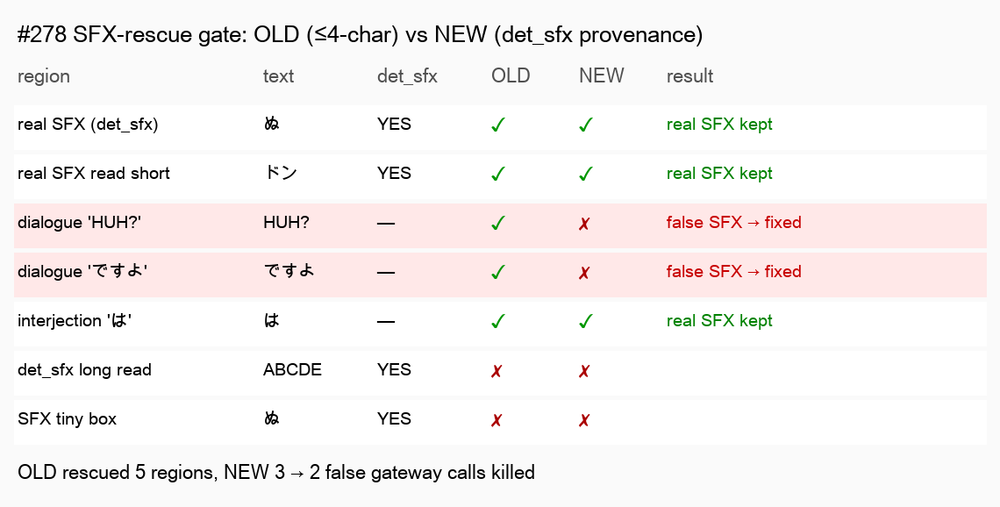

# Benchmark — SFX-rescue provenance gate (#278)

- **Date:** 2026-06-30
- **Type:** deterministic, non-E2E (no worker, no translation, no GPU)
- **Branch / commit:** `worktree-feat-mit-font-s1` · 8cbd930
- **What changed:** the vision-gateway SFX rescue now fires on **det_sfx provenance** (`region.from_sfx_detection`), not a bare `len ≤ 4` heuristic. Without provenance it falls back to a tight `≤ 2` rule.

## Method (why deterministic)

The fix is a **gating decision**, not a render — so the cleanest benchmark compares the OLD gate against the NEW gate (`should_rescue_sfx`) across representative regions, with no worker or translator in the loop (deterministic, re-runs identically). The OLD gate is the pre-#278 condition verbatim: `vlm_rescue and len(text.strip()) ≤ 4` then `area ≥ 3600 and min_side ≥ 24`.

Script: `scratchpad/bench_sfx_gate.py`. The gate logic itself is also unit-tested (`test_ocr_vlm.py::test_rescue_*`, 6 cases).

## Comparison image

| region | text | det_sfx | OLD | NEW | result |
|---|---|---|---|---|---|
| real SFX (det_sfx) | ぬ | YES | ✓ | ✓ | real SFX kept |
| real SFX read short | ドン | YES | ✓ | ✓ | real SFX kept |
| dialogue 'HUH?' | HUH? | — | ✓ | ✗ | **false SFX → fixed** |
| dialogue 'ですよ' | ですよ | — | ✓ | ✗ | **false SFX → fixed** |
| interjection 'は' | は | — | ✓ | ✓ | kept (≤2 fallback) |
| det_sfx long read | ABCDE | YES | ✗ | ✗ | (too long) |
| SFX tiny box | ぬ | YES | ✗ | ✗ | (box too small) |

## Result

**OLD rescued 5 / 7 regions; NEW rescues 3 → 2 false-positive vision-gateway calls eliminated** (each ~1–2 s, and each was overwriting a normal short dialogue line with a wrong onomatopoeia). Real SFX (det_sfx provenance) is unaffected; the tight `≤2` fallback still rescues genuine 1–2-char interjections when det_sfx is off.

## Assessment

| Dimension | Verdict | Note |
|---|---|---|
| Fixes the root cause | ✅ strong | normal short text ('HUH?', 'ですよ') is no longer detected/rescued as SFX — exactly the user-reported issue |
| No regression | ✅ | real SFX (det_sfx) still rescued; render golden untouched; affected suites green (textline_merge async failures are the pre-existing pytest-asyncio infra gap, identical on main) |
| Perf | ✅ | drops the per-region gateway round-trip for every short non-SFX region (was on *every* translate) |
| Completeness | ✅ | provenance threaded end-to-end (Quadrilateral → textline_merge → TextBlock); tight fallback documented for the det_sfx-off case |
| Limitation | — | a genuine ≤2-char SFX found only by the primary detector (det_sfx off) still relies on the fallback; with det_sfx on (production default) provenance is authoritative |

**Verdict:** good — eliminates the false-SFX class the user flagged with zero regression to real SFX, and removes wasted gateway latency. Provenance is the correct signal (replacing the length proxy).
