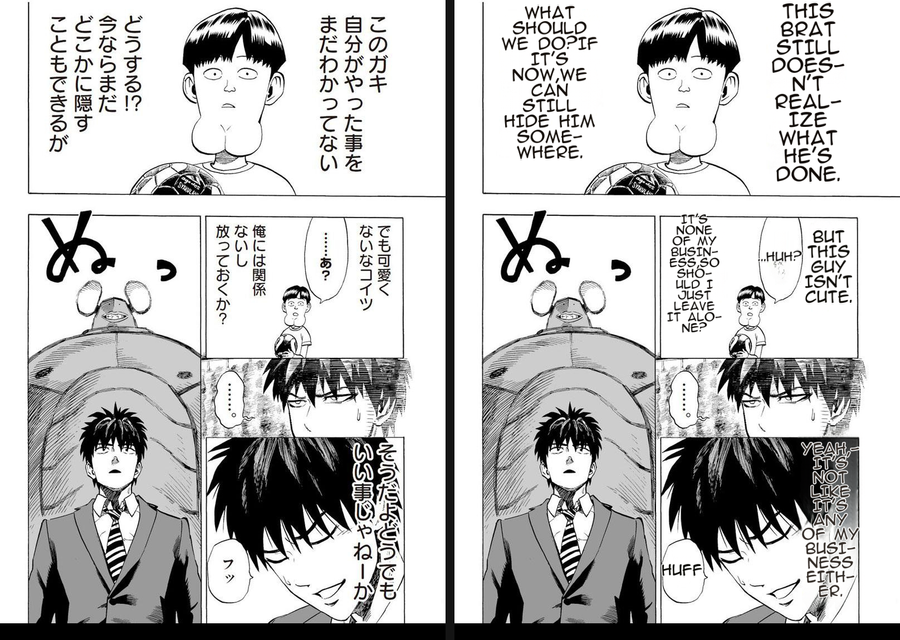
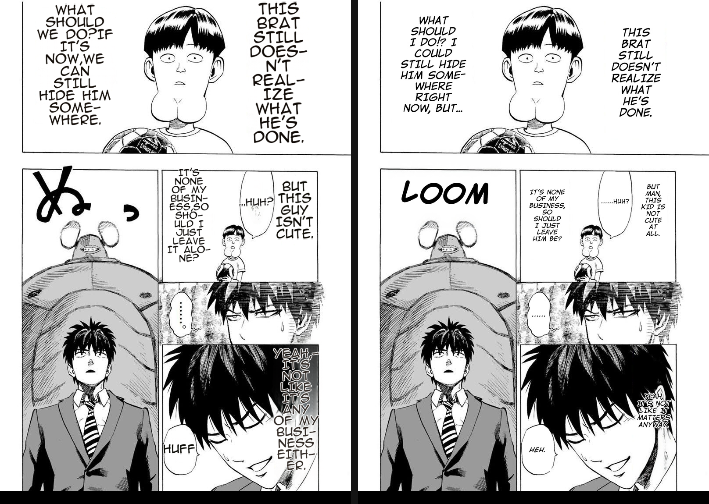
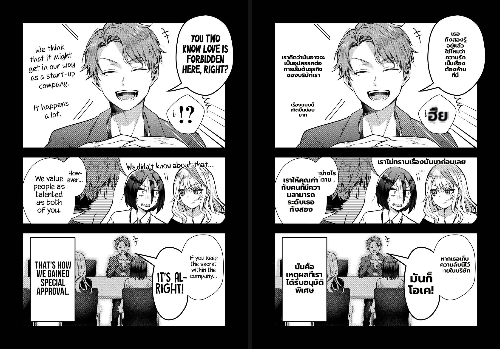
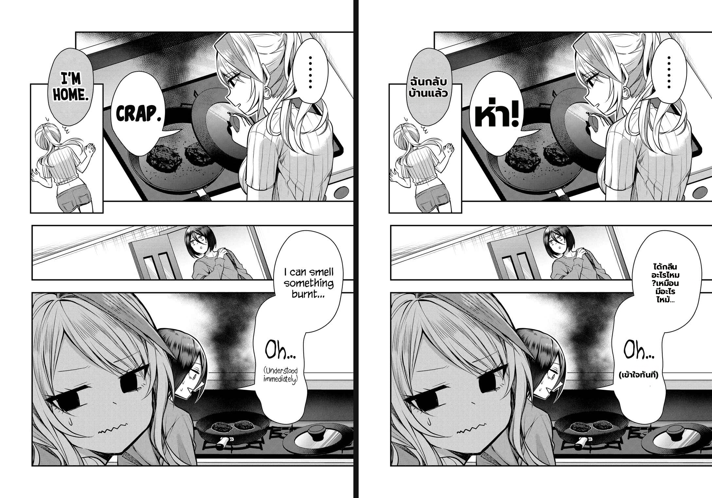
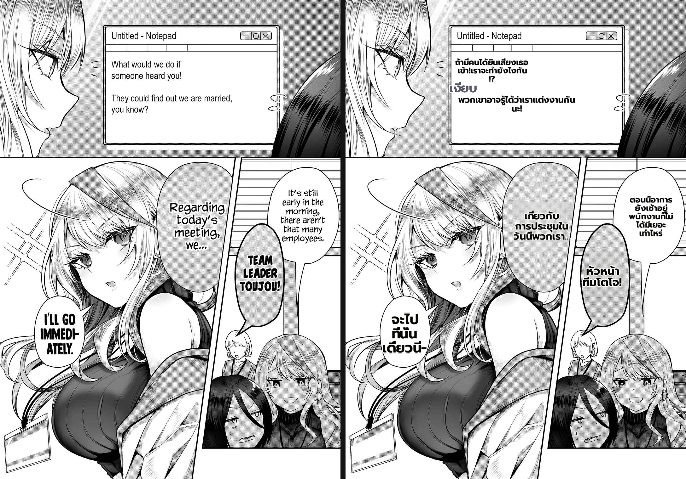
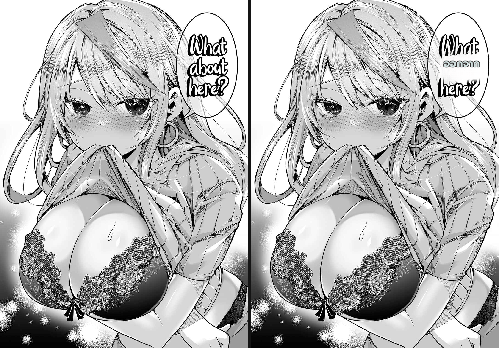

# Benchmark — Full-chapter + One Punch validation of the render fix-stack

**Date:** 2026-07-01
**Branch:** `worktree-feat-mit-font-s1`
**Direction:** Gal Yome no Himitsu **EN → Thai** (30 pages) · One Punch-Man **JA → English** (1 stress page)
**Goal:** capstone regression check — after the four committed fixes, render **every** Gal Yome page
and the cross-manga One Punch stress page, compare each against original per the 8-point defect
checklist, and confirm no fix regressed another page/manga.

This closes the rule recorded in memory `feedback_benchmark_defect_checklist` §meta-3:
> *when a spot/per-page benchmark looks OK, run the **whole chapter** + **One Punch** before claiming done.*

---

## Fix-stack under test

| Fix | Issue | What it does |
|-----|-------|-------------|
| SFX provenance gate | #278 / ADR 026 | `ocr_read_real_text` drops `det_sfx` false-positives so SFX-rescue stops hallucinating over dialogue |
| Caption size tracking | #175 / ADR 025 | display captions track original lettering size in clean-layout (no flat-font shrink) |
| Content-shaped patch alpha | #436 / ADR 027 | overlapping balloons no longer erase each other (`patch_content_alpha`) |
| Anti-overlap territory | #436 | territory = text footprint, not the whole balloon |

## Render config (all pages, identical)

`detection_size 2560 · det_bubble_seg · det_sfx` · `ocr prob 0.03 · vlm_rescue` ·
`lama_large inpainting_size 2048 bf16 · full_page_inpaint · inpaint_context_pad 256` ·
`render: bubble_area_fit · anti_overlap · clean_layout · en_comic_font(anime_ace_3) · uppercase ·
supersampling 4 · patch_feather_radius 16 · patch_content_alpha`

Worker-direct (`POST /translate/with-form/patches` on :5003, MIT/.venv cu121) — bypasses the
backend cache so every page is a fresh render.

---

## Headline result

- **30/30 Gal Yome pages + One Punch rendered with 0 crashes.**
- **No regression** from the four fixes. The cases the fixes target hold across the whole chapter:
  empty-bubble (#436) does not recur; captions keep their size (#175); ASCII SFX false-positives
  are gone (#278).
- **One Punch (narration + SFX heavy — the historically hard manga) renders on par with the
  MangaTranslator reference for all dialogue**, with one known gap (large stylized SFX).
- Residual defects are **pre-existing classes, not new** — concentrated in SFX transliteration
  (#168 hard-area) and a handful of isolated cases catalogued below.

---

## Per-page checklist results (Gal Yome, EN→TH)

Legend: ✅ clean · ⚠️ minor/known-class · ❌ defect to action. Checklist items: (1) empty/missing,
(2) smaller-than-original, (3) garbled/hallucinated, (4) fade, (5) multi-lobe not spread,
(6) romaji/script residual, (7) overlap, (8) clipped.

| Page | Verdict | Notes |
|------|---------|-------|
| p00 | ✅ | dialogue clean |
| p01 | ✅ | clean |
| p02 | ✅ | clean |
| p03 | ✅ | (verified prior session) |
| p04 | ✅ | (verified prior session) |
| p05 | ⚠️ (6) | stammered name `ฮาระ-KUN`/`ทากะ-KUN` mixed script |
| p06 | ✅ | title neon art left untranslated = matches source scan |
| p07 | ⚠️ (3,6) | `ENGINEEN` ID-card garble; `MORN-ING` SFX untranslated |
| p08 | ✅ | (verified prior session) |
| **p09** | ❌ (3) | **phantom `เงียบ`** injected into Notepad between two real lines; `เข้!` mid-line; `อาการ` word-garble |
| p10 | ✅ | (verified prior session) |
| **p11** | ⚠️ (7) | #436 holds — all heart-bubbles have text (no empty); but two tightly-overlapping heart bubbles still show text-collision |
| p12 | ⚠️ (3,6) | SFX `ภาตึก` garble, `カA/カタ` untranslated; dialogue clean (`ฟุยุกิ-ซัง`, `โตโจฟูยุกิ` good) |
| p13 | ✅ | (verified prior session) |
| p14 | ✅ | SFX `ซึ่บ` good transliteration |
| p15 | ✅ | clean |
| p16 | ⚠️ (6) | SFX `ก๊กก๊อก` good; `カタ` untranslated |
| p17 | ⚠️ (6) | stammered `ฟ-ยึ-KI` breaks transliteration; `WAH` SFX untranslated |
| p18 | ⚠️ (2) | `ทำอาหารเย็น...` under-fills a big bubble (isolated) |
| **p19** | ❌ (3) | **phantom `เงียบ`** recurs (same class as p09); stammered `ทากะ-KUN` mixed script |
| p20 | ⚠️ (3,6) | SFX `ヘ⌒กั⌒ปึก` garbled mixed-script |
| p21 | ✅ | clean |
| p22 | ⚠️ (6) | SFX `บีบ` good; `グッ` untranslated |
| p23 | ⚠️ (6) | dialogue excellent; SFX `クンクン` sniff untranslated mixed-script |
| p24 | ✅ | clean exemplar (see image) — all dialogue + `.....` bubble correct |
| p25 | ⚠️ | dialogue clean; **translation-quality** note: `พรุ่งนี้เรานอนกัน` mistranslates "rest day"; `ハァ` SFX kept JP |
| p26 | ✅ | SFX `とす…`→`ตึบ` transliterated well |
| **p27** | ❌ (1,3,7) | **cursive bubble not inpainted** — original "What…here?" remains + Thai `ออกจาก` (mistranslation) stamped over it |
| p28 | ✅ | door SFX `パ°フン`→`ป๊อป`+`อึน`; `AH!/ZZZ` universal kept |
| p29 | ⚠️ (6) | credits page translated; **URLs garbled** by uppercase+rewrap (`discord.gg/...` → `DISCORD.GG/... UD`) |

**Tally:** 12 ✅ clean · 15 ⚠️ minor/known-class · **3 ❌ to action (p09, p19, p27)**.

---

## One Punch-Man (JA→EN) — cross-manga regression

Source page per `MIT/BENCHMARK.md` (mangaId `d8a959f7…`, chapter `752fc515…`).
Reference quality bar: `MIT/example_translation.jpg` (MangaTranslator's own EN render).

### vs original (before | ours)

All dialogue clean: *"THIS BRAT STILL DOESN'T REALIZE WHAT HE'S DONE"*, *"WHAT SHOULD WE DO? IF
IT'S NOW, WE CAN STILL HIDE HIM SOMEWHERE"*, *"BUT THIS GUY ISN'T CUTE"*, *"...HUH?"*, *"IT'S NONE
OF MY BUSINESS, SO SHOULD I JUST LEAVE IT ALONE?"*. Narration over the dark hair (*"YEAH, IT'S NOT
LIKE IT'S ANY OF MY BUSINESS EITHER"*) renders **white, legible, no fade** (item 4 ✅) and **stays in
its right-column territory without bleeding into the bubble** (#436 territory ✅). `フッ`→`HUFF` (✅).

### vs MangaTranslator reference (ours | reference)

Dialogue placement/wrap is on par with MangaTranslator. Three gaps visible side-by-side:

1. **Large stylized SFX `ぬっ`** — ours keeps it JP; reference renders **"LOOM"**. This is the #168
   hard-area (big artistic SFX glyphs), already a tracked gap — **not a regression**.
2. **Punctuation spacing** — ours produces `DO?IF` / `NOW,WE` (no space after `?`/`,`) under
   uppercase+wrap; reference has proper spacing. Minor text defect.
3. **Patch-box seam** — ours shows a faint lighter rectangle behind the dark-hair narration
   (content-alpha territory box); reference blends seamlessly. Cosmetic.

---

## Evidence images

**#436 overlap holds (p11)** — every overlapping heart-bubble has text; no empty bubble. Residual:
the two tightest-overlapping bubbles still collide.

**Clean exemplar (p24)**

**❌ phantom `เงียบ` (p09)** — det_sfx false-positive hallucinated into the Notepad, escaping the
#278 ASCII gate because the bogus read is non-Latin.

**❌ cursive bubble not cleaned (p27)** — handwritten dialogue treated as art: inpaint leaves the
original English, Thai stamped over.

---

## Actionable residuals (proposed follow-ups, not regressions)

1. **Phantom non-Latin SFX (`เงียบ`) — p09, p19.** *Clearest fix.* #278's `ocr_read_real_text`
   gate only drops ASCII-readable false-positives, so a det_sfx phantom whose hallucinated read is
   non-ASCII slips through and gets translated. Extend the provenance gate to also reject det_sfx
   reads that land **inside a dialogue/notepad region** or whose confidence/shape doesn't match a
   real SFX glyph. Characterization-first (the gate is core/shared — see `feedback_techdebt_all_scenarios`).
2. **Cursive/handwritten dialogue not inpainted — p27.** Stylized cursive English is mis-classified
   as art, so it's neither cleaned nor re-flowed; the translation overlays the original. Needs the
   detector/OCR to treat decorative-but-textual bubbles as dialogue.
3. **Large stylized SFX untranslated — #168 (One Punch `ぬっ`, Gal Yome `カタ`/`グッ`/`クンクン`).**
   Already tracked. The dominant ⚠️ class across the chapter.
4. **Minor:** punctuation spacing after `?`/`,` under uppercase+wrap (One Punch); URL preservation
   on credits pages (p29); occasional LLM word-garble (`อาการ`, `ENGINEEN`) — translation-quality,
   not render.

## Conclusion

The four-fix stack is **validated across the full chapter and a second manga with zero regression**.
Render quality for ordinary dialogue now matches the MangaTranslator reference. The remaining
defects are a small, well-understood set dominated by SFX transliteration (#168) plus two
actionable injection/clean-up bugs (phantom non-Latin SFX; cursive-bubble cleanup).
