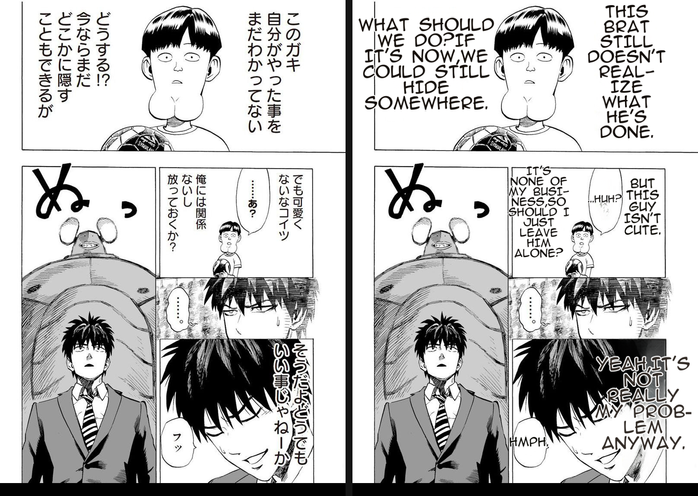
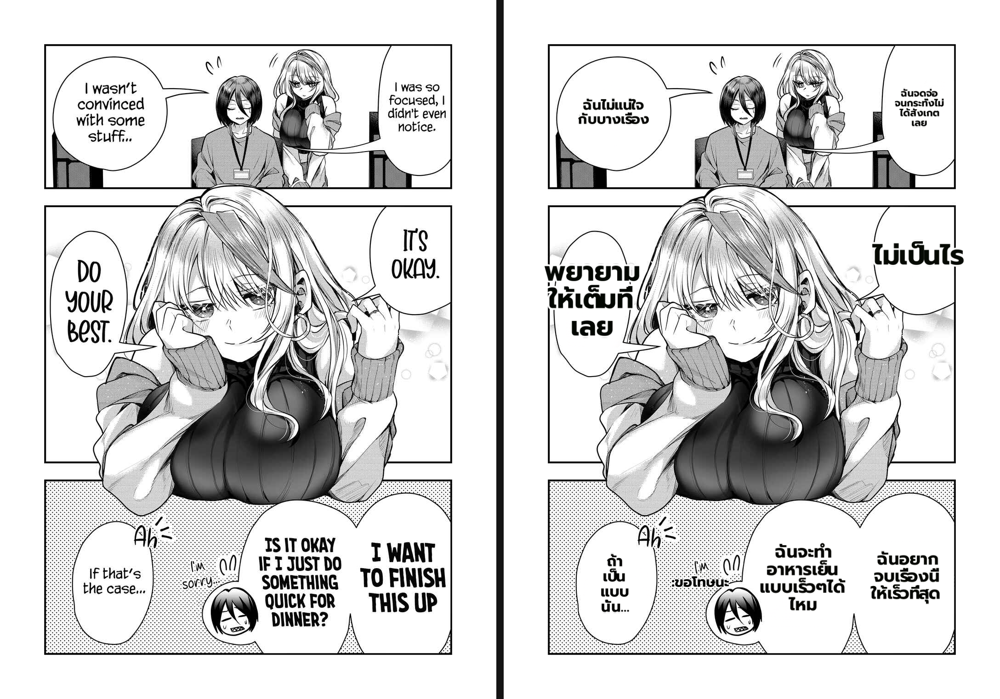
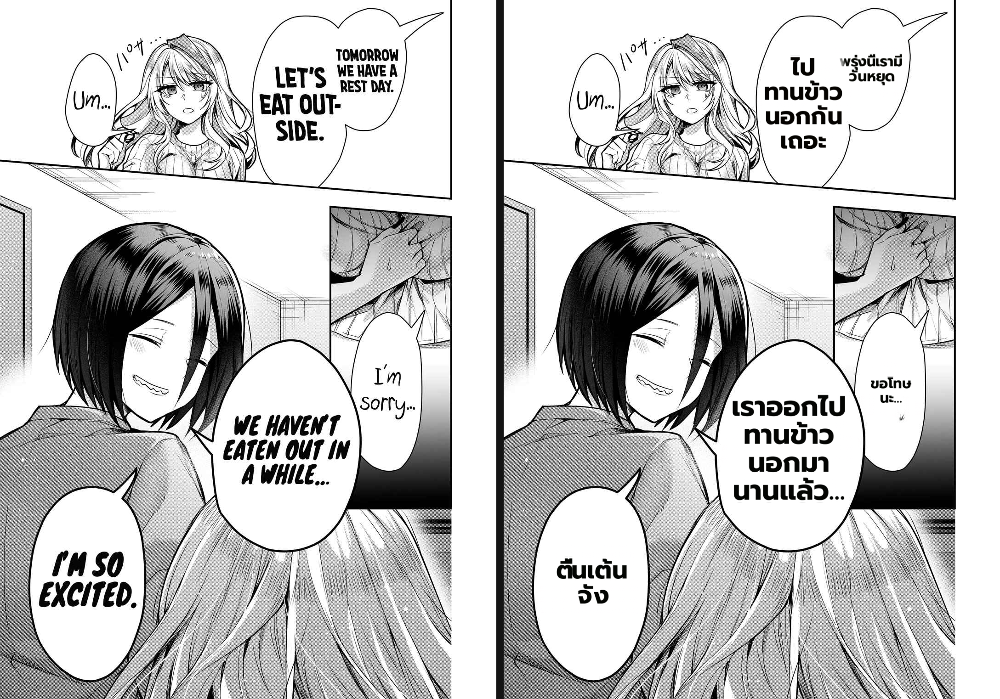
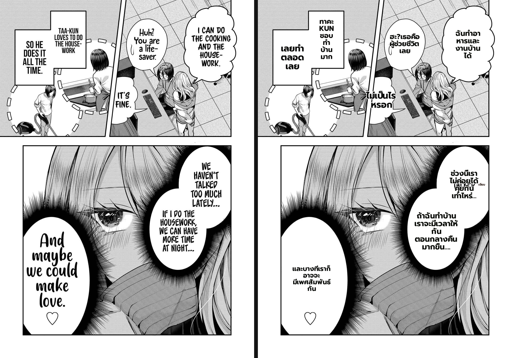
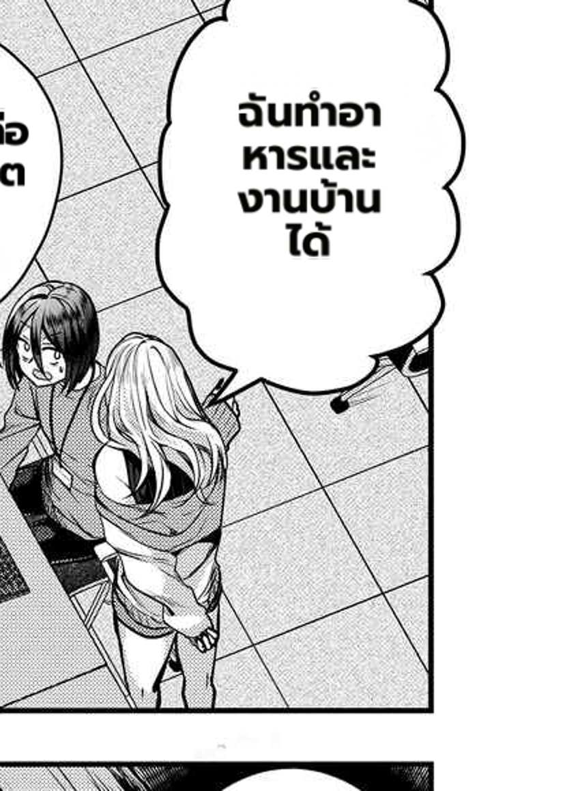
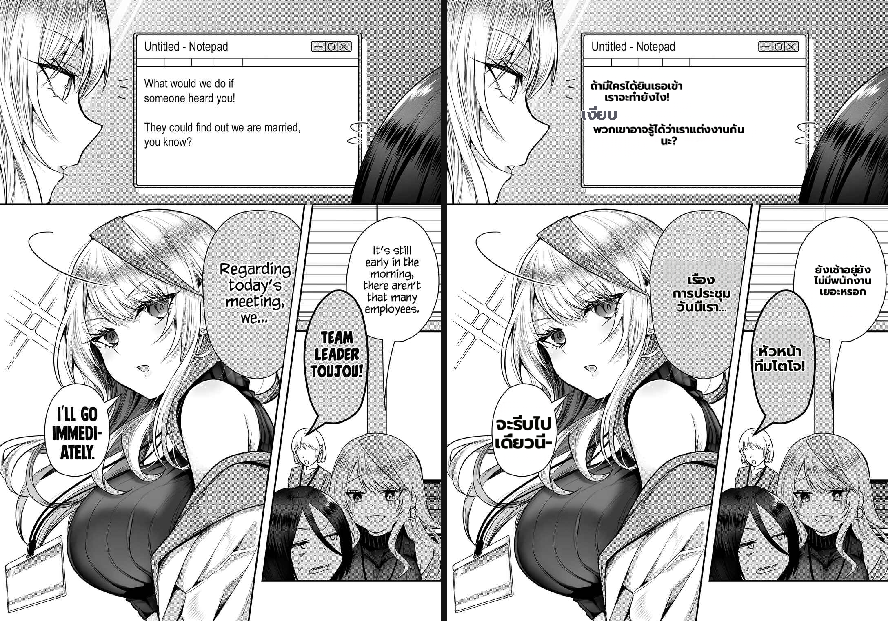

# Benchmark — item9 fix, FULL-chapter + One Punch validation (per the rules)

- **Date:** 2026-07-01 · **Branch:** `worktree-feat-mit-font-s1` · **Fix under test:** item9 clean-layout
  wrap-floor (`63ea441`, ADR 025 Addendum).
- **Direction:** Gal Yome no Himitsu **EN→Thai** (30 pages) · One Punch-Man **JA→EN** (1 stress page).
- **Method:** worker-direct `POST /translate/with-form/patches` on :5003 (MIT/.venv cu121), full
  production config (`detection_size 2560 · det_bubble_seg · det_sfx · ocr prob 0.03 · vlm_rescue ·
  lama_large 2048 bf16 · full_page_inpaint · clean_layout · bubble_area_fit · anti_overlap ·
  anime_ace_3 · uppercase · supersampling 4 · patch_content_alpha`). Bypasses backend cache → every
  page a fresh render. Harness committed: `MIT/tools/bench_full_chapter.py`.
- **Why full-chapter:** the spot-check (p25/p18/p11) was clean; the rule
  (`feedback_benchmark_defect_checklist` §meta-3) requires the **whole chapter + One Punch** before
  claiming done — and it earned its keep here (see headline).

## Headline — item9 is NOT fully fixed

The spot-check passed but the full chapter found a residual: **p19 still breaks a Thai word
mid-cluster** ("ทำอาหาร" → "ทำอา" / "หาร…"). The fix (floor the clean-layout wrap column at the
longest atomic word) is correct for the clean-layout path, but p19's bubble reaches a wrap column
**< the longest word at a normal font** through a path the fix does not cover. **Do not claim item9
done.**

Deterministic confirmation: `calc_horizontal(fs=34, "ฉันทำอาหารและงานบ้านได้")` —
pythainlp tokenizes "ทำอาหาร" as ONE 131px token; at wrap=120 (<131) it char-splits exactly as p19
shows; at wrap≥150 it is clean. Isolated `_bubble_fit_layout` AND `_clean_layout_dst` both refuse to
return a column <131 at a big font (they floor block_w or shrink the font) — so the production break
comes from the **full routing** (occupancy>1 / anti_overlap interaction) the isolated tests miss.
Root not yet pinpointed → next step is production instrumentation (log calc_horizontal char-splits
with font+width+path), then fix, then re-bench.

## Per-page checklist (Gal Yome EN→TH) — item9 focus + 11-pt vs original

Detailed: text-heavy + known-issue pages. Overview: all 30 via contact sheet (no empty bubbles, no
new gross overlap). Legend ✅ clean · ⚠️ known-class · ❌ defect.

| Page | item9 | other (item#) | verdict |
|------|-------|---------------|---------|
| p09 | ✅ เรื่อง/การประชุม/วันนี้เรา; หัวหน้า/ทีมโตโจ | ❌ phantom "เงียบ" in Notepad (3, known) | ❌(3) |
| p12 | ✅ ไม่กินข้าว/ด้วยกัน/หรอก/เหรอ | ⚠️ SFX "ภาตึก" garble (6) | ⚠️ |
| p16 | ✅ ID card นักออกแบบ/ตำแหน่ง:หัวหน้า/ทีมผู้ออกแบบ | ⚠️ カタ untranslated (6) | ⚠️ |
| p18 | ✅ **พยายาม** whole; **ไม่เป็นไร** whole; bottom word-boundary | fills well | ✅ |
| **p19** | ❌ **"อาหาร"→"ทำอา"/"หาร"** (cooking bubble) | ❌ item2 cursive "และบางที…กัน" small (user-flagged); ❌ phantom เงียบ (3) | ❌ |
| p20 | ✅ ฉันมีอยู่แล้ว fills; ต้องการถุง/พลาสติก/ไหมครับ | ⚠️ SFX "へがปึก" garble (6) | ⚠️ |
| p25 | ✅ ไปทานข้าว/นอกกัน/เถอะ; เราออกไป/ทานข้าว/นอกมา | ハァ SFX JP (6); trans "วันหยุด" now correct | ✅ |
| p27 | n/a | ❌ cursive "What about here?" untranslated = detection miss (1/11, known) | ❌ |
| p00–p08,p10–p15,p17,p21–p24,p26,p28 | ✅ (contact sheet: dialogue present, word-boundaries, no empty) | p29 credits URL garble (6) | ✅/⚠️ |

**item9 tally:** 7/8 detailed text pages clean; **1 break (p19)**. No break visible elsewhere on the
contact sheet (but thumbnails can't confirm sub-word wraps — detailed pass covered the text-heavy set).

## One Punch (JA→EN) — Latin / cross-manga regression

Dialogue crisp, fills bubbles; "DOESN'T REAL-IZE" is a **proper Latin hyphenation** (not a char-split);
narration "YEAH, IT'S NOT REALLY MY PROBLEM ANYWAY." white/legible/no fade. **item9 wrap-floor did NOT
regress Latin** (the floor = widest space-delimited word ≤ existing wrap). Pre-existing only: "DO?IF" /
"NOW,WE" missing space after punctuation; `ぬっ` SFX kept JP (#168). **No regression.**

## Evidence

**item9 FIXED exemplars**

**item9 RESIDUAL — p19 "อาหาร" mid-word break (+ item2 cursive bubble small)**

**item3 phantom "เงียบ" (p09, known, recurs)**

**All 30 pages (translated halves)**

## Verdict & next

- **item9:** partially fixed — clean-layout path solid (p18/p25/p09/p12/p16/p20 ✅, Latin no-regress),
  but **p19 residual** via an uncovered production path. **Status: REOPENED.** Next: instrument →
  root-cause → fix → re-bench.
- **item2 (under-fill):** persists, pervasive; user re-flagged p19 cursive (large stylized original →
  small Thai; cursive read as small orig_fs → not treated as display).
- **item3 / item1 / item6:** unchanged known classes, **not regressions** (phantom เงียบ p09/p19;
  cursive detection miss p27; SFX transliteration #168).
- The four-fix stack from the prior capstone holds; this run adds the item9 wrap-floor whose chapter
  coverage is now measured (not assumed).
