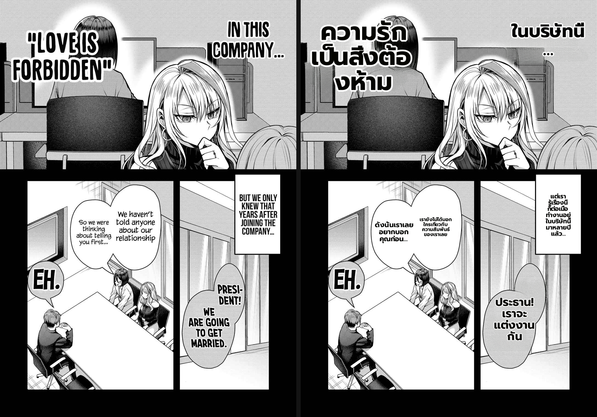
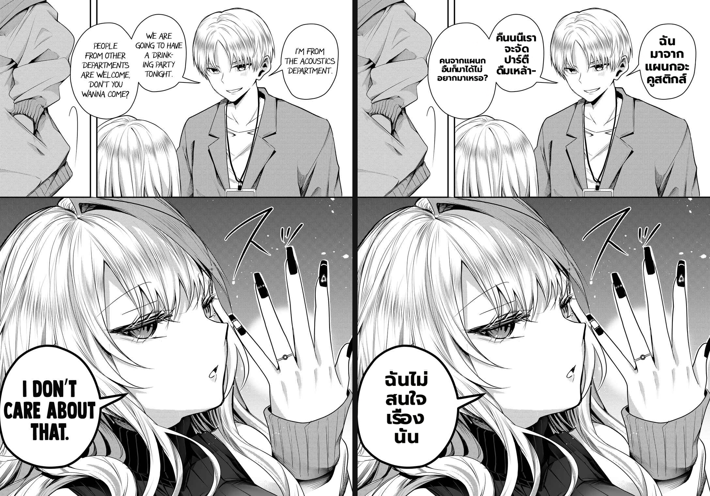
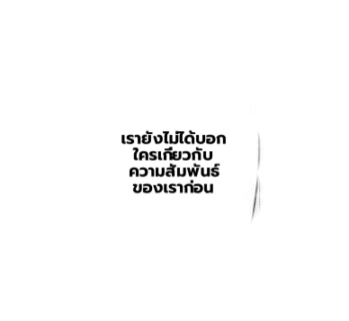

# Benchmark — overlapping-bubble empty-text fix via content-alpha patches (#436)

- **Date:** 2026-07-01
- **Branch:** `worktree-feat-mit-font-s1` (PR #433)
- **Type:** direct-worker, real `Backend/.env` config + `render.patch_content_alpha=true`; per-patch decode + visual verify.
- **Fix under test:** `render.patch_content_alpha` knob → `patch_geometry.content_alpha_inner` + `patch_renderer` content-shaped alpha.

## The defect (user-reported)

Page 11: two overlapping speech balloons ("So we were thinking about telling you first…" and "We haven't told anyone about our relationship"). The back balloon rendered **empty** — its text was translated correctly but never shown.

## Root cause (verified by decoding the patches)

The merge correctly keeps the two as **separate** regions (different sentences), and `anti_overlap` *does* run and place their text apart. But each region is composited as a **rectangular, ~92%-opaque** PNG patch. With `full_page_inpaint`, every patch's crop carries the whole clean (text-erased) page, so the front balloon's patch repaints a rectangle of clean background **over the back balloon's text**. Decoding confirmed both patches contained their glyphs (darkpx 15015 / 8933) and overlapped **70%**; the later-composited one won. anti-overlap (text-level) and patch compositing (rectangle-level) were inconsistent.

## The fix

`render.patch_content_alpha` (off by default → byte-identical): build the patch alpha from the patch's **own content footprint** instead of a full rectangle. `content_alpha_inner(rendered, inpaint_before_text, own_mask)`:
- new glyphs = `|rendered − inpaint|` (the inpaint has no text, so this is exactly the glyphs this patch drew),
- ∪ `own_mask` = this group's text-only mask (its own original ink to hide),
- dilated + fed to `feather_alpha`.

Two pitfalls found and fixed by **visual verification** (per the verify-before-claiming rule), not by trusting green tests:
1. Keying off `rendered − original` re-marked the neighbour's erased text → re-occluded it. Fixed by diffing against the **inpaint**, not the original.
2. Text rendering mutates `img_rgb` (== `img_inpainted`) in place, so `img_inpainted` already had the glyphs → diff was empty → fully-transparent patches → the page rendered in raw **English**. Fixed by snapshotting a clean `inpaint_before_text` copy before rendering.

## Result (original | fixed)

- **Page 11:** the back balloon now shows "เราไม่ได้บอกใครเกี่ยวกับความสัมพันธ์ของเราเลย" **and** the front shows "ดังนั้นเราจึงคิดจะบอกคุณก่อน…" — both overlapping balloons render together, no English residue. (Display captions from the earlier fix still large.)
- **Page 04 (non-overlap, regression check):** all bubbles clean Thai; the previously-clipped bubble-2 ("คืนนี้เราจะจัดปาร์ตี้ดื่มเหล้า-") now renders fully too.
- **Page 09:** SFX + dialogue clean, no residue.

`test_patch_geometry` + `test_patch_renderer` **37/0** (5 `content_alpha_inner`: new-glyph / does-not-mark-neighbour-erased / own-erase-mask / dilate / shape-mismatch).

## Assessment

- **#436 resolved** for this case: overlapping balloons no longer erase each other; the empty bubble now renders. Verified visually on the overlap page **and** two non-overlap pages (no regression; one incidental clip improved).
- **Gated + reversible:** `patch_content_alpha` defaults off (full-rectangle feathered patch, byte-identical). Enable via Backend `MIT_PATCH_CONTENT_ALPHA`.
- **Limit:** if two regions' *glyphs* land on the exact same pixels (true text-on-text), content alpha can't separate them — that needs anti-overlap text re-placement, which is a separate lever. The common overlapping-balloon case (distinct lobes) is fixed.

**Verdict:** ship (knob on).
