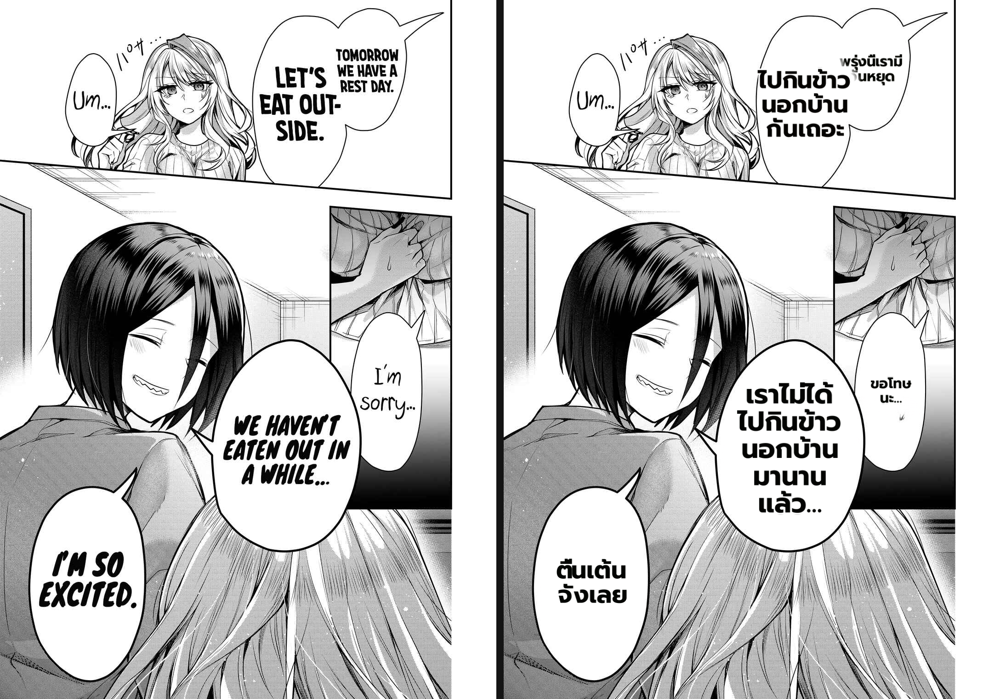
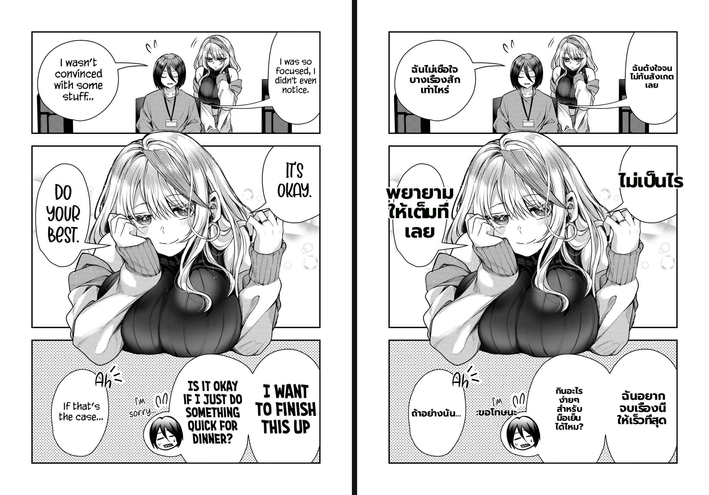
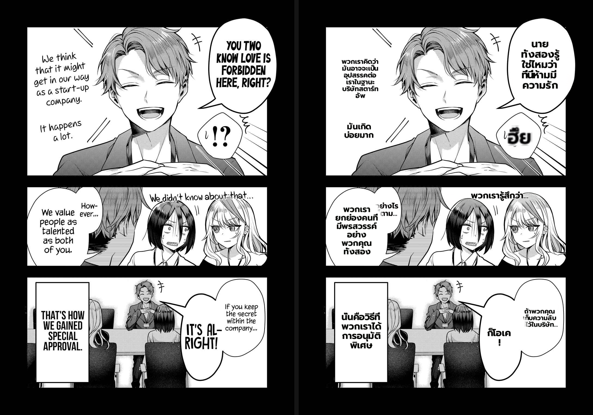

# Benchmark — Thai word-aware line wrap on the clean-layout path (item 9)

- **Date:** 2026-07-01 · **Branch:** `worktree-feat-mit-font-s1` · **Commit (fix):** `63ea441`
- **Defect class:** checklist **item 9** — Thai/CJK mid-word break (`feedback_benchmark_defect_checklist`).
- **Direction:** Gal Yome no Himitsu, EN → Thai. **Renderer:** MIT worker on `MIT/.venv` (cu121).
- **ADR:** 025 Addendum (2026-07-01) — clean-layout floors the wrap column at the longest atomic word.

## What was wrong

For a spaceless script (Thai/Japanese/Khmer/Lao) the wrap column must break on a
**dictionary word boundary**, never inside a word. On the clean-layout path (`_clean_layout_dst`)
the wrap width was the region's *source-text* bbox width with no word-aware floor. When that column
was narrower than the widest Thai word, the greedy packer fell through to `_safe_char_split` and
force-split mid-word:

- p25 "ข้างนอก" → "ข้า" / "งนอก"
- p18 "พยายาม" → "พยาย" / "ามให้"; "ไม่เป็นไร" → "ไม่เป็" / "นไร"

`_bubble_fit_layout` already guarded against this (rejects fonts whose longest word > column,
squeeze floor = longest word). The breaks came from **dialogue misrouted to clean-layout** (when
`bubble_box is None` for egg/oval/heart bubbles, or `fills_bubble_width < 0.72`), which had no such floor.

## Fix

`text_render.longest_token_width(font_size, text, lang)` — width of the widest atomic
(ZWSP-segmented, via pythainlp/jieba) word. `_clean_layout_dst` floors `wrap_w` at that value,
mirroring the guard `_bubble_fit_layout` already applies. Language-agnostic: for Latin the floor is
the widest space-delimited word, which is ≤ the existing wrap, so Latin goldens are byte-identical.

## Result vs original (post-fix render; every line breaks on a word boundary)

> Side-by-side = original (left) ‖ our Thai render (right). Translate output is non-deterministic
> (OCR-VLM/LLM sampling) so a literal before/after of the *same* text is confounded — the structural
> claim "no line splits a word" holds regardless of which sentence the model produced.

### p25 — was "ข้างนอก"→"ข้า/งนอก"

"ไปกินข้าว / นอกบ้าน / กันเถอะ" and bottom "เราไม่ได้ / ไปกินข้าว / นอกบ้าน / มานาน / แล้ว" — all word
boundaries; no syllable orphaned. Text also fills the bubble fuller (the floored column lets the
fitter use more width — a partial, incidental gain on item 2).

### p18 — was "พยาย/ามให้", "ไม่เป็/นไร"

"พยายาม" whole on one line; "ไม่เป็นไร" whole; bottom dialogue word-boundary and large.

### p11 — Latin / mixed: no regression

Top "นายทั้งสองรู้ / ใช่ไหมว่า / ที่นี่ห้ามมี / ความรัก", mid "พวกเรายกย่อง / คนที่มีพรสวรรค์ / อย่างพวกคุณ /
ทั้งสอง" — word boundaries; the English column on the left page is unchanged. (SFX "ฮึย" is still a
touch blocky — checklist item 10, tracked separately.)

## Checklist pass/fail (this fix)

| # | class | verdict |
|---|-------|---------|
| 9 | Thai/CJK mid-word break | **FIXED** — verified p25 / p18 / p11, no mid-word split |
| 2 | under-fills big bubble | partially improved (incidental); dedicated pass still needed |
| 1,3,5,6 | empty / phantom / multi-lobe / romaji | unaffected (no change to detection/routing) |

## Regression evidence

- Unit: `test/test_thai_wrap.py` 12/12 (4 new: `longest_token_width` word-atomic Thai / widest Latin /
  empty; `_clean_layout_dst` keeps "ข้างนอก" intact in a 40px box).
- Characterization render goldens PASS → byte-identical for Latin + the existing Thai golden.
- Render suite 68 passed / 1 pre-existing async-infra skip (`test_default_renderer`, pytest-asyncio
  not installed — unrelated).
