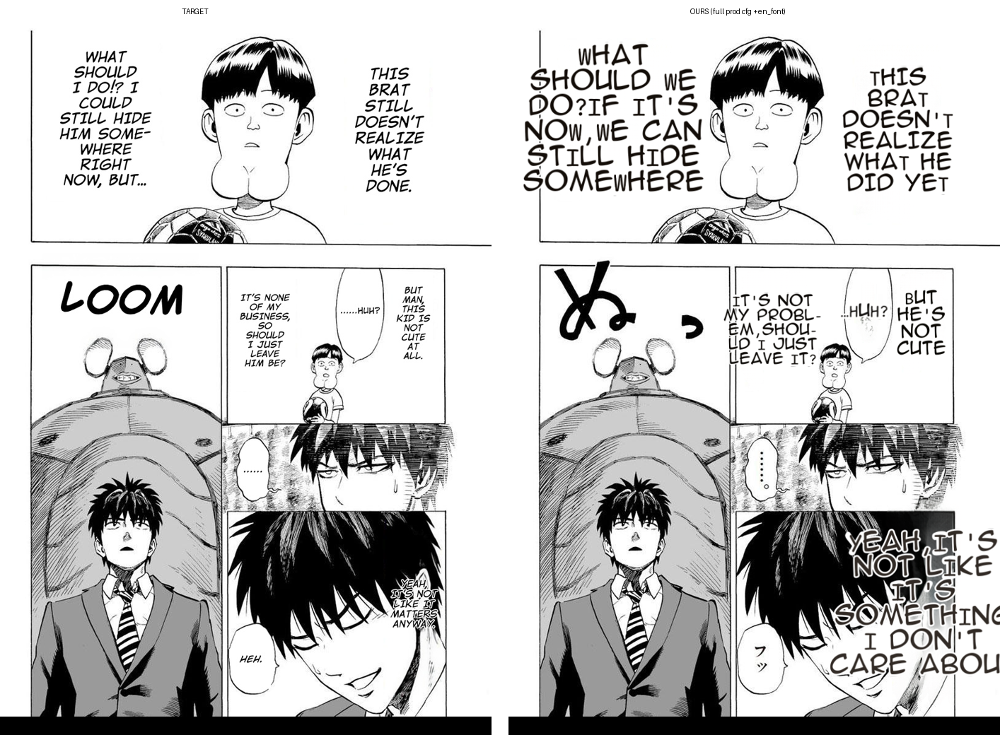
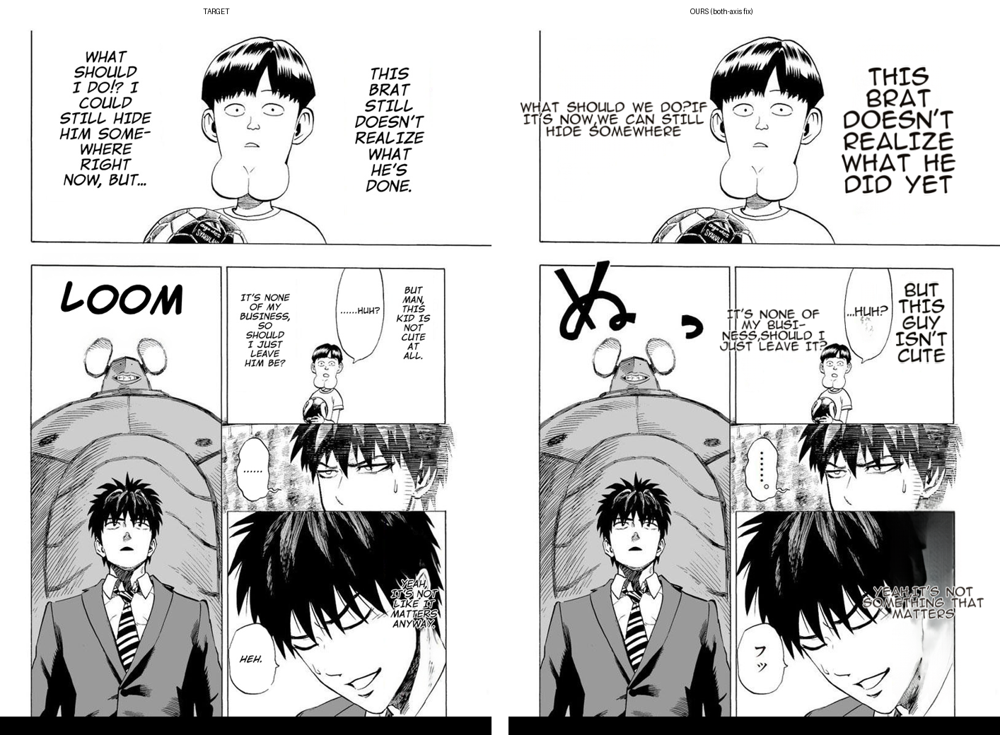
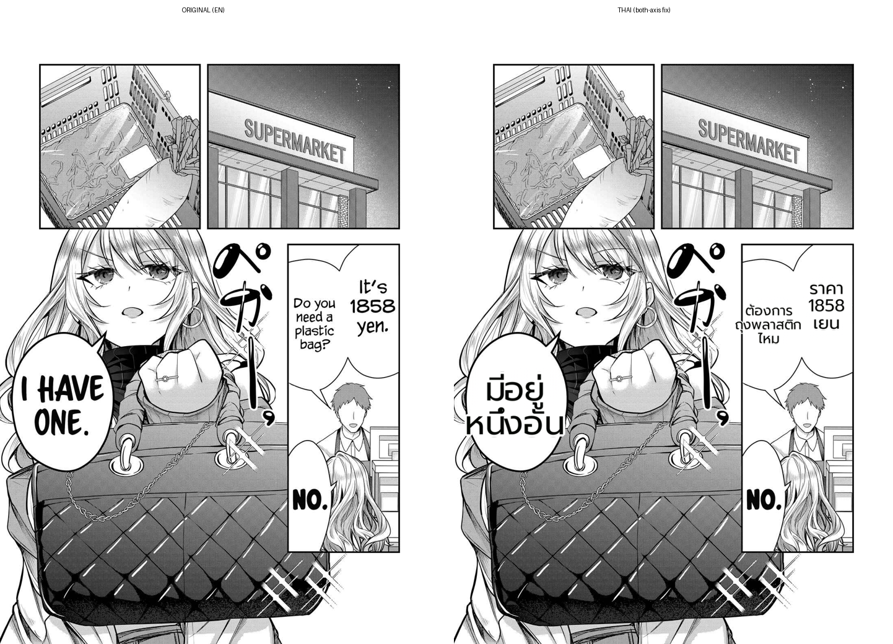

# Benchmark — clean_layout both-axis bound (Phase-3 hotfix, #430)

**Date:** 2026-07-02 · **Branch:** `worktree-feat-mit-font-s1` · **Master plan:** `docs/prd/mit-render-defect-master-plan.md` (Phase 3, "stop the bleeding")

## What & why

`_clean_layout_dst`'s display-caption shrink loop bounded **height only**. A caption sized up by
`clean_layout_target_fs` (orig font ≫ flat) stayed far **wider** than its source column and overflowed
the art — the 2026-07-02 One-Punch narration oversize (a Thai fill-the-balloon change regressed the
English target). Fix: bound the shrink loop on **both axes** (`_CLEAN_DISPLAY_W_TOL = 1.6`, symmetric
with the existing height tol); the longest-token floor keeps words whole as the font shrinks, so no
item-9 mid-word break is re-introduced.

This is the contained Phase-3 hotfix, **not** the full fix. It reduces gross overflow but does not do
the reference layout (safe-box + Knuth-Plass + shrink-to-min) — that is Phase 4.

## Method (deterministic where possible)

- **Unit:** font-only characterization of `_clean_layout_dst` (`test/test_clean_layout_fit.py`, 3 tests) —
  deterministic, no worker. Plus the existing render/wrap/sizing/golden suite as the regression net.
- **Worker (real render):** `POST /translate/with-form/image` on the worktree `.venv` GPU worker with
  the prod config, `MIT_SIZING_TRACE=1`. Both protected targets rendered (meta-rule 6).

## Results — per-region sizing trace (One-Punch, `fill_frac_w = block_w / source_col`)

| region (orig_fs) | before: final_fs / fill_frac_w | after: final_fs / fill_frac_w |
|---|---|---|
| 39 | 39 / 1.75 (block 307) | **19** / 1.75 |
| 35 | 35 / 1.48 | 35 / 1.48 |
| 26 | 26 / 1.63 | **18** / 1.90 |
| 40 (bottom-right "YEAH…") | 40 / **2.45** (block 218) | **18** / 2.29 (block 199) |
| — worst pre-fix | up to **4.93** (block 444) on synthetic | bounded toward flat |

Fonts dropped 39/40 → 18/19; the giant bottom-right overflow that covered the character's face is now
a small, mostly-contained block. Unit self-check: a 90px source column that rendered `block_w ≈ 444`
(fill_frac_w 4.9) now renders bounded.

## Images

**One-Punch — before (oversized):**

**One-Punch — after (both-axis bound):**

**Thai (Gal Yome ds20) — no under-fill regression:**

## Assessment

- **fix-root (partial):** removes the gross width overflow (fonts no longer stay at the source 40px;
  the face-covering block is gone). ✅
- **no-regression:** unit 3 new + 74 existing pass incl the byte-golden (non-display paths untouched);
  Thai dialogue still fills bubbles (item-2 safe — Thai dialogue is bubble-fit, not clean_layout). ✅
- **limitation (by design, → Phase 4):** the shrink stops at the **flat floor (~18px)**, so very narrow
  regions still read slightly large and can spill (top-left "WHAT SHOULD WE DO?"); and line-breaks are
  still greedy, **not** matched to the original (target uses Knuth-Plass DP). Both are the Phase-4
  reference-engine port (safe-box → binary-search-from-cap → both-axis → Knuth-Plass → shrink-to-min),
  tracked in #175/#178/#180/#434 and gated by the harness #462.

## สรุปภาษาไทย

hotfix Phase-3 (#430): `_clean_layout_dst` เดิม bound แค่**ความสูง** → caption ที่ size ขึ้น (track-orig-fs)
กว้างเกิน source column → ล้นทับ art (One-Punch oversize 2026-07-02). แก้: bound **ทั้ง 2 แกน**
(`_CLEAN_DISPLAY_W_TOL=1.6`), longest-token floor กันหักคำ (item-9 ไม่ regress). **ผล:** fonts 40→18,
block ยักษ์ทับหน้าหาย; unit 3+74 pass (รวม golden); Thai dialogue ยังเต็มบับเบิล. **ข้อจำกัด (ตามแผน →
Phase 4):** ย่อได้แค่ถึง flat floor ~18px → region แคบมากยังใหญ่/ล้นนิดหน่อย + line-break ยัง greedy ไม่ตรง
original (target ใช้ Knuth-Plass) → Phase 4 port reference engine แก้เต็ม (#175/#178/#180/#434, gate ด้วย #462).
