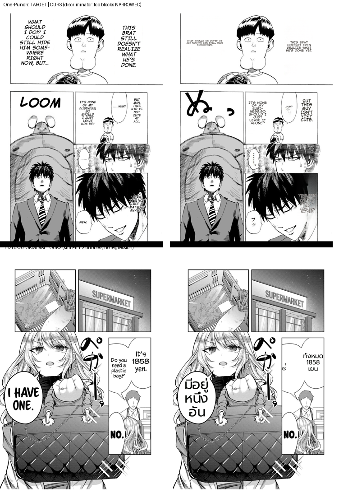

# Demoted-bubble fill/narrow discriminator — live patch-path verification (2026-07-02)

## Method
`interior_w / det_w` discriminator (threshold 1.4, `should_fill_demoted_bubble`) wired into the
`reference_layout` path. Verified two ways:
1. **Deterministic replay** (`replay_clean_layout` on committed fixtures) — the primary, reproducible signal.
2. **Live patch-path render** (`/translate/with-form/patches`, reference_layout ON, lama_large, supersampling 4) composited onto the original — meta-rule 6 confirmation on the real pipeline.

## Result (deterministic replay)
| region | before (fill wide interior) | after (discriminator) |
|---|---|---|
| One-Punch top-L (det 175, ratio 1.61) | final 32px, spill 1.54x | **final 10px, 0.93x** (narrow) |
| One-Punch top-R (det 128, ratio 2.30) | final 44px, spill 2.27x | **final 19px, 0.97x** (narrow) |
| Thai ×3 (ratio 1.07–1.19) | — | **final 69/28/50px, fills** (no regression) |

## Live render (image below)
- One-Punch: both top blocks the user flagged as oversize now render as small narrow columns — no spill past their boxes.
- Thai: dialogue still fills its bubbles ("มีอยู่หนึ่งอัน", "ทั้งหมด 1858 เยน").

## Assessment
- **fix-root:** the oversize was demoted-bubble regions filling a bubble interior far wider than the text; the ratio gate stops that while preserving genuine bubble-fill (Thai).
- **no-regression:** Thai dialogue fill preserved (deterministic gate `test_reference_layout_thai_dialogue_still_fills_its_bubble`).
- **limitation:** narrowed One-Punch blocks are now conservative (a touch smaller than the target's readable column); the flat cap could be tuned up for narration later. reference_layout remains flag-gated OFF; production default unchanged (byte-identical).

