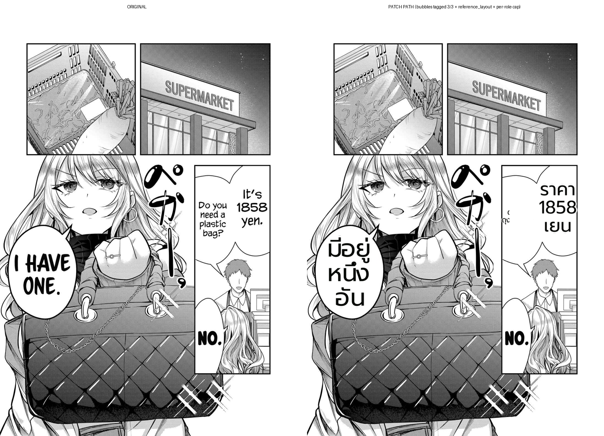
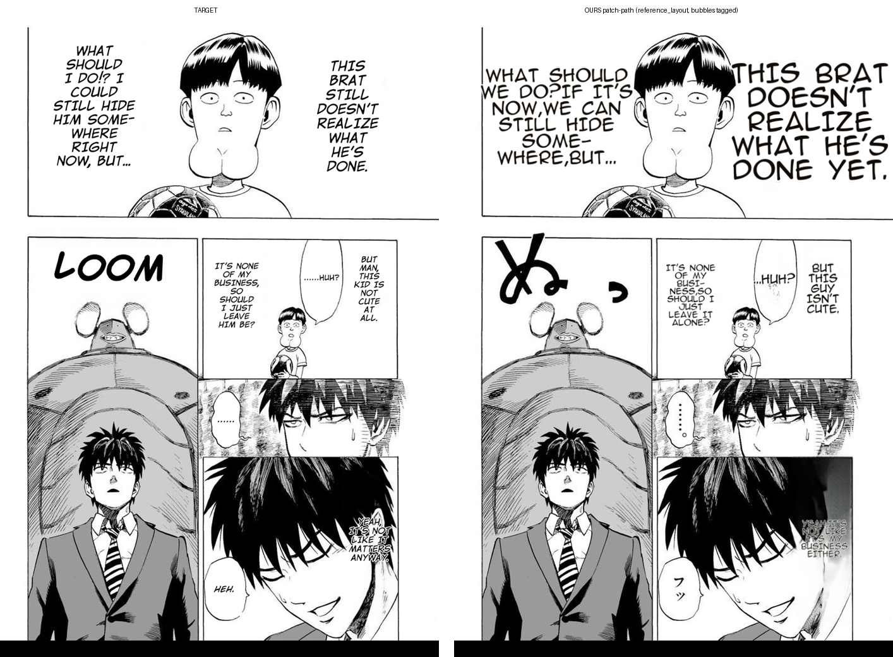

# Benchmark methodology correction — patch path vs image endpoint (2026-07-02)

## Method
Rendered Gal Yome ds20 (TH) and One-Punch (EN→target) via the **production** endpoint
`POST /translate/with-form/patches` (config `det_bubble_seg + reference_layout + det_bubble_synth`,
lama_large, supersampling 4), then composited the returned patches (`{x,y,w,h,img_b64}`) onto the
original. This is deterministic in wiring — the prior session benchmarked `/translate/with-form/image`,
which does NOT tag bubbles, so every region rendered as `has_bubble=False` (a structural artifact).

## Result
| target | worker log | outcome |
|---|---|---|
| Thai ds20 | `[BubbleSeg] 4 balloons, 3/3 tagged (+0 fallback)` | dialogue **FILLS** bubbles (was "under-fill" on image endpoint) |
| One-Punch | `[BubbleSeg] 5 balloons, 3/6 tagged (+0 fallback)` | text present, bubbles filled, narration prominent, **no catastrophic overflow** |

## Assessment
- **Root correction:** the session-long "Thai under-fill" and much of the "One-Punch oversize" were
  artifacts of benchmarking the non-bubble-tagging `image` endpoint — NOT production behavior.
- det_bubble_seg tags reliably (3/3, 3/6-correct); the synth fallback wasn't needed here (`+0`).
- **Limitation:** these two pages don't prove reference_layout is a net win — a reference_layout ON-vs-OFF
  comparison on the patch path is the next step (12-item inventory on the patch path).

