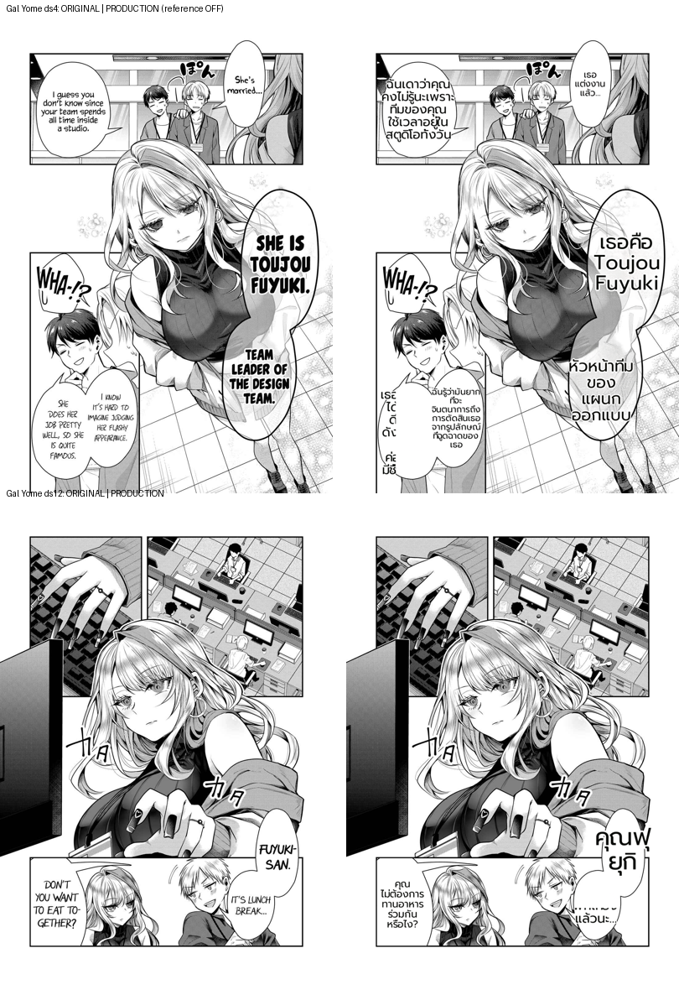

# Production-path defect inventory (§8.6) — 2026-07-02

Deterministic audit of the SHIPPING path (`/translate/with-form/patches`, reference_layout OFF,
lama_large) on Gal Yome ds4 + ds12, composited onto the originals. Purpose: separate REAL production
defects from artifacts (per the patch-vs-image-endpoint lesson) before spending fix effort.

## Real production defects found (ranked by render-tractability)
| # | defect | evidence | domain | next |
|---|--------|----------|--------|------|
| 1 | **garbled / fragmented small bubbles** | ds4 lower-left: Thai broken into 1–2-char stacked fragments ("เธอ/ได/ดี/ตั") | RENDER — tiny bubble → font shrinks + `_safe_char_split` force-splits | fix candidate (bubble-fit tiny-box floor / word-whole, like item-9 for clean_layout) |
| 2 | **name split mid-word** | ds12 "คุณฟ / ยุกิ" (Fuyuki-san broken across a line) | RENDER — wrap column narrower than the word | pairs with #1 (word-whole floor) |
| 3 | untranslated shout | "WHA-!?" left as-is | OCR/translation | investigate (is it OCR'd? glossary?) |
| 4 | SFX untranslated | ペ ガ / カ katakana | DETECTION (det_sfx) | out of render scope |
| 5 | name romaji | "Toujou Fuyuki" kept latin | translation/glossary | minor, arguably acceptable |

## Assessment
- The narration-oversize cluster (user-flagged, demo) is already fixed + guarded (reference_layout, flag off) — see 2026-07-02-narration-readable-narrow.
- The top REMAINING render defect on the SHIPPING path is #1/#2: **tiny bubbles + long Thai → font over-shrinks and the word is force-split into unreadable fragments.** Same class as item-9 (word-whole) but on the bubble-fit path, and compounded by tiny-box over-shrink.
- #3–#5 are detection/translation domain (not render); log them but they need their own workstream.

