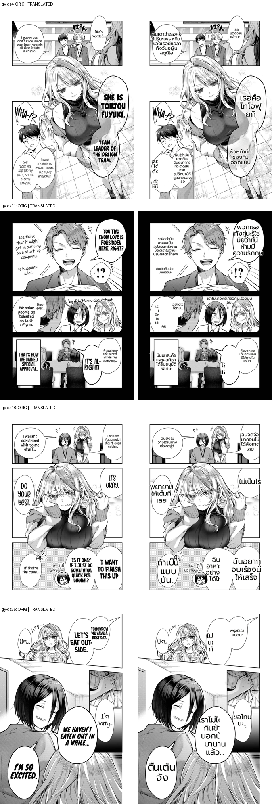
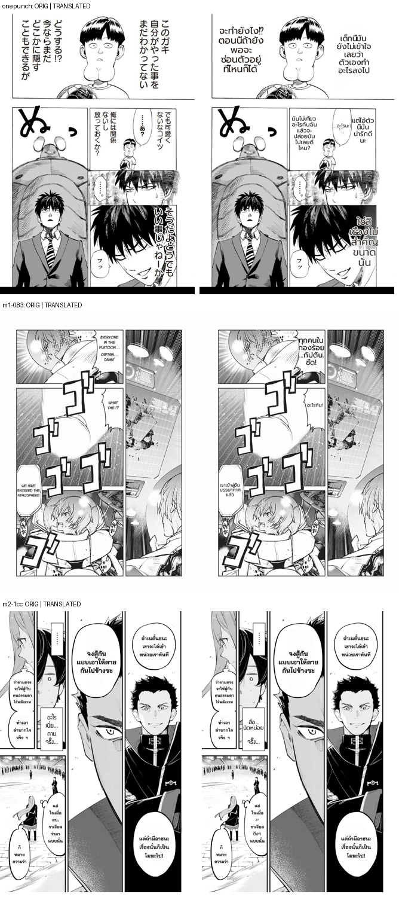
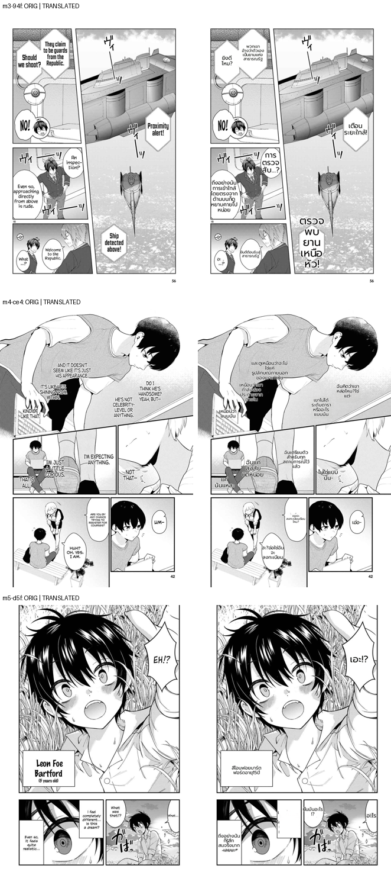

# Comprehensive production defect sweep (2026-07-03) — basis for improvement round 2

**Purpose:** re-benchmark across many pages/manga (per the rule that defects come from many pages) to
build a comprehensive, frequency-ranked defect inventory for the next improvement plan.

## Method
10 pages, 6 manga, **production config** (`/translate/with-form/patches`, reference_layout OFF, det_bubble_seg,
lama, supersampling, JA/EN→TH) composited onto originals. Sample = Gal Yome defect-source (ds4/ds11/ds18/ds25)
+ One-Punch + 5 random other chapters (mid-page). Montages: `2026-07-03-sweep-{A,B,C}.png`.

## Defect inventory (frequency-ranked)
| defect | seen on (of 10) | domain | severity |
|---|---|---|---|
| **narrow/small bubble → text shrinks tiny → at worst effectively INVISIBLE (reads as text-loss)** | ds4, ds11, ds20, m2-1cc, m4-ce4 | **RENDER** | 🔴🔴 severe + recurring — **#1** |
| SFX untranslated (ゴゴゴ, ヴィ, かば) | m1, m3, m5 | detection (#169) | 🟠 recurring |
| translation garble (garbage chars "3"/"<", incomplete: "สแปร3ือมาก<อยยะ<", "ฉันอยากๆอย่างได้ไ", ds4 "JDB") | ds4, ds18, m5 | translation (LLM) | 🟡 medium |
| word/name run-together or mid-word split ("กินข้"→ข้าว, "ลีอองฟอยบาร์ดพอร์ด", "ฟ ยกิ") | ds4, ds25, m5 | render/wrap | 🟡 medium |
| untranslated shout ("NO!") | m3 | translation/OCR | 🟢 low |

## KEY finding — the "text-loss" is NOT a pipeline drop (verified deterministically)
`MIT_DUMP_REGIONS` on m4-ce4: **12 regions detected + translated (all non-empty) → grouped into 2 patches →
all 12 region centers covered (0 dropped).** The text isn't lost from the pipeline. It is the **narrow-bubble
over-shrink at its worst**: e.g. r9 "เธอพยายามลงทะเบียนเรียนรึเปล่า?" (31 chars) in a **104px-wide** bubble →
font shrinks to fit width → so tiny it's effectively invisible = reads as "text gone". Same symptom as the
ds20 "plastic bag" bubble. Root: **no readable-floor** — the sizer shrinks the font without limit to fit a
narrow column instead of holding a minimum readable size (and overflowing slightly / squeezing the word).

## What's good
Most normal/large bubbles fill + render readable Thai — the core render is sound. The defect is concentrated
in **narrow/small bubbles with longer translations**.

## → Improvement plan round 2 (proposed priorities)
1. **#1 (RENDER): narrow-bubble readable-floor** — enforce a minimum readable font; if the Thai is too long
   for a narrow bubble, prefer slight overflow / word-squeeze over shrinking to invisible. Fixes both the
   "tiny" and the "effectively lost" cases. Deterministic-replay + envelope-guard as usual; also extend the
   harness to measure spill vs the **bubble polygon** (not just the detection box — the 2026-07-03 blind spot).
2. Then: SFX translation (#169, detection), translation garble (LLM), shout handling.

