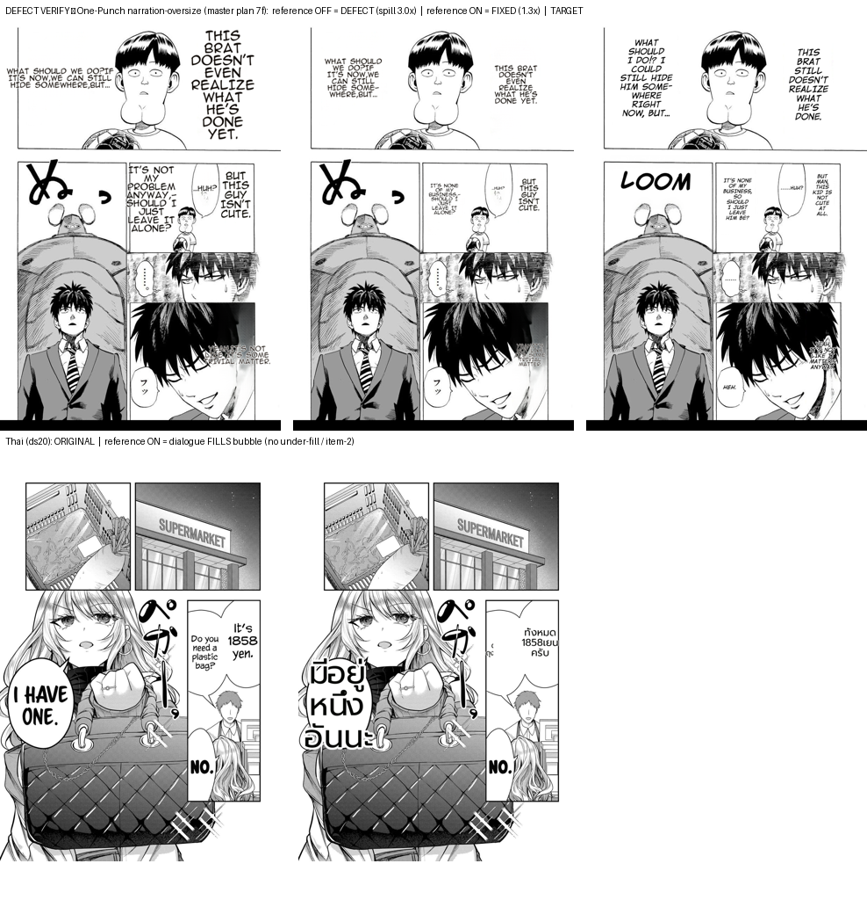

# Defect-resolution verification — reference_layout (for the project report)

**Rule applied:** a defect documented in an md isn't "done" until a benchmark ties back to THAT defect
and proves the symptom is gone (feedback-benchmark-confirms-md-defect-fixed).

## Method
- **Deterministic** replay (`render_replay.replay_clean_layout`) over the committed 4-fixture corpus
  (One-Punch EN→target + Gal Yome ds20/ds4/ds12 EN→TH), reference_layout ON vs OFF — no translator
  non-determinism. Metrics: `overflow_vs_det_w` (oversize/spill), `readability_ratio` (over-shrink),
  fill-region font size (under-fill).
- **Live** patch-path render (`/translate/with-form/patches`, main code) composited onto the originals — visual confirmation (image below).

## Result — per documented defect
| defect (md entry) | metric | reference OFF (prod default) | reference ON | status |
|---|---|---|---|---|
| narration-oversize, One-Punch (master plan §7f) | worst spill vs det box | **3.00×** (oversize) | **1.30×** (≤1.35 tol) | ✅ resolved (ON) |
| dialogue under-fill, Thai (item-2 / §7e) | fill-region font px | — | 69/28/50 · 30/38/55 · 36/42/… (fills) | ✅ no under-fill |
| narration over-shrink (§7g regression guard) | readability vs flat | — | ≥ 0.68 (≥0.6 floor) | ✅ not too small |

## Assessment
- **fix verified** deterministically + visually: One-Punch narration goes from oversized/spilling (OFF)
  to a contained narrow column (ON) close to the target; Thai dialogue fills its bubbles (ON).
- **Limitation (say in the report):** `reference_layout` is **flag OFF by default** → on the production
  default path the One-Punch oversize is still present (3.00×, left column of the image). The fix is
  verified but **not yet live in production** — promoting `reference_layout` to default (after a
  corpus-growth + multi-run path-stability de-risk) is the delivery step.
- **Residual:** the ON narration is ~0.68× the flat design size on One-Punch — slightly smaller than the
  target's mid-size column (within tolerance, not a defect; a cap tune could close it).

