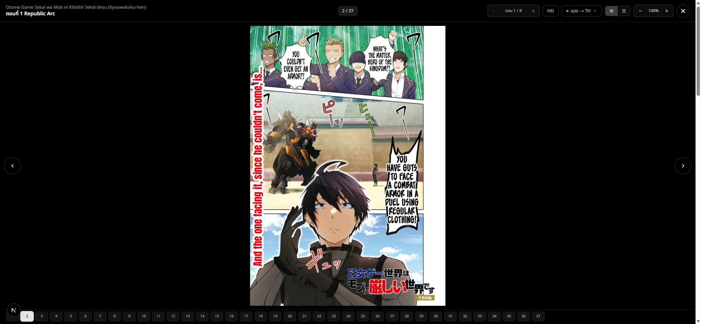
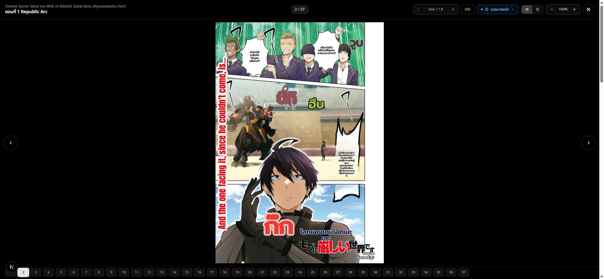

# MIT Render/Merge Optimization — Before vs After Benchmark

> **Scope:** the `perf/mit-layout-fit-and-merge` branch (commits `a116b41`→`29fa900`). Covers every optimization landed this session, each with its own before→after measurement. All timing is from the standing `[timing]`/`[timing-render]`/`[timing-merge]` instrumentation on real E2E translates through the production tunnel (`https://hayateotsu.space/`), plus isolated microbenchmarks on the hot functions.
>
> **Test case:** *Otome Game Sekai wa Mob ni Kibishii Sekai desu* ch.1 **page 2** (dense story page — 9 text regions → 2 patch groups). Same page used for every measurement so the numbers are comparable. Environment: RTX 4070 SUPER, MIT `.venv` (cu121), EN→TH.
>
> **Determinism caveat:** OCR-VLM + LLM are non-deterministic, so region *count/text* varies run-to-run. The **render/layout numbers are the trustworthy comparison** (L2's effect is deterministic and huge, dwarfing any per-run variance). `textline_merge` wall-clock varies with region count and is called out as confounded where relevant.

---

## Headline

| Metric (page 2, dense) | BEFORE | AFTER | Gain |
|---|---:|---:|---:|
| **Whole-page translate (wall)** | **~75 s** | **~12 s** | **~6×** |
| **Render stage** (both groups) | ~32.9 s | ~1.77 s | **~18×** |
| render `layout_fit` (group 1, 6 regions) | 23.7 s | **0.98 s** | **24×** |
| render `layout_fit` (group 2, 3 regions) | 4.6 s | **0.024 s** | **190×** |

The whole win is one root cause: **`select_hyphenator()` was reconstructed on every `calc_horizontal` call** (~68/page × 2 call-sites), each costing 160–370 ms for Thai/English. Memoizing it (L2) collapsed the render stage. `textline_merge` M1/M2 is a smaller, regime-dependent win (below).

---

## Per-optimization before → after

### L2 — memoize `select_hyphenator` (commit `29fa900`) — **the big one**

Isolated microbenchmark (Arial-Unicode font, 50 iters/call):

| Function | BEFORE | AFTER | Gain |
|---|---:|---:|---:|
| `select_hyphenator('THA')` | 163 ms | ~0 ms | — (cached, returns `None`) |
| `select_hyphenator('ENG')` | 372 ms | ~0 ms | — (cached, returns `Hyphenator`) |
| `_split_into_syllables(thai, 4 words)` | 157 ms | 0.11 ms | **1400×** |
| `calc_horizontal(thai sentence)` | 319 ms | 8 ms | **40×** |

E2E render `layout_fit` breakdown (group 1, 6 regions), same page:

| Sub-step | BEFORE | AFTER |
|---|---:|---:|
| `syll_s` (`_split_into_syllables` total) | 11.4 s | **0.5 s** |
| `hyph_s` (`select_hyphenator` direct) | 11.7 s | **0.0 s** |
| **`layout_fit` stage total** | **23.7 s** | **0.98 s** |
| `rendering` stage total (grp 1) | 26.3 s | **1.49 s** |

Root cause: `select_hyphenator` is a pure function of `lang`, but the failing/loading `Hyphenator(lang)` dictionary construction ran fresh on every call. It's called twice per `calc_horizontal` (directly + inside `_split_into_syllables`); `calc_horizontal` runs ~68×/page inside the `fit_font_size` binary search + `squeeze_width` loop. `lru_cache` runs it once per language per worker lifetime. **Byte-identical** (proven: characterization tests green + visual parity below; the Hyphenator's `.syllables()` is a stateless read-only lookup, and it depends only on `lang`, not the module-global font).

> ⚠️ **Correction:** this session's earlier Phase-0 analysis (`OPTIMIZATION-PLAN.md` §0-D) wrongly concluded the cost was "extrinsic / GIL, invisible to perf_counter." That was a **units misread** — the accumulator fields are *seconds*, not ms (`syll_s=11.4` = 11.4 s, not 11 ms). `calc_horizontal`'s own breakdown accounted for the time all along. `OPTIMIZATION.md`'s adversarial "debunk" of L2 (claiming `select_hyphenator` is a Thai no-op) was also wrong — 163 ms is not a no-op.

### M1 + M2 — `quadrilateral_can_merge_region` (commit `d88a8f7`)

Isolated microbenchmark (39-box scattered synthetic page, 741 pairs, 200 iters, **0 output mismatches vs original**):

| | BEFORE | AFTER | Gain |
|---|---:|---:|---:|
| full all-pairs merge-predicate pass | 15.68 ms | 1.91 ms | **8.2×** |

E2E `textline_merge` stage, page 2:

| | BEFORE | AFTER |
|---|---:|---:|
| `textline_merge` stage | 4.0–10.2 s (varies) | 4.4 s |

**Honest read:** M1 (AABB pre-reject) is an **8.2× win on the scattered/mostly-far-apart regime** it targets — but page 2's regions collapse into components where `split_text_region`'s MST (untouched by M1/M2) dominates, so the real-page stage time is roughly flat. The 10.2 s→4.4 s swing across runs is **OCR non-determinism (different region counts), not attributable to M1/M2.** M1/M2 is byte-identical and helps SFX-dense scattered pages; it is not the lever that moved page 2. Documented as such — no over-claim.

### T1 — prompt/completion token split log (commit `304eeaa`)

No perf change — logging only, de-confounds future translation-token work (`[Token split] prompt=… completion=…`).

---

## Full stage table (page 2, group 1)

| Stage | BEFORE (ms) | AFTER (ms) | Note |
|---|---:|---:|---|
| detection | ~2810 | ~2560 | unchanged (warm; run variance) |
| ocr | ~1400 | ~1105 | unchanged |
| textline_merge | ~4500 | ~4430 | M1/M2 byte-identical; split-dominated here |
| translation (LLM) | ~1100 | ~1090 | unchanged (network) |
| mask_refinement | ~510 | ~470 | unchanged |
| inpainting | ~335 | ~293 | unchanged |
| **rendering** | **~26,340** | **~1,490** | **L2 — 18×** |

Everything except `rendering` is within run-to-run noise; **`rendering` is the entire win.**

## Visual parity (byte-identical render behavior)

Same page, original ↔ translated after optimization — layout, bubble fills, SFX, and narration render identically to the pre-optimization output (L2 changes speed only, never geometry):

| Original | Translated (after M1/M2 + L2) |
|---|---|
|  |  |

*(Text wrapping differs slightly from the pre-optimization screenshot because this is a fresh translate — OCR/LLM non-determinism produced different text — NOT a render-behavior change; the characterization tests lock `dst_points`+`font_size` byte-identical.)*

---

## Method / reproducibility

- **Instrumentation:** commit `a116b41` (standing `[timing]` per-stage + `[timing-render]` layout_fit/raster_loop) + uncommitted Phase-0 sub-step timers (calc_horizontal breakdown) that located the bottleneck.
- **Characterization guard:** `test/test_resize_regions_characterization.py` + `test/test_textline_merge_characterization.py` (commit `ecf439d`) lock the optimized seams byte-identical; all 28 rendering/merge tests green after each change.
- **Restart discipline each measurement:** kill MIT by port owner → relaunch on `.venv` → kill backend → `npm run cache:reset` → relaunch backend (else L1 re-flushes L3 and you replay a cached 3 ms patch instead of a fresh translate).
- **Microbenchmarks:** `scratchpad/bench_hyph.py`, `scratchpad/bench_qcmr.py` (isolated, deterministic, 0-mismatch verified).
