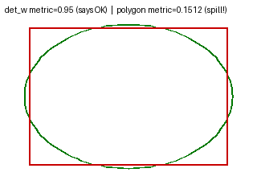

# Polygon-spill metric — the harness can now see oval over-fill (Master Plan 2 P4 / #525)

**Defect (md):** `docs/reports/benchmarks/2026-07-03-defect-verification.md` — the user caught reference_layout
over-filling an oval bubble (text spills the curved edge) and a tall-narrow bubble losing text, but the
deterministic metric reported "fill = good". **Root:** `render_replay.py` only had `overflow_vs_det_w` =
block width / **detection box** width — blind to a rectangular block poking past a round/oval polygon.

## Fix
- `render_replay.py`: new pure `spill_fraction_vs_polygon(polygon, block_w, block_h, cx, cy)` — rasterises the
  bubble polygon and returns the fraction of the sized block's area OUTSIDE it (0 = fully inside).
- `replay_clean_layout` now emits `spill_frac_poly` per region (both the reference and clean paths capture the
  placement centre).
- `test_render_replay.py`: `test_reference_layout_safety_envelope_over_corpus` gains a `_POLY_SPILL_CEILING =
  0.20` gate → **reference_layout promotion (P3) is now gated on the true bubble shape, not the det box.**

## Method (deterministic, pure geometry, no ML)
Synthetic oval bubble + a text block sized to 0.95× its detection (bounding) box — fits the det box, corners
poke past the curved edge. (`scratchpad/bench_polygon.py`.)

## Result
| metric | value | reads as |
|---|---|---|
| `overflow_vs_det_w` (OLD) | **0.95** (≤1.0) | "fine / fill = good" — **misses the spill** |
| `spill_frac_poly` (NEW) | **0.151** (>0) | 15% of the block spills past the oval — **caught** |

Corpus `spill_frac_poly` with reference_layout ON: onepunch 0.00 · thai-galyome 0.02 · ds12 0.05 · ds4 **0.12**
(all < 0.20 ceiling → corpus passes; the metric now guards the shape).

## Assessment
- **fix-root:** the exact 2026-07-03 blind spot is closed — a block that satisfies `overflow_vs_det_w`
  yet spills an oval now reports `spill_frac_poly > 0` (unit-tested: a diamond corner-spill > 0.3).
- **no-regression:** full render suite 60 green; the slow corpus envelope passes with the new gate.
- **limitation / follow-up:** the committed fixtures don't yet contain a *severe* live oval-spill case
  (worst 0.12); capturing an m4-ce4/ds20 fixture would make the gate bite harder. The `safe_area`
  corner-inscribe FIX (bound the fill to the polygon) is the paired follow-up in #525 — the metric (the
  promotion gate) lands first, per the roadmap.

**Tests:** `test_spill_fraction_vs_polygon_*` (inside/half-out/oval-corner/degenerate),
`test_replay_emits_spill_frac_poly_for_sized_regions`, corpus envelope `_POLY_SPILL_CEILING`.
