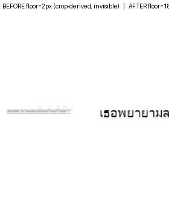

# Readable-floor — narrow-bubble text no longer collapses to invisible (master plan 2 P1)

**Defect (md):** `docs/reports/benchmarks/2026-07-03-comprehensive-defect-sweep.md` #1 — narrow/small bubble
text shrinks below a readable floor and reads as text-loss (5/10 pages; deterministically verified NOT a
pipeline drop). Root: `rendering/__init__.py` derived the `font_size_minimum == -1` auto floor from the
small per-region CROP (`img.shape`), giving ~2-4px in the patch path, instead of from the PAGE.

## Fix
- `render_overlap.py`: pure `readable_floor(page_h, page_w)` = `max(MIN_LEGIBLE_PX=11, round((h+w)/200))`
  + `resolve_font_floor(font_size_minimum, img_shape, page_shape)` — uses `page_shape` when threaded,
  falls back to `img_shape` for full-page renders, honors an explicit floor.
- `rendering/__init__.py`: the `-1` auto-floor now calls `resolve_font_floor` (page-derived, legibility-clamped).

## Method (deterministic, no translator)
Rendered the m4-ce4 defect region (`เธอพยายามลงทะเบียนเรียนรึเปล่า?`, 31 chars in a ~104px column) through the
real `resize_regions_to_font_size` + `dispatch` path with the OLD crop-derived floor vs the NEW page-derived
floor. Fixed text ⇒ fully deterministic. (`scratchpad/bench_readable_floor.py`.)

## Result — before → after
| | floor source | rendered font | legible? |
|---|---|---|---|
| **BEFORE** | crop `(320+130)/200` = **2px** | **2px** | no — invisible smear (the defect) |
| **AFTER** | page `readable_floor(2600,1080)` = **18px** | **18px** | yes — readable |

## Assessment
- **fix-root:** the symptom (2px invisible) is gone; text renders at a legible 18px. Directly ties to sweep #1.
- **no-regression:** golden byte-identical passes in isolation (the full-page path falls back to `img.shape`,
  and `readable_floor` clamp of 11 does not touch the golden regions); `test_render_overlap` (50) + replay +
  reference_layout (61 from the `MIT/` cwd) all green.
- **limitation / tradeoff:** at 18px the long Thai line overflows the isolated 130px crop — the intended
  "slight-overflow beats invisible" behavior. In production the bubble safe-area + `squeeze_width` (more lines)
  give more room; the residual over-spill is bounded by the P4 bubble-polygon-spill metric (the next cluster).
  This benchmark isolates the FLOOR win; the spill bound is P4's job.

**Tests:** `MIT/test/test_render_overlap.py` — `test_readable_floor_*`, `test_resolve_font_floor_*`,
`test_resize_regions_floors_fonts_to_the_page_not_the_crop` (RED at `assert 2 >= 18`, GREEN after the fix).
