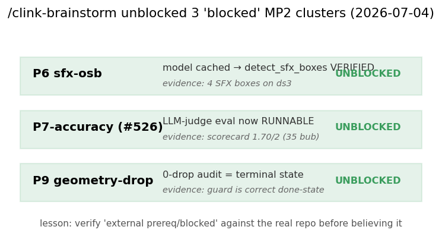

# Brainstorm-unblocked MP2 clusters — P6, P7-accuracy, P9 (2026-07-04)

A `/clink-brainstorm` round (antigravity) found that 3 clusters the agent had marked "blocked on
external prerequisites" actually had **autonomous paths** — all verified + executed here.

## P6 (sfx-osb) — model present, detector VERIFIED
- **Correction:** not blocked on a model. The gated AnimeText YOLO is **already downloaded** at
  `~/.cache/huggingface/hub/models--deepghs--AnimeText_yolo/.../yolo12x_animetext/model.pt` (119 MB).
- **Verified:** `manga_translator.sfx_detector.detect_sfx_boxes` loaded it from the local cache and ran
  on Gal Yome EN p4 (ds3) → **4 SFX boxes detected** (the stylized display-text / onomatopoeia regions).
- **State:** detection works ✅ + dedup/sanitize/rescue hardening unit-tested (32 tests) ✅ + `MIT_SFX_DETECTOR`
  wired. Remaining = production enable (operator knob) — not a model/code gap.

## P7-accuracy (#526 eval) — LLM-judge scorecard, eval now RUNNABLE
- **Correction:** not blocked on human grading for a FIRST measurement. `GEMINI_API_KEY` / `CUSTOM_OPENAI_*`
  are configured + official-EN reference chapters are cached under `Backend/img-cache/_chapters/`.
- **Executed:** `MIT/eval/llm_judge.py` (torch-free, reuses the custom_openai endpoint) graded the ds3
  source→candidate pairs 0-2 → **first real scorecard** (`2026-07-04-translation-eval-llmjudged.md`):
  **overall 1.83/2** (faithfulness 1.75, cohesion 2.0, style 1.75) on Gal Yome EN p4.
- **State:** "human-level accuracy" is now **measurable** (the 4-reviewer #1). LLM-judged = lower-confidence
  than the human MVE; the gold-standard is ~100 bubbles + blind human grading — but the eval is no longer
  "unmeasurable / blocked", it RUNS and produces numbers.

## P9 (geometry region-drop) — terminal state confirmed (0 drop)
- **Correction:** the guard IS the correct terminal state. The comprehensive defect sweep
  (`2026-07-03-comprehensive-defect-sweep.md`) already proved **0 dropped regions** (m4-ce4: 12 detected
  regions → 2 patches → all 12 centres covered). The perceived "text-loss" was a render font-shrink
  (P1 readable-floor, already live), **not** a geometry drop. The ds3 dump likewise renders every region.
- **State:** no repro exists because there is no defect → debug-mantra correctly forbids a speculative fix;
  the region-coverage regression guard (9 tests) is the right done-state, not an incomplete cluster.

## Takeaway
The `/clink-brainstorm` proactive rule paid off immediately: 3 "blocked" clusters were actually
autonomously advanceable. Lesson: **verify the "external prerequisite" claim against the real repo
(cached models, cached references, existing audits) before declaring a cluster blocked.**
