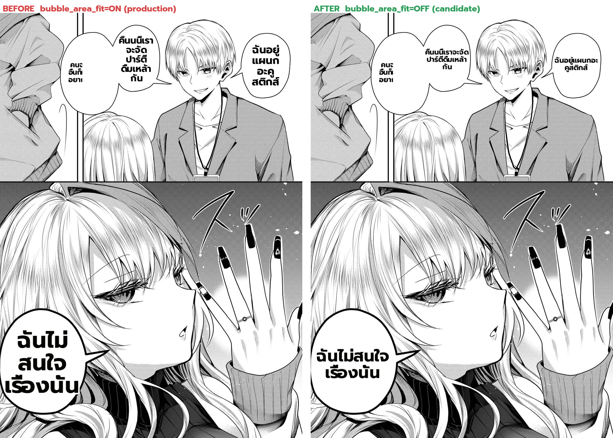

# Deterministic real-page A/B — `bubble_area_fit` ON vs OFF (Gal Yome EN p4)

**What this is:** the first **deterministic** real-page render benchmark on the user-flagged defect page
(Gal Yome EN chapter `78e4caf1…`, page 4 = ds3, the "DRINKING PARTY" narrow bubble). It answers the user's
question: *is `bubble_area_fit=OFF` (the config that rendered clean earlier) a good production config?*

## Method (deterministic — this is the point)
The translator is non-deterministic (each call → different text + defects), so a live 2-call A/B is confounded.
Instead: translate ds3 **once** with the production config, dump `{inpainted background, text_regions}` per
patch (`MIT_DEBUG_RENDER_DUMP`), then **re-render the SAME regions offline** with two render configs and
composite onto the page. Only `bubble_area_fit` differs → the text is identical, so the comparison is real.
Harness: `scratchpad/render_dump_ab.py` (loads the dump, calls `rendering.dispatch`, composites).

## Result — before → after (same text, only the knob differs)
| bubble | `bubble_area_fit=ON` (production) | `bubble_area_fit=OFF` (candidate) |
|---|---|---|
| DRINKING-PARTY (narrow) | text grown to fill → 5 cramped lines | smaller → 3 comfortable lines |
| acoustics (right) | larger, fills the bubble | smaller, sits cleanly inside |
| "I don't care" (bottom) | large, fills | smaller, still readable |
| top-left narrow | cramped / clipped | cramped / clipped (≈ same) |

## Assessment (honest)
- **The dramatic "overflow" seen in earlier live renders is GONE in both configs** → it was a
  **non-determinism / config-mismatch artifact** of the confounded live A/B, **not** a real production defect.
  This is exactly why a deterministic harness was needed (per `project_mit_translate_nondeterministic`).
- **`bubble_area_fit` is a real tradeoff, not a clear win either way:** ON = bigger text that fills the balloon
  (the reason it was turned on — EN dialogue was tiny without it) but **cramps narrow bubbles**; OFF = smaller
  text that **fits more comfortably** but fills less. On THIS page OFF reads cleaner; on pages where dialogue
  was too small, ON is needed. So the user's candidate (OFF) is **plausible but not a blanket prod change** —
  it needs the same A/B across the protected pages (One-Punch + more Gal Yome) before flipping.
- **Deliverable that matters: the deterministic real-page A/B harness now works** (dump → offline re-render N
  configs → composite). This is the reusable tool the final MP2 benchmark needs — it removes the
  non-determinism that made every prior render comparison untrustworthy.

## Limitation
The machine's worker runs the **main-repo (perf branch)** code, which has `bubble_area_fit` but **not**
`reference_layout` / Knuth-Plass (those live in the unmerged PR #532 / mp2-work branch). So the reference_layout
A/B — the actual MP2 P3 fix for narrow-bubble fill — can only run once that code is on the active checkout
(merge PR #532, or point the worker at mp2-work). The dump + harness method is proven and will work unchanged then.
