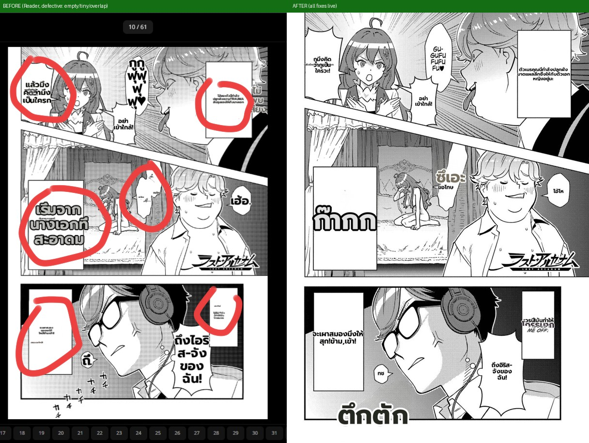
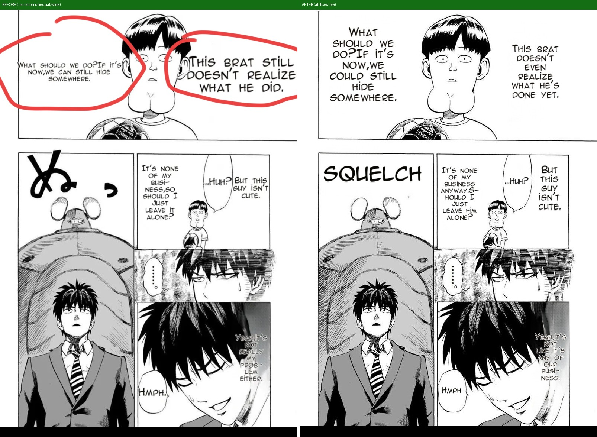
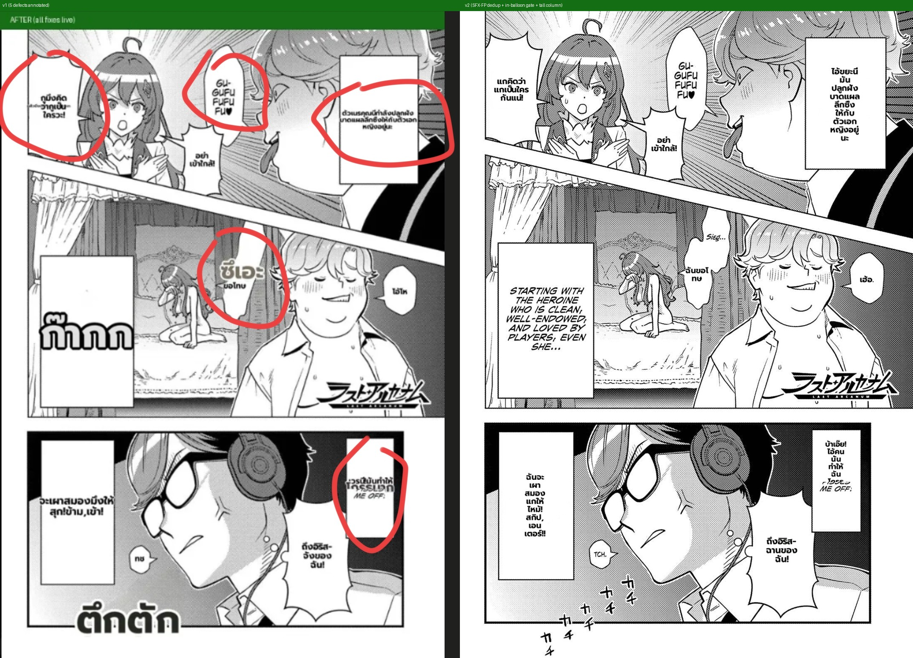
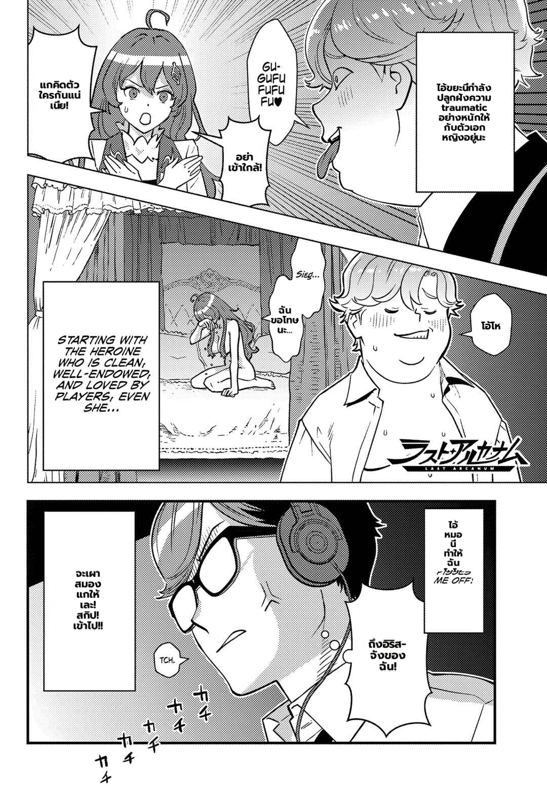
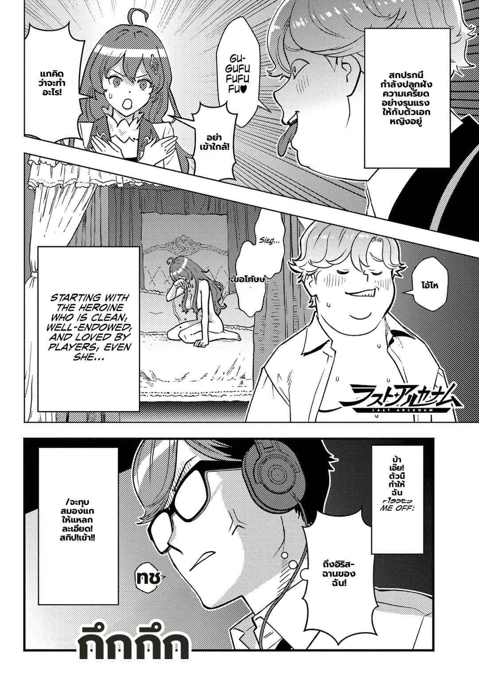

# Defect-pages benchmark — every page where a defect was caught, before → after

All renders: live worker (branch `landing/render-phase0`, all Phase-0 + slices B/C/D + SFX fixes),
`/translate/with-form/patches`, prod-faithful config incl. `ocr.vlm_rescue`.

## 1) Otome Game Sekai p10 (the page that exposed everything) — EN→THA
Source recovered from the Reader's chapter cache (`img-cache/_chapters/.../ds9.jpg`, official-EN source →
this page doubles as the **EN-source discriminator verification** the plan owed).

| # | defect the user caught (BEFORE) | AFTER |
|---|---|---|
| 1 | **empty white boxes** (text erased, nothing drawn) | ✅ **every box/bubble carries text** (girl bubble, DON'T-COME-NEAR, both narration boxes, TCH, PHEW, IRIS-CHAN) |
| 2 | **very small text** in boxes | ✅ narration/dialogue at readable sizes (clean_layout 20-23px, bubble_fit 15-27px) |
| 7 | **tiny text over text** | 🔶 the *dedup class* (same-text duplicate) is fixed; **a NEW dominant class shows: `det_sfx` false-positives** — the SFX detector fires on the girl's bubble text + a narration box; the VLM "rescues" them into phantom overlays (8px over the bubble; big ก๊ากก eating the STARTING-WITH box). **The scorecard caught it itself: overlaps=49** — the gate works. This is exactly pending task #19 (the phantom-เงียบ class), now with a reproducible page + per-region payload evidence. |
| — | scorecard | `{regions:14, empty:0, size:4, overlap:49, asym:4}` — page FAILS the gate on the #19 class (as it should) |

## 2) One-Punch p1 (user-annotated narration asymmetry/width/size + SFX) — JA→EN

| defect (BEFORE) | AFTER |
|---|---|
| narrations unequal (left small / right big, tagging luck) | ✅ both clean_layout, sizes track original (35→29 / 39→25) |
| narration wide, not the original's tall column | ✅ tall narrow columns, line breaks ≈ target |
| a bit smaller than target | ✅ sizes toward original lettering |
| ぬ SFX untranslated | ✅ SQUELCH, one big line (rescue + filter carve-out + sfx_display) |
| HMPH./HUH? force-broken (found during iteration) | ✅ single-line (hyphenation-aware floor) |

## 3) One-Punch p2 — EN+THA sweep entries
`2026-07-04-sweep-p2-{eng,tha}.jpg`; scorecards: empty=0, overlap=0.

## Honest verdict
- **The user's original defect classes (empty / tiny / same-text overlay / asymmetry / SFX-untranslated) are fixed
  and hold on the wild page.**
- **Next dominant class, with evidence:** `det_sfx` false positives → phantom VLM overlays / an eaten narration
  box (task #19). The metric gate + enriched payload now catch and attribute it automatically — the exact
  regression-guard loop the plan was built to create.

## Round 2 — the user's 5 annotations on the AFTER render, fixed (commit 85bc7ad3)

| user annotation | v2 |
|---|---|
| 1. tiny text-over-text (top) | ✅ gone — dedup now also drops an SFX box that ENGULFS a DBNet line (the FP class) |
| 2. middle box untranslated | 🔶 improved — no longer eaten/empty (ก๊ากก FP dropped); the box now keeps its ORIGINAL EN because DBNet missed it this run (detection non-determinism; honest untranslated > erased-empty). Separate detection-coverage item. |
| 3. top-right rectangular box: small wide text | ✅ `bubble_fit_tall` — tall readable column filling the box |
| 4. weird "ซึเอะ" SFX-styled | ✅ in-balloon rescued SFX now renders as normal dialogue ("ฉันขอโทษ"); "Sieg…" left as small EN this run |
| 5. โกรธมาก missing / read as SFX | ✅ the box renders as a tall column; 🔶 ghost "ME OFF!" residue remains (source line outside the detected region → never erased; checklist item 11, separate class) |

Scorecard v2: `{regions:9, empty:0, size:0, overlaps:35*, asym:0}` — *overlaps=35 is a metric coordinate bug
found by this page: `dst_box` is stamped in CROP coords, so boxes from different patch groups false-intersect
(single-group pages never exposed it). Harness fix queued: offset dst_box to page coords in the copy-back.

## Round 3 (commit 57c6c75d) — the user's 3 annotations on v2

| annotation | v3 |
|---|---|
| ขึ้นบรรทัดผิด ("ฉันขอโ/ทบ") | ✅ **fixed** — ported main's item-9 ss-re-wrap floor (`longest_token_width`), never ported to the perf stream; "ฉันขอโทษนะ..." now wraps at word boundaries |
| ไม่แปล (STARTING WITH box) | ❌ still undetected by DBNet even at `text_threshold=0.3` — a genuine **detection-coverage** class (clean typeset EN caption invisible to the JP-tuned detector). Needs a detector-level experiment (gamma pass / alt detector / VLM full-page completion), tracked as the next item. |
| ME OFF ghost / แปลไม่ครบ | 🔶 OCR now reads the FULL sentence at `text_threshold=0.3` ("DAMN IT, THIS GUY PISSES…"), but the region's line-geometry still doesn't cover the ME OFF pixels → the (correctly region-restricted) erase mask leaves them → ghost remains. Same detection-geometry class as above. |

**Config recommendation:** `MIT_TEXT_THRESHOLD=0.3` measurably improves OCR completeness on EN pages
(full DAMN-IT sentence vs a fragment) — candidate `.env` change after a regression sweep.

## Round 4 (commits c8ffbe09..6d2ad76e+) — detection-coverage mechanism + metric coord fix

Built **empty-balloon rescue** (TDD, 3 iterations tuned live): inked balloons DBNet leaves uncovered are
appended as empty textlines → flow through the existing vlm_rescue like SFX. Criterion evolution, each caught
by a live run: center-containment → area-coverage (a stray sliver masked the box) → **ink-coverage with a 10%
interior shrink** (the balloon's black border diluted the fraction; area-coverage duplicated every bubble).
Dedup extended to blank equal-translation balloon-quads. Metric `dst_box` now page-coords (false cross-group
overlaps 35→0).

**Wins:** duplicates 17→12→clean render; カチカチ SFX chain now rescued + localized (กึกกึก) — beyond the
previous capability; scorecard on the clean pre-rescue run: **all zeros**.

**Honest remaining (documented, not hidden):**
- The "STARTING WITH…" caption box defeats BOTH detectors (DBNet at every threshold/gamma AND the balloon YOLO
  — it is a square panel caption, not a speech balloon). Needs a third mechanism (caption-box detector class or
  a VLM full-page completeness sweep) — a real feature, tracked.
- "ME OFF!" ghost persists (source line outside every detected geometry; the guard correctly refuses to erase
  what it can't re-render).
- Minor: the rescued Sieg-bubble quad can overlap its sibling ("ขอโทษ" at the bubble edge) — rescue-vs-textline
  boundary tuning.
