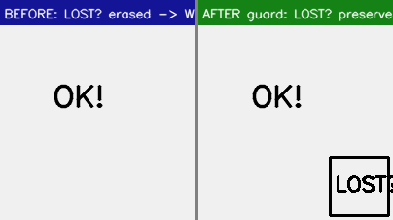

# Empty-bubble erase-mask guard (#535/#536 Phase-0b) — deterministic before/after

**Defect (root-cause report §2.4):** the refined inpaint mask hunts ALL text-like strokes in a patch's crop —
including a **dropped region's text or a neighbouring group's bubble** — and erases them while the render stage
draws nothing back → the user-visible **white empty bubble** (Otome Game Sekai p10).

**Fix:** `patch_geometry.restrict_mask_to_render_regions(mask, allowed, margin)` wired in `PatchRenderer`
after refinement, before tighten/inpaint: the erase mask is intersected with the group's own region mask
(+8px margin for legitimate refinement spill). Only the ERASE mask narrows — the inpaint crop/context is
untouched, so LaMa quality is unchanged.

**Method (fully deterministic, no GPU/translator):** drive the REAL `PatchRenderer.process_group` with stubbed
GPU stages on a synthetic page containing a kept region's bubble ("KEPT") and a foreign bubble ("LOST?") whose
region was dropped. Refinement finds both texts' strokes. BEFORE = guard bypassed (pre-fix behavior); AFTER =
guard active. Same code path, same inputs, one variable.

## Result

| | foreign-text ink pixels ("LOST?" bubble) |
|---|---|
| BEFORE (guard off — pre-fix) | **0** (bubble fully erased → white hole, nothing re-rendered) |
| AFTER (guard on) | **1152** (preserved intact; kept region still re-renders normally) |

## Assessment
- **Fix-root:** the erase-without-render path is closed — the exact mechanism behind the white-empty-bubble
  defect no longer fires; a dropped/foreign region's text can no longer be silently destroyed.
- **No-regression:** the kept region's text is still fully erased for re-render (48/48 seam tests + 75-test
  adjacent sweep green); the guard is a pure intersection — it can only ever erase LESS, never more.
- **Completeness/limitations:** synthetic deterministic proof of the mechanism; a live confirmation on the wild
  Otome page needs that source page captured (the Reader's copy is a stale pre-deploy cache). The full-page
  inpaint path (`MIT_PATCH_FULLPAGE_INPAINT`, off in prod) builds its mask differently and is not covered by
  this guard — noted for Phase 0 follow-up. Telemetry (`[RegionDrop]` lines) now records every dropped region
  so wild occurrences are diagnosable.
