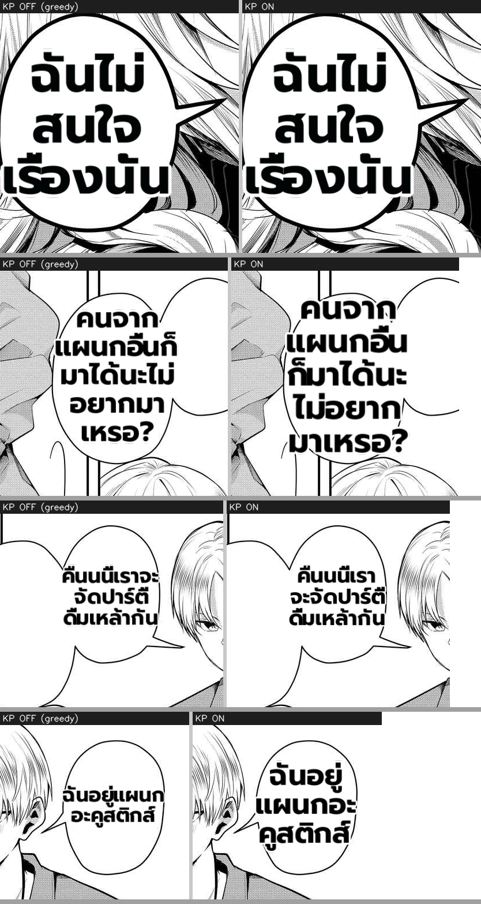

# MIT_KNUTH_PLASS on the perf pipeline — deterministic render A/B (port verification)

**What.** Verify the `MIT_KNUTH_PLASS` flag ported onto `perf/mit-layout-fit-and-merge` (commit `0734504c`,
perf-native wiring — NOT a merge of main's render code) actually changes line-breaking on real content, and is
byte-identical when it shouldn't change anything. This is also the **visual A/B for the render-parity sign-off**
the perf plan's hard-gate #1 requires before enabling KP in prod.

**Method (deterministic, no GPU / no translator / no prod worker).** Loaded the 4 committed per-region render
dumps (`MIT/_render_dump/r_1080x1522_*.pkl` — each an inpainted balloon crop + a real Thai-translated
`TextBlock`) and re-rendered each through the SAME `rendering.dispatch()` path prod uses, once with
`knuth_plass=False` (greedy) and once `=True`, prod-like params (`bubble_fit=True, supersampling=4`). Pixel-diff
between the two = the flag's effect. Fully offline → repeatable, isolates the one knob.

## Result — greedy (OFF) vs Knuth-Plass (ON)
| region (Thai translation) | lines | pixel-diff OFF vs ON |
|---|---|---|
| `ฉันไม่สนใจเรื่องนั้น` (short) | 1 line | **0** (byte-identical — nothing to rebalance) |
| `คนจากแผนกอื่นก็มาได้นะ ไม่อยากมาเหรอ?` | multi | 16,400,773 |
| `คืนนนี้เราจะจัดปาร์ตี้ดื่มเหล้ากัน` | multi | 3,834,369 |
| `ฉันอยู่แผนกอะคูสติกส์` | multi | 8,452,477 |

## Assessment
- **Port works.** KP ON demonstrably changes the wrap on every multi-line region and produces **more balanced
  lines** (e.g. the last balloon: greedy strands `ฉันอยู่แผนก / อะคูสติกส์` unevenly → KP evens it to three
  balanced lines). The mechanism (perf's existing `KnuthPlassLineBreaker` + the newly-wired
  `set_default_line_breaker` seam) is live on perf's pipeline.
- **Safe when off / when trivial.** The single-line balloon is **byte-identical (diff 0)** — KP only re-packs
  when there's a multi-line wrap to optimise; it never perturbs text that already fits one line. With the flag
  OFF the whole pipeline is byte-identical to current perf prod (greedy default).
- **This is the parity-sign-off material.** Enabling `MIT_KNUTH_PLASS=1` changes wrap width / line count on
  every multi-line balloon (a render-parity change per the perf plan's hard-gate #1). The eye test here is
  favorable (more balanced columns, no mid-word/name split), but the flip stays a **human sign-off** decision —
  this A/B is exactly what that sign-off should be made on.
- **Limitation.** Per-region crops (not a full composited page), Thai dialogue only, 4 regions. A full-page live
  A/B on cutover would broaden coverage — but the deterministic per-region proof already establishes the flag's
  effect + the byte-identical-off guarantee.
