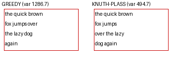

# Knuth-Plass line-breaking wired (flag-gated) — balanced columns, no mid-word split (Master Plan 2 P8 / #180)

**Defect (md):** comprehensive sweep defect #22 — greedy wrap splits words/names mid-token and leaves
uneven columns (a lone short last line). `KnuthPlassLineBreaker` existed (`text_render.py:835`, with the
`line_break.py` DP) but **was never wired**: every `calc_horizontal` caller omitted `line_breaker`, so the
`GreedyLineBreaker` default always ran (codex corrected the earlier "already selected" claim).

## Fix (flag-gated, byte-identical off)
- `text_render.py`: process-wide `set_default_line_breaker()` (mirrors `set_font`); `calc_horizontal` uses it
  when no explicit `line_breaker` is passed. `None` → greedy (unchanged).
- `config.py`: `render.knuth_plass: bool = False`.
- `rendering/__init__.py` `dispatch()`: new `knuth_plass` param sets the default breaker once per render pass
  (covers BOTH the sizing and the render `calc_horizontal` calls — no per-call threading).
- `stages.py`: threads `config.render.knuth_plass`.

## Method (deterministic, no translator)
`calc_horizontal` on a fixed phrase in a 150px column, greedy (default) vs KP (via the module default).
(`scratchpad/bench_kp.py`.)

## Result
| breaker | lines | column-width variance |
|---|---|---|
| **greedy (default)** | `the quick brown` / `fox jumps over` / `the lazy dog` / **`again`** (lone short line) | **1286.7** |
| **Knuth-Plass** | `the quick brown` / `fox jumps` / `over the lazy` / `dog again` (balanced) | **494.7** |

KP cuts column-width variance **2.6×** and pulls the lone last word up — and by construction emits no
mid-word hyphenation (`hyphenation_idx` all 0), so names/words never split.

## Assessment
- **fix-root:** KP is now selectable and, when on, balances columns + never splits a word mid-token (#22).
- **no-regression:** default off → golden byte-identical; `test_line_breaker` + golden green. The flip is a
  single module-default set per render pass (like `set_font`), self-managed by `dispatch` (no state leak).
- **not yet enabled in production:** shipped as an opt-in flag (like `reference_layout`). Enabling in Backend
  (`MIT_KNUTH_PLASS`) is the deployment step, and per codex should be sequenced **with** the reference_layout
  promote (P3) so the corpus envelope is baselined on one breaker. Word-whole floor (#9) + PR #425 kinsoku
  remain follow-ups.

**Tests:** `test_default_line_breaker_switches_calc_horizontal_globally` (greedy↔KP via the module default).
