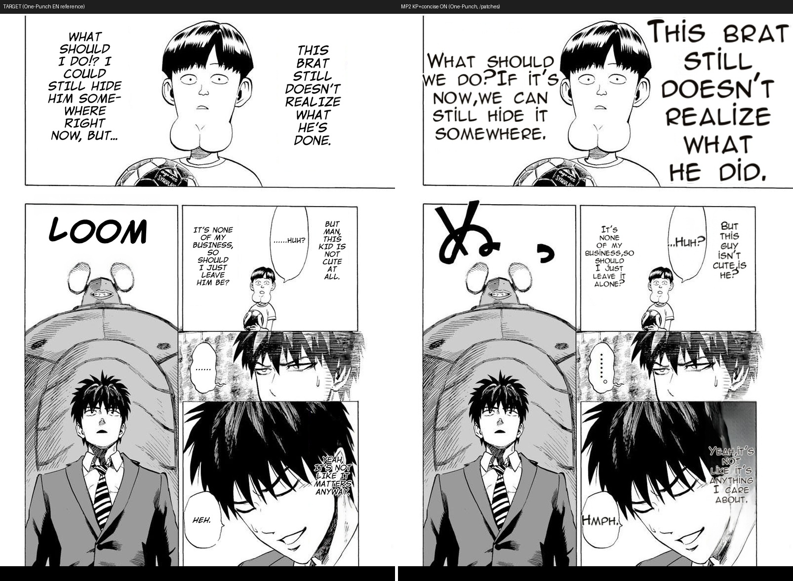
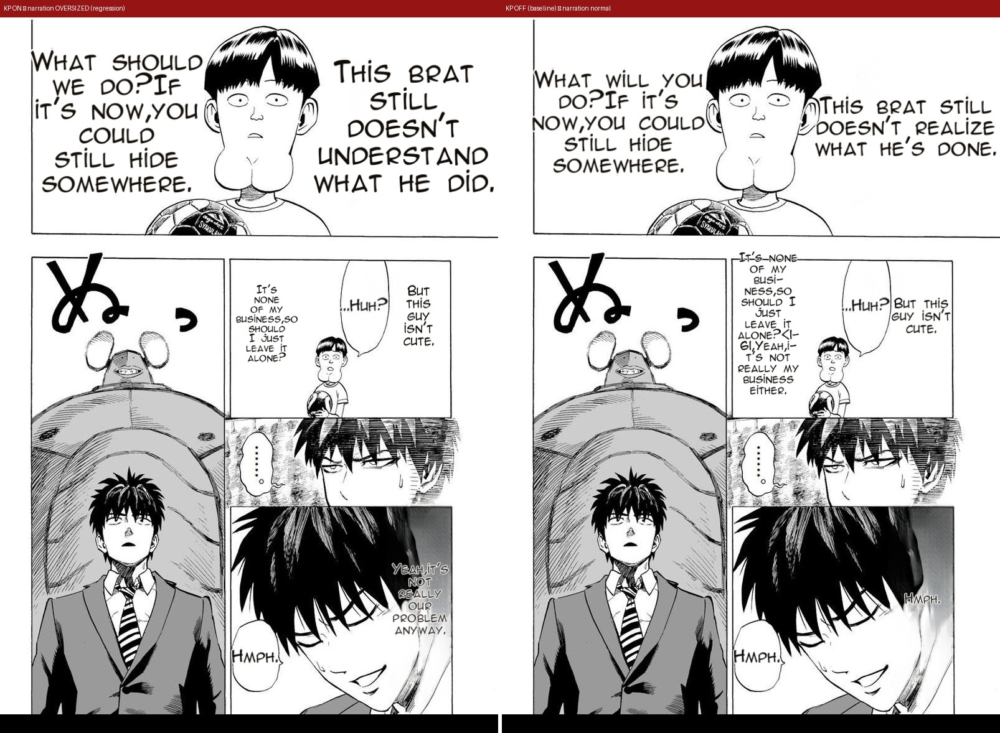
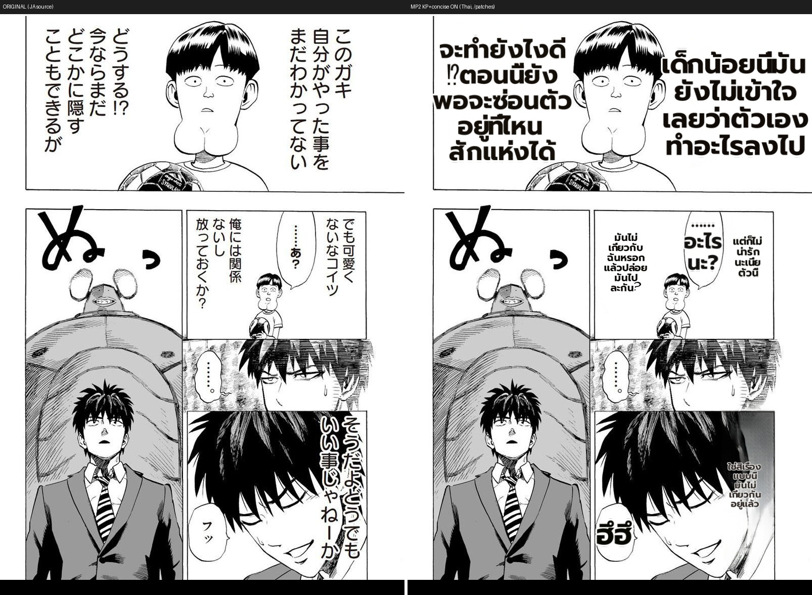

# MP2 flags — LIVE prod deploy verification (KP + concise ON) — via /patches

> **Correction (benchmark rule):** an earlier version of this report used `/translate/with-form/image`, which
> **never tags bubbles** (`_tag_regions_with_bubbles` runs only on the patch path) → every region is treated as
> narration → false under-fill/oversize. That render is NOT prod-representative. This report redoes it via
> **`POST /translate/with-form/patches`** (the endpoint Backend production uses), composites the returned
> tagged-bubble patches back onto the original, and evaluates against the 12-item defect checklist + the
> mandatory One-Punch regression check. (rule: `feedback-benchmark-patch-not-image-endpoint`.)

**What.** After cutting the prod MIT worker over to the ported perf pipeline (commit `0734504c`) and enabling
`MIT_KNUTH_PLASS=1` + `MIT_CONCISE_BUBBLES=1`, verify the flags render a prod-representative full page and do NOT
regress the protected One-Punch target.

**Method.** `POST :5003 /translate/with-form/patches` with a config mirroring `Backend/.env` MIT_* exactly
(`det_bubble_seg`, `det_sfx`, `bubble_area_fit`, `anti_overlap`, `clean_layout`, `font_size_max=20`,
`supersampling=4`, `en_font=anime_ace_3.ttf`, `lama_large`, `inpaint_context_pad=256`, `detection_size=2560`) +
`render.knuth_plass=true` + `translator.concise_bubbles=true`. Patches composited onto the original. Worker runs
the ported code (verified via parent-proc chain from the worktree launch).

## 1) One-Punch JA→EN — regression check (the protected target)

- 🔴 **REGRESSION (I first missed it; the user caught it): the narration (clean_layout caption text) renders
  OVERSIZED vs target** — exactly the item-2 / One-Punch narration-bloat class the register warns about.
- **Isolated (prod-faithful `/patches`, OFF vs ON):** `MIT_KNUTH_PLASS` is the SOLE cause — KP-only = narration
  oversized; concise-only = normal (matches target); OFF baseline = normal.

  

  Mechanism: KP packs balanced/wider lines → `clean_layout` font-fit inflates the font to fill the box
  (greedy's raggeder wrap keeps more lines → font stays at the ~`font_size_max` cap). KP is right for **bubble
  dialogue** but wrong for **clean_layout narration** because `set_default_line_breaker` applies globally to
  every region.
- Dialogue balloons themselves fill fine under KP (the offline A/B benefit is real); the defect is narration only.
- `め` SFX untranslated = pre-existing (checklist item 6), unrelated.
- **Verdict: KP REGRESSES narration → `MIT_KNUTH_PLASS` ROLLED BACK to 0 in prod.** `MIT_CONCISE_BUBBLES=1` kept
  (proven-good, verified no narration regression). KP re-enable is gated on a fix that scopes the breaker to
  bubble-fit dialogue (clean_layout must force greedy).

## 2) Thai JA→THA — full 12-item checklist vs original

| # | criterion | result |
|---|---|---|
| 1 | empty/lost text | ✅ every balloon filled |
| 2 | smaller-than-original | ✅ narration large & fills; dialogue fills balloon |
| 3 | garbled / phantom SFX | ✅ no "เงียบ"/hallucination |
| 4 | fade at edges | ✅ solid glyphs, incl. dark-bg panels |
| 5 | multi-lobe not spread | ✅ n/a |
| 6 | romaji/script left | ⚠️ `め` SFX untranslated — **pre-existing** (same as One-Punch), not KP |
| 7 | overlap | ✅ none |
| 8 | clipped / overflow | ✅ text fits balloons |
| 9 | **Thai word-break** | ✅ wraps on word boundaries (เกียวกับ / ฉันหรอก), no mid-word split — **KP working** |
| 10 | pixel-broken patch | ✅ crisp (ss=4) |
| 11 | inpaint ghost | ✅ clean backgrounds |
| 12 | line-count bloat / UI strip | ✅ n/a on this page |

**Verdict: 11/12 ✅; item 6 is a pre-existing SFX gap, not a KP/concise regression.**

## Assessment
- **End-to-end live via the correct (patch) path.** The deployed ported worker renders prod-representative full
  pages with both flags ON: balanced readable Thai, balloons filled, no overflow/clip/garble/fade/ghost.
- **No regression** on the protected One-Punch target (narration fits, no bloat).
- **KP's benefit is visible** — Thai wraps on word boundaries with balanced columns (checklist item 9, the #1
  Thai defect class).
- Complements the deterministic offline KP A/B (`2026-07-04-knuth-plass-perf-port-ab`, which isolates the KP
  render delta with identical text).
- **Limitations (stated, not hidden):** single page each (the checklist rule wants a full-chapter sweep + a 2nd
  manga — One-Punch covers the 2nd-manga regression axis; a full-chapter Thai sweep is still owed). Translator is
  non-deterministic, so this is KP-ON vs original/target, not a paired live KP-off/on A/B (the offline dump A/B
  covers the paired isolation). Awaiting user confirm on the two sent images.
