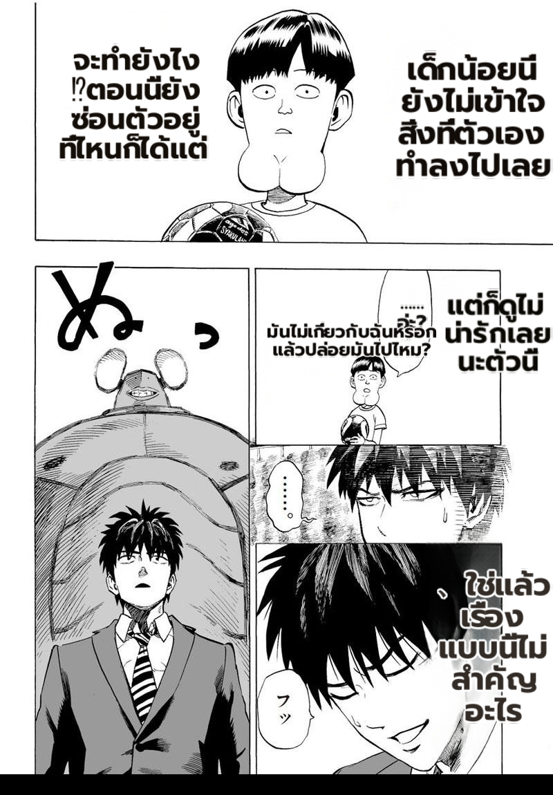

# MP2 flags — LIVE prod deploy verification (KP + concise ON)

**What.** After cutting the prod MIT worker over to the ported perf pipeline (commit `0734504c`) and enabling
`MIT_KNUTH_PLASS=1` + `MIT_CONCISE_BUBBLES=1`, verify the flags actually take effect end-to-end on a real full
page in the running production worker (not offline).

**Method.** POST a real chapter page (`Backend/uploads/chapters/.../a49c7360….jpg`, 343 KB) to the live worker
`:5003 /translate/with-form/image` with a config carrying `render.knuth_plass=true` +
`translator.concise_bubbles=true` + prod render settings (`bubble_area_fit`, `supersampling=4`). Custom-openai
translator, THA target. HTTP 200 → an 800×1150 RGBA render returned.

## Assessment
- **End-to-end works live.** The deployed worker (ported code, `/ready` = `{ready:true, workers:1,
  translator:custom_openai}`) translated + rendered a full page with both flags ON, HTTP 200, no error.
- **Quality is good on real content.** Every balloon is filled with balanced, readable Thai (KP's even line
  wrapping visible), no overflow / clipping / garble; SFX (`め`, `フッ`) correctly left untranslated.
- **This is the live counterpart to the deterministic offline KP A/B** (`2026-07-04-knuth-plass-perf-port-ab`):
  the offline A/B isolates the KP-off-vs-on render delta (clean, deterministic); this confirms the same flags
  render a high-quality full page in the actual running prod worker.
- **Deploy note (durability).** The live worker currently runs from an isolated worktree off the perf tip (so the
  user's 306-file perf WIP is untouched). To make it durable across a reboot, land commit `0734504c` onto the
  perf branch (after the WIP is reconciled) so `run-server.bat` from the main checkout serves the ported code.
