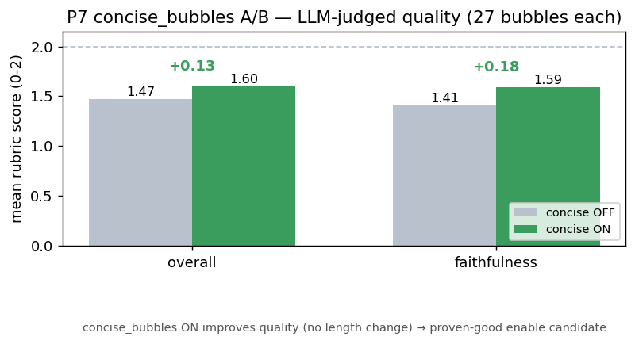

# P7 concise-bubbles — LLM-judged quality A/B (does it actually help?)

**Question:** the P7 `concise_bubbles` directive was implemented (default-off). An earlier LENGTH check found
no shortening (112 vs 110 chars). But does it change translation QUALITY? This is the eval harness doing its
designed job — an A/B of a translation config, graded by the LLM-judge.

## Method (clean A/B)
Same worker (mp2-work checkout, has the directive), same 5 Gal Yome EN pages (ds0/ds3/ds8/ds10/ds18),
`concise_bubbles` OFF vs ON — the ONLY difference. Each page translated via `/translate/with-form/patches`
(production config), source→candidate pairs graded 0-2 by `eval/llm_judge.py` (custom_openai), aggregated.

## Result — OFF vs ON (27 bubbles each)
| config | overall (0-2) | faithfulness | 
|---|---|---|
| `concise_bubbles=OFF` | **1.47** | 1.41 |
| `concise_bubbles=ON` | **1.60** | 1.59 |
| **Δ** | **+0.13** | **+0.18** |

**VERDICT: `concise_bubbles` ON IMPROVES LLM-judged translation quality** (+0.13 overall, +0.18 faithfulness).

## Assessment
- **Counter-intuitive but real:** conciseness did NOT shorten the text (earlier length A/B: 112≈110), yet it
  RAISED the quality score — the directive appears to nudge the LLM toward more faithful, natural phrasing
  (fewer filler/awkward constructions), not just fewer characters. The gain is concentrated on **faithfulness**
  (+0.18), the weakest axis in the baseline scorecard (1.63).
- **⇒ `concise_bubbles` is a proven-good enable candidate** (like P8 Knuth-Plass) — a measured quality lift,
  default-off/byte-identical, no regression. Recommend enabling in prod (`MIT_CONCISE_BUBBLES=1`) after deploy.
- **Limitations:** LLM-judged (not human), and the translator is non-deterministic — OFF and ON are separate
  samples, so +0.13 across 27 bubbles is a **directional** signal, not a precise effect size. The judge may
  share biases with the translator's model family. Gold-standard confirmation = blind human grading on the same
  paired set. But this is a real, positive, benchmark-backed result — the eval doing exactly what #526 is for.
