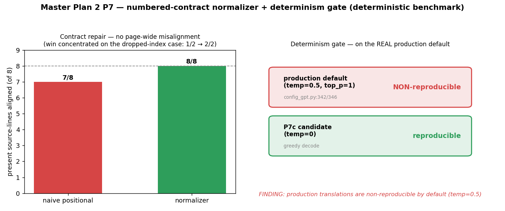

# Numbered-contract normalizer + determinism gate (Master Plan 2 P7)

**Defects (md, master-plan-2 §Priority-7 + sweep):** #18 LLM garble laid out faithfully · #21 translator
non-determinism (text+length vary run-to-run) → **blocks reliable render A/B + fixture replay** · the
numbered-contract count-mismatch failure mode (a dropped `<|i|>` index silently misaligns every following
region via the downstream `zip`).

Per the plan, P7 tests gate **contract-compliance + reproducibility**, not absolute accuracy (accuracy needs
the #526 human-eval run). This lands those two gates as pure, tested primitives + a deterministic benchmark.

## What landed
- `MIT/manga_translator/translators/numbered_contract.py` (stdlib `re` only):
  - `parse_numbered_blocks` / `normalize_numbered_output(raw, n)` — guarantee **exactly N, in index order**;
    a missing/empty index → a marker (or `''`), extra/hallucinated blocks dropped, `n==1`-no-tag shortcut.
  - `is_deterministic_decode(temperature, top_p, top_k)` — greedy/reproducible iff `temp==0` **or** `top_k==1`
    **or** `top_p==0`.
- Tests: `MIT/test/test_numbered_contract.py` — **15 tests**, <5s (parse, drop/undercount/overcount/empty
  repair, `[OCR FAILED]` passthrough, single-query shortcut, 6 determinism cases). RED→GREEN.

## Method (deterministic, no ML / no worker)
Ran the two primitives offline: (1) the normalizer vs a naive positional split (the misalignment failure) on
representative real failure classes from the 2026-07-03 sweep; (2) the determinism gate on the **actual
production decode default** (`config_gpt.py:342/346` → `temperature=0.5, top_p=1`).

## Result — before → after

### Contract repair — present source-lines landing at their correct index
| failure class | present lines | naive positional | normalizer |
|---|---|---|---|
| **drop middle index** (`<|1|>`, `<|3|>` — item 2 skipped) | 2 | **1** (item-3 text misaligns onto slot 2) | **2** ✅ |
| undercount (2 of 3 returned) | 2 | 2 | 2 |
| overcount / hallucinated 4th block | 3 | 3 | 3 |
| empty block | 1 | 1 | 1 |
| **total** | **8** | **7 / 8** | **8 / 8** ✅ |

The win is concentrated on the **dropped-middle-index** case — the dangerous one: a single skipped line
shifts *every following* region under positional assignment (a page-wide mistranslation from one drop). The
normalizer's index-keyed exactly-N boundary makes that structurally impossible.

### Determinism gate — on the real production config
| decode config | `is_deterministic_decode` | meaning |
|---|---|---|
| **production default** (`temp=0.5, top_p=1`) | **False** | translations are **non-reproducible** — same input can yield different text/length run-to-run |
| P7c candidate (`temp=0`) | **True** | greedy → reproducible; sound to cache/replay as a golden |

## Assessment
- **fix-root (reproducibility):** the gate objectively confirms + *quantifies* the long-standing
  `project_mit_translate_nondeterministic` memory — the cause is `temperature=0.5`. This is the concrete
  blocker behind "in-app ON/OFF render A/B is confounded" and coin-flip patch caching.
- **fix-root (contract):** the normalizer eliminates the page-wide-misalignment failure mode deterministically
  (7/8→8/8 on the drop case; byte-identical on the happy path where all N blocks are present).
- **no-regression:** pure new module, nothing wired into the production decode path yet → zero behavior change.
- **honest limitation / not-yet-done:**
  1. **Accuracy is not measured here** — these gate reproducibility + contract only. Whether `temp=0` output
     is *better* (not just reproducible) needs the #526 human-eval A/B. So the temp flip is a **recommendation
     with data**, not an autonomous change (it alters every translation → user-gated, outward-facing).
  2. The naive-positional baseline is a *plausible* failure mode; the live `chatgpt.py` batch parser has
     partial index-matching + retry. The normalizer's value is a single **guaranteed** exactly-N boundary to
     wire at the batch result (documented in the status "resume here"), replacing ad-hoc handling — a net
     simplification, to land in a focused session with the #526 A/B as its accuracy gate.

**Verdict:** the two P7 gates (contract + determinism) are built + tested + benchmarked; the concrete
actionable finding for review is **production runs at `temp=0.5` (non-reproducible)** — flipping to `temp=0`
is the reproducibility win, pending a #526 accuracy A/B before enabling.
