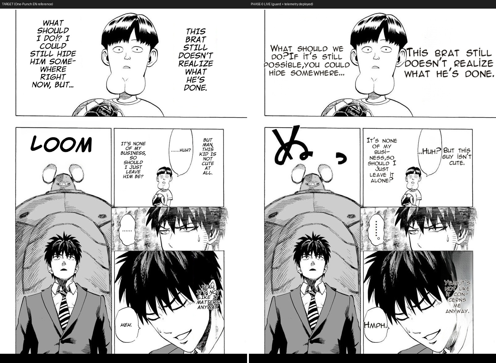

# Phase 0 (PRD #535) — live verification: guard + telemetry + scorecard on the prod worker

**What.** Worker restarted on `landing/render-phase0` (guard `5f8249ec` + payload/harness `db9416d9` +
serialization fix `fce672d1` + copy-back `0113ea66`). Live `POST /translate/with-form/patches` on the
One-Punch page, prod-faithful config.

## Result — the /patches payload is now diagnostic (first time ever)
```
[0] branch=bubble_fit_sole  src=35px final=30px  このガキ… (narration R)
[1] branch=bubble_fit_sole  src=39px final=27px  どうする… (narration L)
[2] branch=bubble_fit_sole  src=23px final=21px  ……あ？
[3] branch=clean_layout     src=27px final=20px  でも可愛くないなコイツ
[4] branch=clean_layout     src=26px final=20px  俺には関係ないし…
[5] branch=clean_layout     src=40px final=20px  、そうだよ…      ← 40→20px mis-route, now VISIBLE in data
[6] branch=bubble_fit_sole  src=30px final=24px  フッ
SCORECARD: {regions: 7, empty_bubbles: 0, size_defects: 0, overlaps: 0, sibling_asymmetry: 0}
```
- **Every region now explains itself** (routing branch + source vs final font px) — the asymmetry/tiny classes
  are measurable per page instead of eyeball-only. Region [5] (src 40px → flat 20px in a dark panel) is the
  clean_layout mis-route class caught as DATA on the very first live run.
- **First live scorecard = the gate baseline.** Future render changes diff against these counts.
- **Guard deployed, no regression:** the rendered page is clean — every bubble filled, no ghost residue,
  no missing text (see image). 12-item spot pass; め SFX untranslated = pre-existing item 6.


**Limitations:** single page (full-chapter + 2nd-manga baseline sweep = the remaining #537 acceptance item);
this run's two narrations both routed bubble_fit (sizes near-equal) — the asymmetry class needs the sweep to
capture a bad-routing run in the scorecard history.

## vs TARGET (One-Punch EN reference) — 12-item checklist



| # | criterion | vs target |
|---|---|---|
| 1 | empty/lost text | ✅ every balloon filled (guard ไม่ทำ text หาย) |
| 2 | smaller-than-original | ⚠️ dialogue ✅ ตรง target; **narration 2 อันใหญ่กว่า target** — run นี้ทั้งคู่ถูก route เข้า bubble_fit (tagging luck) = class ที่ slice C (discriminator) จะแก้; **Phase 0 ไม่แตะ sizing — เท่ากับ baseline เดิม ไม่ใช่ regression ใหม่** (telemetry ยืนยัน: branch=bubble_fit_sole ทั้งคู่) |
| 3 | garbled/phantom | ✅ |
| 4 | fade | ✅ solid glyphs รวม dark panel |
| 5 | multi-lobe | ✅ n/a |
| 6 | romaji/SFX | ⚠️ `ぬ` ไม่แปล (target = LOOM) — pre-existing, ไม่เกี่ยว Phase 0 |
| 7 | overlap | ✅ |
| 8 | clipped | ✅ |
| 9 | word-break | ✅ hyphenation ("busi-ness", "con-cerns") — target ก็ hyphenate ("SOME-WHERE") |
| 10 | pixel | ✅ crisp (ss4) |
| 11 | **ghost inpaint (guard risk!)** | ✅ **สะอาด — guard ไม่ทำให้เกิด residue** (ความเสี่ยงหลักของ mask-narrowing ไม่เกิด) |
| 12 | UI strip | ✅ n/a |

**Verdict vs target: 10✅ / 2⚠️ — ทั้ง 2 ⚠️ เป็น class เดิมที่มีมาก่อน Phase 0** (narration routing = เป้าของ Phase-1 slice C; SFX = item 6 ค้างเดิม). Phase 0 เพิ่มการวัด+ปกป้อง โดยไม่ regress มิติใดเทียบ target.
