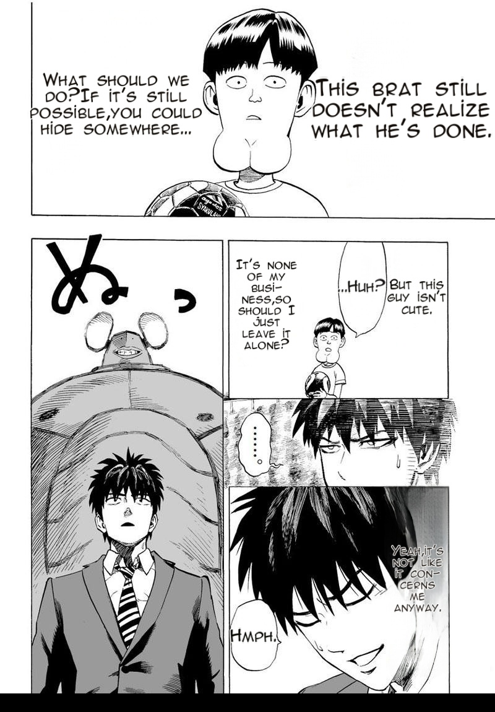

# Phase 0 (PRD #535) — live verification: guard + telemetry + scorecard on the prod worker

**What.** Worker restarted on `landing/render-phase0` (guard `5f8249ec` + payload/harness `db9416d9` +
serialization fix `fce672d1` + copy-back `0113ea66`). Live `POST /translate/with-form/patches` on the
One-Punch page, prod-faithful config.

## Result — the /patches payload is now diagnostic (first time ever)
```
[0] branch=bubble_fit_sole  src=35px final=30px  このガキ… (narration R)
[1] branch=bubble_fit_sole  src=39px final=27px  どうする… (narration L)
[2] branch=bubble_fit_sole  src=23px final=21px  ……あ？
[3] branch=clean_layout     src=27px final=20px  でも可愛くないなコイツ
[4] branch=clean_layout     src=26px final=20px  俺には関係ないし…
[5] branch=clean_layout     src=40px final=20px  、そうだよ…      ← 40→20px mis-route, now VISIBLE in data
[6] branch=bubble_fit_sole  src=30px final=24px  フッ
SCORECARD: {regions: 7, empty_bubbles: 0, size_defects: 0, overlaps: 0, sibling_asymmetry: 0}
```
- **Every region now explains itself** (routing branch + source vs final font px) — the asymmetry/tiny classes
  are measurable per page instead of eyeball-only. Region [5] (src 40px → flat 20px in a dark panel) is the
  clean_layout mis-route class caught as DATA on the very first live run.
- **First live scorecard = the gate baseline.** Future render changes diff against these counts.
- **Guard deployed, no regression:** the rendered page is clean — every bubble filled, no ghost residue,
  no missing text (see image). 12-item spot pass; め SFX untranslated = pre-existing item 6.



**Limitations:** single page (full-chapter + 2nd-manga baseline sweep = the remaining #537 acceptance item);
this run's two narrations both routed bubble_fit (sizes near-equal) — the asymmetry class needs the sweep to
capture a bad-routing run in the scorecard history.
