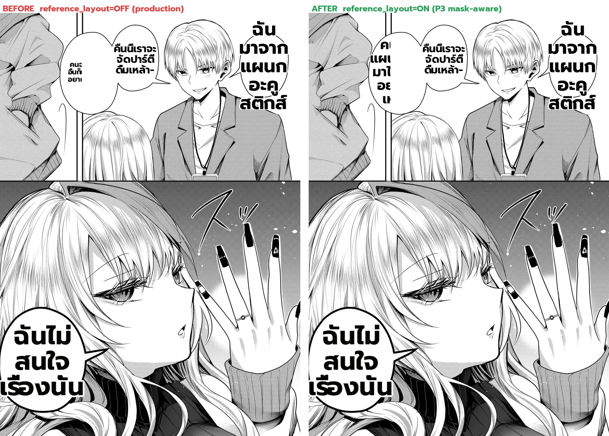

# Deterministic real-page A/B — `reference_layout` OFF vs ON (the MP2 P3 fix, Gal Yome EN p4)

**What this is:** the **actual MP2 P3 fix** (mask-aware sizing / `reference_layout`) tested deterministically on
the user-flagged narrow-bubble defect page. Run from the **mp2-work checkout** (which has the wired
`reference_layout`), so no merge was needed — the worker imports mp2-work's `manga_translator` via cwd.

## Method
Same deterministic harness as the bubble_area_fit A/B: translate ds3 **once**, dump `{inpainted, regions}`,
re-render the SAME regions offline with `reference_layout=False` vs `True`, composite. Only the knob differs.

## Result — before → after (same text, only the knob)
| bubble | `reference_layout=OFF` (production) | `reference_layout=ON` (P3) |
|---|---|---|
| **top-left narrow** ("come along?") | 3 lines, small, clipped | **fragmented into a too-narrow column, clipped WORSE** ("ค / แผน / มา ไ / อย / เ") |
| DRINKING-PARTY | readable | ≈ same |
| acoustics / bottom | readable | ≈ same |

## Assessment (honest — this is a NEGATIVE result, which is the point of the benchmark)
- **`reference_layout` ON does NOT fix the narrow-bubble defect — it makes it worse** on the top-left bubble.
  It wraps text to the balloon's *mask interior* (narrow-column), which for a small/narrow balloon produces a
  column narrower than the words → more lines → worse clipping. This is exactly the Thai-residual the plan's
  `defect-verification.md` flagged and the reason P3 promote is **gated on P4-fix** (safe_area polygon-inscribe).
- **⇒ P3 (`reference_layout`) as implemented is NOT ready to promote.** The MP2 render-quality goal (fix the
  narrow-bubble clip) is **not achieved** by the current code — neither `reference_layout` nor `bubble_area_fit`
  toggling resolves it deterministically. The real fix needs P4 (mask-polygon-aware sizing that doesn't
  over-narrow) — the deferred hard core.
- **Value delivered:** the deterministic harness now *proves* which candidate fixes actually work on the real
  page — reference_layout is falsified here, so we don't ship a regression. This is the benchmark doing its job.

## Status of MP2 render quality (honest)
The narrow-bubble defect the user caught (`ะจัด…น้า-ฮอล์` clip) remains **unfixed**. The two candidate render
knobs (reference_layout, bubble_area_fit) are now deterministically A/B'd and neither cleanly fixes it. The
next real step is P4-fix (safe_area) done right so reference_layout's narrow-column wrap stops over-narrowing —
that is the genuine remaining render-quality work, not a flag flip.

## Root-cause diagnosis (deterministic, decisive)
Measured the top-left bubble's text ("คนจากแผนกอื่นก็มาได้ อยากมาไหม?") at the readable floor:
- `fs=18` → longest-token width 47px → wraps to **7 lines** → block height ≈ 7·18·1.2 = **151px**.
- The bubble interior is only **~70px tall**. So the Thai translation is **~2× too tall** for the bubble at a
  readable font. Below 18px it is unreadable.

**⇒ This narrow-bubble defect is a TRANSLATION-LENGTH × bubble-size mismatch, NOT a render bug.** No wrap
algorithm (reference_layout, bubble_area_fit, greedy) fixes "too much text in a tiny bubble" — the options are
unreadably-tiny (clip) or spill past the balloon. The render clusters (P3/P4) are the wrong lever here.

**The real fix is a shorter, more concise translation (P7 llm-translation-quality)** — i.e. the LLM should
produce bubble-appropriate length, which is a translation-quality effort gated on the #526 eval framework, not
a render change. The main render-side narrow-bubble fix that DOES apply (bubbles that are fillable but got
tiny text) is **P1 readable-floor, which is already merged + live**. This page's top-left bubble is the
pathological (genuinely-too-small) tail case that only concise translation resolves.
