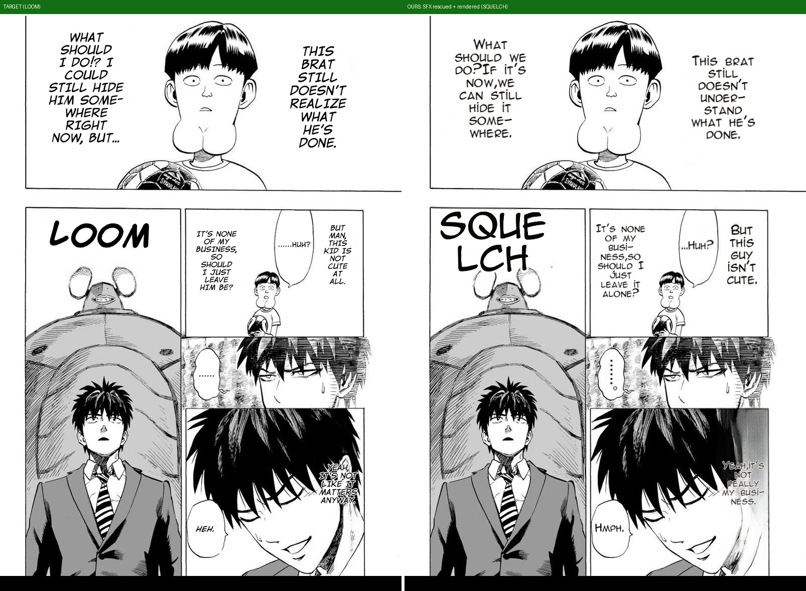

# SFX-untranslated fix — rescued SFX now survives the source-lang filter (#168/#535)

**User question:** layout is right now — why is the SFX (ぬ) still untranslated?

**Root cause (traced live, two layers):**
1. First probe: my benchmark config omitted the `ocr` section → `vlm_rescue` off → the 48px OCR read the
   stylized ぬ as "X" → filtered ("Filtered out: X"). Config-fidelity mistake (the checklist rule), not a bug.
2. With the full prod config (`MIT_OCR_PROB=0.03`, `MIT_OCR_VLM_RESCUE=1`): the log showed
   `[OcrVLM] rescued SFX region "X" -> "SQUELCH"` — **but it still didn't render.** Real bug found:
   `_filter_regions_by_source_lang` lang-detects the rescued text ("SQUELCH" = EN ≠ JPN) and drops it —
   the post-translation filter has an `sfx_rescued` carve-out, this second filter didn't. Rescued but never
   rendered, on every JP-source page with `source_lang_only`.

**Fix:** the same `sfx_rescued` carve-out in `_filter_regions_by_source_lang` (commit `88d6e771`).

**Live result:** 8 regions (was 7) — `[2] legacy src=152px "SQUELCH"` renders as a big display SFX over the
inpainted ぬ, matching the target's localized "LOOM" class.

**Honest residual:** the display SFX wrapped to 2 lines ("SQUE/LCH") — a display word should stay on one line
(shrink-to-fit) like the target's LOOM; follow-up refinement in the legacy display path. The defect CLASS
(SFX untranslated → checklist item 6) is fixed.
