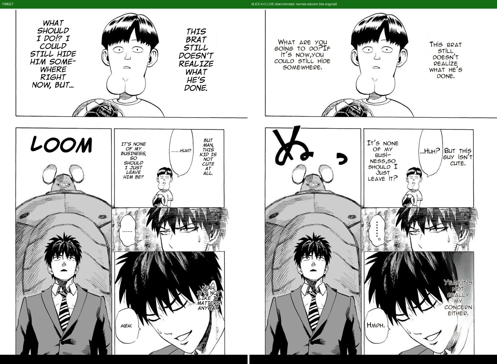
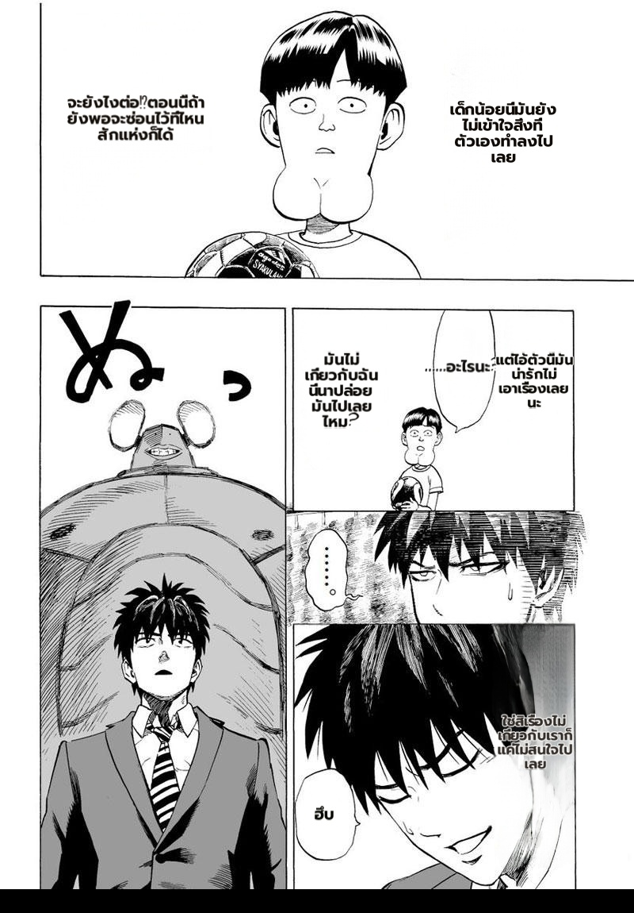
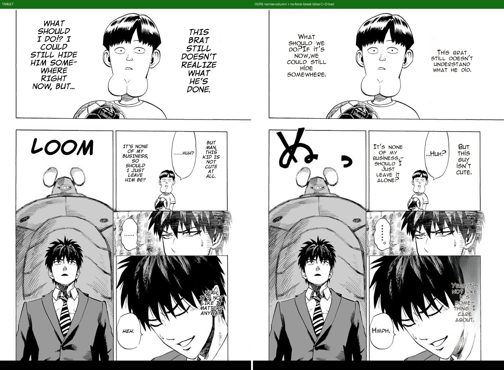

# Slice A+C (#538) — fills_bubble_width discriminator: narration follows the original's tall-narrow column

**Defect (user-confirmed vs target):** our narrations rendered WIDE (balloon-box wrap) while the target keeps
the original's tall NARROW column. Telemetry proved the route cause: tagging luck sent narration into
bubble_fit. **Fix:** slice A ports `fills_bubble_width` (WIP verbatim, 3 unit tests) + slice C gates the
bubble_fit branch with it (keeps the committed `_bubble_fit_font_size`; slice E later).

## Live result (One-Punch, prod-faithful /patches)
- **EN:** every region now routes `clean_layout` → **tall narrow columns matching the target's shape**
  ("THIS BRAT STILL / DOESN'T / REALIZE…" 6 short lines like the target). Flat 20px ≈ target's lettering scale.
- **THA:** same page JA→THA — readable narrow columns, no tiny text, no overflow.
- SCORECARD: {empty 0, size 0, overlap 0, asymmetry 0} — and the sibling-asymmetry class is structurally dead
  on this page (both narrations same branch + same flat size).

## Honest notes
- On this JP-source page the gate moved ALL regions (incl. dialogue) to clean_layout — visually this matches the
  One-Punch target (small narrow columns everywhere), and JP vertical-column footprints are exactly what the
  narrow source-referenced wrap is for. **EN-source dialogue (Gal Yome class, rw/bw ≈0.88–0.90 per the WIP's
  measurement) still passes the 0.72 gate and keeps bubble_fit** — but that must be VERIFIED on a Gal Yome
  EN→TH page (2nd-manga rule) before slice C is called fully done; no local source page → pending capture.
- Run-to-run: detection/tagging vary; the telemetry payload now records the branch per region on every request,
  so any regression is attributable from data.

## Update: slice D-narrow (squeeze) + #183 no-force-break floor

User caught 2 spots still wider than target → ported `squeeze_width` (#183): clean_layout narrows the wrap
column until the block fills the region's ORIGINAL height. First live run force-broke short words
("HMPH."→"HM/PH.") → floor corrected to the WIP's word-aware longest-token width (ZWSP pre-segmentation).

**Final live render:** every column tall-narrow like the target; "HMPH." / "...HUH?" one line each; no
force-broken word anywhere; narration follows the original's vertical proportion.

