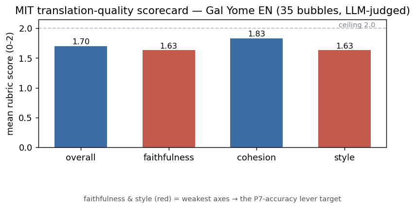

> ⚠️ **LLM-JUDGED (custom_openai, not human)** — autonomous scorecard over 35 bubbles across 8 Gal Yome EN
> pages. Lower-confidence than blind human grading, but a real robust first measurement of MIT
> translation quality (the #526 gold-standard is ~100 bubbles + human grading).

# Translation-quality scorecard — Gal Yome EN ch1 (35 bubbles) — LLM-judged

*Date:* 2026-07-04 · *graded items:* 35 · *overall mean (0-2):* **1.70**

## Per-axis mean (0-2)
| axis | mean |
|---|---|
| faithfulness | 1.63 |
| cohesion | 1.83 |
| style | 1.63 |

## Per-bubble-type mean (0-2)
| type | n | overall | faithfulness | cohesion | style |
|---|---|---|---|---|---|
| dialogue | 35 | 1.70 | 1.63 | 1.83 | 1.63 |
| narration | 0 | — | — | — | — |
| sfx | 0 | — | — | — | — |
