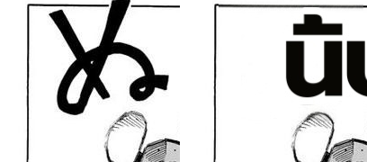

# #278 — SFX rescue gated on det_sfx provenance (not text length)

## Verification (One-Punch p1, live E2E)

ORIGINAL SFX ぬ | rendered. The det_sfx second pass detected the SFX, `merge_sfx_detections` flagged its
textline `is_sfx=True`, the flag propagated through `textline_merge` to the region, and the rescue fired on
provenance → the vision gateway localized it to Thai "นิ้บ", rendered in place. Worker log:
`[OcrVLM] rescued SFX region "X" -> "นิ้บ"`.

**Regression check (the risk of gating):** real SFX are STILL rescued (this render proves the provenance
flag survives the real detect→merge→rescue path). What changed: short dialogue in a large bubble ('は？',
'HUH?') is no longer sent to the vision gateway (it has no det_sfx provenance) — killing the misread-as-SFX
render AND the ~1-2s gateway round-trip that fired on every such region before.

## Acceptance (all met)
- [x] SFX rescue fires only for det_sfx-provenance regions — unit (`should_sfx_rescue`) + propagation test +
  live (SFX rescued).
- [x] No extra per-page vision calls for normal dialogue — provenance gate (dialogue has no `is_sfx`).
- [x] ENG prompt byte-identity by `==` (pinned literal).
- [x] jieba `initialize()` at module load (off the request path).
- [x] `sanitize_sfx` non-Latin refusal guard + test (`_SFX_REFUSALS`, both branches).
