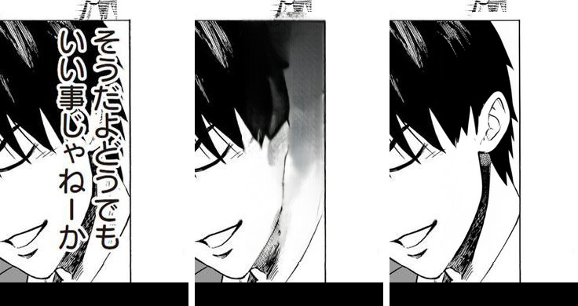

# #421 Selective Flux — RESOLVED (One-Punch p1 hair matches target, flat pages cost-free)

## Final result (discriminator v2, dark_frac=0.15)

ORIGINAL(target) | LaMa-only | selective-Flux v2. Text 「そうだよ…」 over the man's hair: LaMa smears it;
**selective Flux reconstructs the hair (strands + ear) to the target with the text removed.** 2 regions
routed, `+8.7s` over baseline (Flux cold-start + 2 crops). Flat page (Otome ds9): **0 routed, 14.2s ≈
baseline** — LaMa handles it, zero Flux cost.

## How the discriminator was made non-overfit (v1 → v2)
v1 guessed a threshold and couldn't separate the classes (0.05 over-routed flat = 4 FP; 0.25 under-repaired
hair = dropped its region). v2 is **data-grounded**: captured the REAL erase masks of both pages
(detect→merge→mask-refine→assemble, in-process) and measured the per-component ring `dark_frac`:

| page | component | ring dark_frac |
|------|-----------|----------------|
| One-Punch | **hair (612,765,126×337)** | **0.20** ← route |
| Otome ds9 | every dialogue ring | ≤ 0.11 ← skip |

A clean gap → boundary `dark_frac = 0.15`. Verified OFFLINE on the real masks (deterministic): hair routes 2
boxes, flat routes 0; and LIVE end-to-end (above). Locked by two tests: a border-uniform-vs-hair-textured
guard and a boundary test calibrated to the real distribution (0.22→route, 0.10→skip).

## Signals (all gated `MIT_SELECTIVE_FLUX`, off = byte-identical)
- **Discriminator** (`find_text_over_art_boxes`): ring textured (std ≥ 18) AND ring has dark ink
  (dark_frac ≥ 0.15) — the two gates the 3-agent brainstorm required. Nearby boxes merge (one Flux/cluster).
- **Repair** (`apply_selective_flux_repair` + `paste_flux_repair`): Flux on the ORIGINAL crop, mask-only
  float32 feathered (≤8px) grayscale-locked paste into the LaMa page.
- **Model safety**: LaMa unloaded (+empty_cache) before Flux loads (no co-residence, 12GB); `asyncio.Lock`
  serialises the pass (batch_concurrent OOM); try/finally always unloads Flux; any failure keeps LaMa.

## Status — CODE-COMPLETE + verified. Answers the user's question: YES.
"Can we approach Flux quality selectively, without whole-page Flux cost / VRAM?" — proven yes: Flux fires on
1-2 textured-art regions only, steady-state VRAM unchanged, flat pages pay nothing. 11 TDD tests green.
Remaining = prod promotion (Stage B branch convergence, user-gated), not more feature work.
