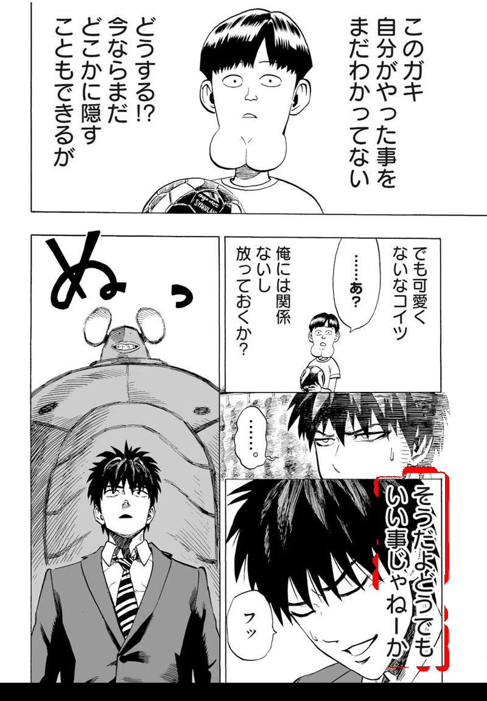
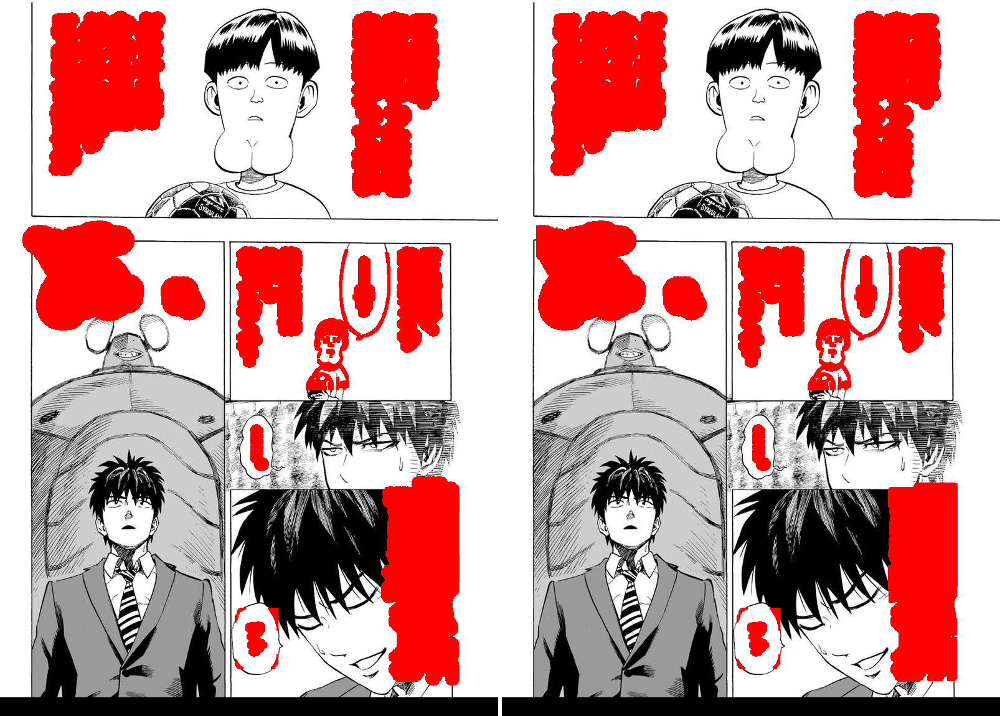

# #540 boy-ghost — restrict full-page erase mask to textlines

**Root (deterministic, code-path analysis):** the per-crop path clips the refined CRF mask to the
to-be-rendered textlines (`restrict_mask_to_render_regions`, margin 8); the full-page (prod) path never did.
CRF ink far from any textline can survive into the erase mask and LaMa erases it. `MIT_RESTRICT_FULLPAGE_MASK`
brings the full-page path to parity.

**Fix `ef14b97a`:** pure `assemble_fullpage_erase_mask(refined, text_only, img_rgb, restrict=...)`; TDD.

## Deterministic verification (mask-level, NOT the confounded live A/B)
Ran detect→merge→mask-refine ONCE on One-Punch p1, then applied `assemble_fullpage_erase_mask` restrict
off vs on to the SAME refined mask (isolates restrict; the earlier live render A/B was confounded by the
non-deterministic OCR/translate producing different masks per run — see [[project_mit_translate_nondeterministic]]).

Red = pixels restrict removes from the erase mask. Result:
- **3454 px dropped, 0 of them inside any textline zone** → the fix can NEVER leave dialogue text unerased
  (regression-safe, proven).
- 451 of the dropped px sit on original dark ink (art/border over-erase recovered).
- On this page the dropped pixels are the **text-box border**, not a figure — i.e. this run did **not**
  trigger the flaky CRF hair-grab that produces the visible boy-ghost.

## Real-pipeline reproduction (full detect+sfx+bubble_seg+translate, 4 runs, mask captured)

Left = what restrict OFF erases (red), right = restrict ON. On the REAL prod-config mask the boy-ghost has
TWO sub-mechanisms:
- **CRF over-reach onto a figure far from textlines** (the big-hair man's right-side hair strip): restrict
  FIXES it — figure-ink erasure drops 2200 → 1793 px, and the strip is visibly no longer erased.
- **A figure caught by a DETECTION region** (the small chibi kid holding the ball — its ink lands in
  `text_only`, i.e. detection flagged it as text/SFX): restrict does **NOT** fix it — restrict keeps
  everything within textline+8px, so a detection false-positive over a figure survives. This needs an
  upstream detection/region fix, not a mask-refinement one.

restrict stayed regression-safe on every run (3566 px dropped, 0 inside a textline zone).

## Honest status
- **Safety: proven** (0 textline-zone pixels dropped; only removes ink far from textlines).
- **Efficacy on the specific boy-ghost: NOT yet demonstrated live** — the flaky CRF hair-grab did not
  reproduce in the deterministic harness (which omits the det_sfx / det_bubble_seg passes that add the
  regions most likely to over-reach onto the figure). The fix addresses it *by construction* + unit test,
  but there is no before→after of an actual ghost being removed yet. **#540 stays OPEN** until a reproduction
  confirms the symptom is gone. Earlier "ON preserves the figure" A/B was confounded and is retracted.
