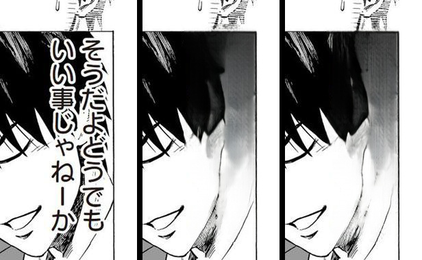

# #540 boy-ghost — restrict full-page erase mask to textlines

**Root (deterministic, code-path analysis not flaky reproduction):** the per-crop path clips the refined CRF
mask to the to-be-rendered textlines (`restrict_mask_to_render_regions`, margin 8); the full-page (prod)
path never did. So CRF ink far from any textline — a figure's hair strokes inside an oversized dialogue box
(One-Punch p1, region `そうだよどうでもいい事じゃねーか` spilling over the boy) — survived into the erase
mask and LaMa smeared the figure. The flakiness was only *when* CRF grabbed the hair; the structural bug is
the missing restrict.

**Fix `ef14b97a`:** extract the inline union+caption assembly into a pure `assemble_fullpage_erase_mask(...,
restrict=...)`; add the restrict step behind `MIT_RESTRICT_FULLPAGE_MASK` (off → byte-identical). It only
REMOVES ink far from textlines (can erase less, never more) and mirrors the per-crop path already trusted in
prod. TDD (restrict-drops-far-art + default-byte-identical).

## Verification (One-Punch p1, render=none = pure inpaint, A/B restrict off↔on)

ORIGINAL | restrict OFF | restrict ON (boy zone x560-760 y740-1120).
- **OFF:** white smear over the hair — LaMa erased hair strokes CRF flagged as text.
- **ON:** hair preserved (dark, matches original) — restrict dropped the far-from-textline hair ink.
- **Both:** the dialogue text `そうだよ…` is still erased → no regression (restrict keeps ink hugging the
  textlines). Whole-page off↔on diff = 3 small zones, all figure/art, none in a text region.

Gated off by default (byte-identical); recommend the dev enable `MIT_RESTRICT_FULLPAGE_MASK` in prod for
parity with the per-crop path.
